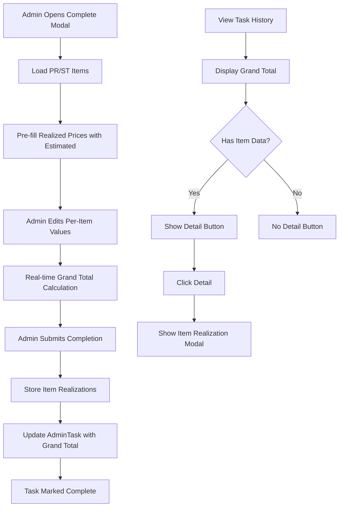
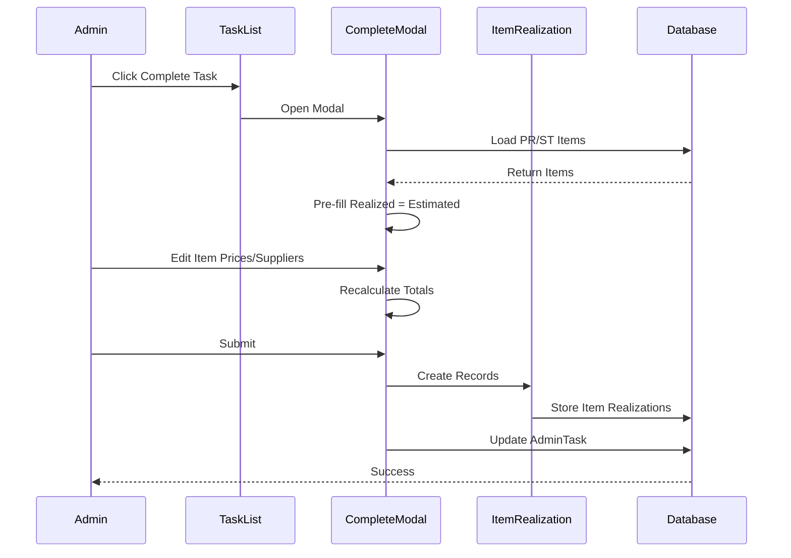
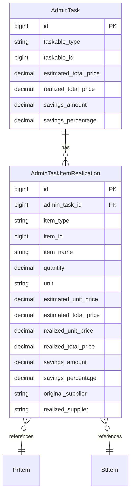

# Design Document: Admin Item Realization

## Overview

This feature enhances the Purchasing Admin task completion workflow to support per-item realization tracking. Currently, admins only input a grand total realized price when completing tasks. This enhancement allows admins to input realized prices and supplier names for each individual item, providing granular cost tracking and better procurement analytics.

The feature maintains backward compatibility with the existing workflow while adding item-level detail capabilities. The personal task history continues to show grand totals as the primary view, with a detail modal for item-level breakdown.

## Architecture

### High-Level Flow



### Data Flow



## Components and Interfaces

### New Model: AdminTaskItemRealization

```php
namespace App\Models\Modules\Purchasing\Admin;

class AdminTaskItemRealization extends Model
{
    protected $fillable = [
        'admin_task_id',
        'item_type',           // 'pr_item' or 'st_item'
        'item_id',             // Reference to pr_items.id or st_items.id
        'item_name',           // Denormalized for history
        'quantity',            // Denormalized
        'unit',                // Denormalized
        'estimated_unit_price',
        'estimated_total_price',
        'realized_unit_price',
        'realized_total_price',
        'savings_amount',
        'savings_percentage',
        'original_supplier',   // From PR/ST item
        'realized_supplier',   // Admin input
    ];
    
    // Relationships
    public function adminTask(): BelongsTo;
    public function item(): MorphTo;  // Polymorphic to PrItem or StItem
}
```

### Modified Component: TaskList.php

Add new properties and methods for item-level completion:

```php
// New properties
public $completingTaskItems = [];
public $itemRealizations = [];

// New methods
public function loadTaskItems($taskId): void;
public function updateItemRealization($index, $field, $value): void;
public function calculateItemTotal($index): void;
public function calculateGrandTotal(): void;
public function completeTaskWithItems(): void;
```

### Modified Component: PersonalTaskHistory.php

Add detail modal functionality:

```php
// New properties
public $showDetailModal = false;
public $detailTaskId = null;
public $detailItems = [];

// New methods
public function openDetailModal($taskId): void;
public function closeDetailModal(): void;
```

### Service Layer

No new service required. Logic will be contained within Livewire components for simplicity.

## Data Models

### New Table: admin_task_item_realizations

```sql
CREATE TABLE admin_task_item_realizations (
    id BIGINT UNSIGNED AUTO_INCREMENT PRIMARY KEY,
    admin_task_id BIGINT UNSIGNED NOT NULL,
    item_type VARCHAR(50) NOT NULL,  -- 'pr_item' or 'st_item'
    item_id BIGINT UNSIGNED NOT NULL,
    item_name VARCHAR(255) NOT NULL,
    quantity DECIMAL(10,2) NOT NULL,
    unit VARCHAR(50) NOT NULL,
    estimated_unit_price DECIMAL(15,2) NOT NULL,
    estimated_total_price DECIMAL(15,2) NOT NULL,
    realized_unit_price DECIMAL(15,2) NOT NULL,
    realized_total_price DECIMAL(15,2) NOT NULL,
    savings_amount DECIMAL(15,2) NOT NULL,
    savings_percentage DECIMAL(8,2) NOT NULL,
    original_supplier VARCHAR(255) NULL,
    realized_supplier VARCHAR(255) NULL,
    created_at TIMESTAMP NULL,
    updated_at TIMESTAMP NULL,
    
    FOREIGN KEY (admin_task_id) REFERENCES admin_tasks(id) ON DELETE CASCADE,
    INDEX idx_admin_task_id (admin_task_id),
    INDEX idx_item_type_id (item_type, item_id)
);
```

### Entity Relationship



## Correctness Properties

*A property is a characteristic or behavior that should hold true across all valid executions of a system-essentially, a formal statement about what the system should do. Properties serve as the bridge between human-readable specifications and machine-verifiable correctness guarantees.*

### Property 1: Item Total Calculation Consistency

*For any* item with quantity Q and realized unit price P, the realized total price SHALL equal Q × P (within floating point tolerance).

**Validates: Requirements 1.3, 2.2**

### Property 2: Grand Total Calculation Consistency

*For any* set of item realizations, the grand total realized price SHALL equal the sum of all individual item realized total prices.

**Validates: Requirements 1.5, 2.3**

### Property 3: Pre-fill Default Values

*For any* item loaded into the completion modal, the initial realized unit price SHALL equal the estimated unit price.

**Validates: Requirements 2.1**

### Property 4: Realization Persistence Round-Trip

*For any* completed task with item realizations, querying the stored data SHALL return the exact values that were submitted.

**Validates: Requirements 4.1, 4.2**

### Property 5: Savings Calculation Correctness

*For any* item realization, savings_amount SHALL equal (estimated_total_price - realized_total_price) and savings_percentage SHALL equal (savings_amount / estimated_total_price × 100) when estimated_total_price > 0.

**Validates: Requirements 5.1, 5.2**

### Property 6: Cascade Delete Integrity

*For any* PR/ST that is deleted, all associated AdminTaskItemRealization records SHALL be deleted.

**Validates: Requirements 4.3**

### Property 7: Supplier Persistence

*For any* item where admin modifies the supplier, both original_supplier and realized_supplier SHALL be stored separately and retrievable.

**Validates: Requirements 6.2, 6.3**

### Property 8: Detail Button Visibility

*For any* completed task in history, the detail button SHALL be visible if and only if the task has associated AdminTaskItemRealization records.

**Validates: Requirements 3.2**

## Error Handling

### Validation Errors

| Error Condition | Handling |
|----------------|----------|
| Realized unit price is empty | Show validation error, prevent submission |
| Realized unit price is negative | Show validation error, prevent submission |
| Realized unit price is not numeric | Show validation error, prevent submission |
| Task not found | Show toast error, close modal |
| Task not in progress | Show toast error, close modal |
| Task not assigned to current user | Show toast error, close modal |

### Database Errors

| Error Condition | Handling |
|----------------|----------|
| Failed to save item realizations | Rollback transaction, show error toast |
| Failed to update admin task | Rollback transaction, show error toast |

### Edge Cases

| Edge Case | Handling |
|-----------|----------|
| PR/ST has no items | Show message "No items to realize", allow completion with notes only |
| Estimated price is 0 | Set savings_percentage to 0 to avoid division by zero |
| Very large numbers | Use DECIMAL(15,2) to handle up to 9,999,999,999,999.99 |

## Testing Strategy

### Dual Testing Approach

This feature will use both unit tests and property-based tests:

- **Unit tests**: Verify specific examples, edge cases, and error conditions
- **Property-based tests**: Verify universal properties that should hold across all inputs

### Property-Based Testing Library

**Library**: Pest PHP with `pestphp/pest-plugin-faker` for data generation

### Test Categories

#### Unit Tests

1. Test modal opens with correct items loaded
2. Test pre-fill values match estimated prices
3. Test validation rejects invalid inputs
4. Test detail modal shows correct data
5. Test cascade delete removes realizations

#### Property-Based Tests

Each property-based test will be tagged with the format: `**Feature: admin-item-realization, Property {number}: {property_text}**`

1. **Property 1**: Item total calculation (quantity × unit_price = total)
2. **Property 2**: Grand total equals sum of item totals
3. **Property 3**: Pre-fill values equal estimated values
4. **Property 4**: Round-trip persistence
5. **Property 5**: Savings calculation correctness
6. **Property 6**: Cascade delete integrity
7. **Property 7**: Supplier persistence
8. **Property 8**: Detail button visibility logic

### Test Configuration

- Minimum 100 iterations per property test
- Use factories for generating test data
- Use database transactions for isolation
