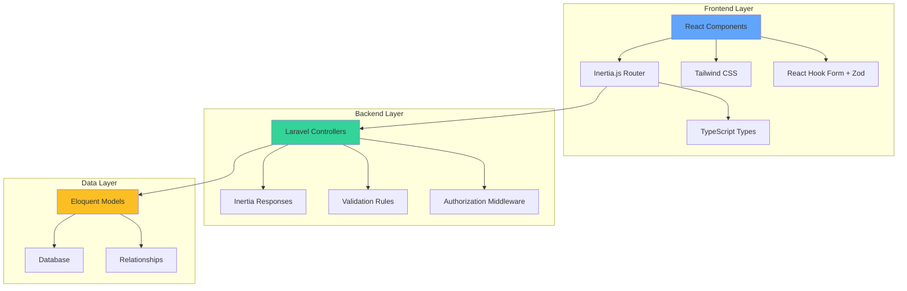
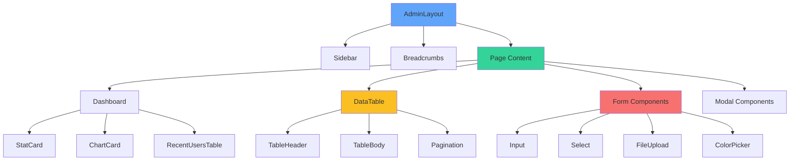

# Design Document: Admin Panel React Migration

## Overview

This design document outlines the technical approach for migrating all admin panel pages from Blade/Livewire to React/Inertia.js. The migration will create a unified technology stack across the Oasis application, providing consistent user experience, improved performance through client-side routing, and better developer experience with TypeScript.

### Migration Goals

1. **Unified Technology Stack**: Align admin panel with existing React/Inertia modules (Purchasing, Activity Tracking)
2. **Consistent User Experience**: Provide seamless navigation and interaction patterns across all modules
3. **Improved Performance**: Leverage Inertia's SPA capabilities for instant page transitions
4. **Type Safety**: Implement comprehensive TypeScript types for compile-time error detection
5. **Reusable Components**: Build a library of admin-specific React components for future extensibility

### Migration Scope

The migration covers 9 admin sections:
- Admin Dashboard (statistics and overview)
- User Management (CRUD operations)
- Business Unit Management (CRUD with logo upload)
- Department Management (CRUD with position management)
- PR Category Management (CRUD operations)
- Activity Type Management (CRUD with color picker)
- Sub-Activity Management (CRUD operations)
- Notification Settings (SMTP configuration)
- SLA Settings (business unit-specific configuration)

## Architecture

### High-Level Architecture




### Technology Stack

**Frontend:**
- React 18+ with TypeScript for type-safe component development
- Inertia.js for SPA-like experience with server-side routing
- Tailwind CSS for utility-first styling (consistent with existing pages)
- React Hook Form for performant form state management
- Zod for runtime validation and TypeScript type generation
- TanStack Table (React Table v8) for data table functionality
- Recharts for data visualization (already used in Activity module)
- Framer Motion for smooth animations and transitions
- Lucide React for consistent iconography (already used in Activity module)
- Sonner for toast notifications (already used in Activity module)
- @headlessui/react for accessible UI components
- Existing UI components from `resources/js/inertia/components/ui/`

**Backend:**
- Laravel 12.26.3 controllers returning Inertia responses
- Existing validation rules and authorization middleware
- AJAX endpoints for dynamic data loading (departments, positions)

**Build System:**
- Vite 7.0.4 for fast development and optimized production builds
- Code splitting per admin section for optimal bundle sizes
- Lazy loading for heavy components (charts, tables)

### Routing Strategy


**Universal Route Structure:**
All admin routes maintain existing URL patterns:
- `/admin` - Dashboard
- `/admin/users` - User management
- `/admin/business-units` - Business unit management
- `/admin/departments` - Department management
- `/admin/pr-categories` - PR category management
- `/admin/activity-types` - Activity type management
- `/admin/sub-activities` - Sub-activity management
- `/admin/notification-settings` - Notification configuration
- `/admin/sla-settings` - SLA configuration

**Inertia Page Components:**
Each route maps to a React page component:
- `resources/js/inertia/Pages/Admin/Dashboard.tsx`
- `resources/js/inertia/Pages/Admin/Users/Index.tsx`
- `resources/js/inertia/Pages/Admin/Users/Create.tsx`
- `resources/js/inertia/Pages/Admin/Users/Edit.tsx`
- `resources/js/inertia/Pages/Admin/Users/Show.tsx`
- (Similar structure for other admin sections)

**Client-Side Navigation:**
Inertia provides SPA-like navigation without full page reloads:
- Preserves scroll position on back/forward navigation
- Prefetches pages on link hover for instant transitions
- Supports partial reloads for updating specific page data
- Maintains browser history for proper back button behavior

## Components and Interfaces

### Component Hierarchy

**Reuse Existing Components:**
The admin panel should leverage existing UI components from the Activity module to maintain consistency:

- `Button` from `@/components/ui/button.tsx`
- `Card` from `@/components/ui/Card.tsx`
- `Badge` from `@/components/ui/Badge.tsx`
- `Dialog` from `@/components/ui/dialog.tsx` (for modals)
- `Input` from `@/components/ui/input.tsx`
- `Label` from `@/components/ui/label.tsx`
- `Select` from `@/components/ui/select.tsx`
- `Skeleton` from `@/components/ui/skeleton.tsx`
- `EmptyState` from `@/components/ui/empty-state.tsx`
- `LoadingSpinner` from `@/components/ui/LoadingSpinner.tsx`
- Toast notifications using Sonner (already configured)

**Animation Patterns:**
Follow Activity module animation patterns using Framer Motion:
- Page transitions with `AnimatePresence`
- Smooth view switching with layout animations
- Hover effects with `whileHover` and `whileTap`
- Spring transitions for natural feel: `{ type: "spring", stiffness: 300, damping: 30 }`




### Core Components

#### 1. AdminLayout Component

**Purpose:** Provides consistent layout structure for all admin pages

**Props:**
```typescript
interface AdminLayoutProps {
  children: React.ReactNode;
  title: string;
  breadcrumbs?: Breadcrumb[];
}

interface Breadcrumb {
  label: string;
  href?: string;
}
```

**Responsibilities:**
- Renders sidebar navigation (reuses existing Sidebar component)
- Displays page title and breadcrumbs
- Manages responsive layout for mobile/desktop
- Provides error boundary for graceful error handling

#### 2. DataTable Component

**Purpose:** Reusable data table with sorting, filtering, and pagination

**Props:**
```typescript
interface DataTableProps<T> {
  data: T[];
  columns: ColumnDef<T>[];
  pagination?: PaginationData;
  onSearch?: (query: string) => void;
  onSort?: (column: string, direction: 'asc' | 'desc') => void;
  onPageChange?: (page: number) => void;
  isLoading?: boolean;
  emptyMessage?: string;
}

interface PaginationData {
  current_page: number;
  last_page: number;
  per_page: number;
  total: number;
}
```

**Features:**
- Built on TanStack Table for robust table functionality
- Skeleton loading states during data fetch
- Responsive design with horizontal scroll on mobile
- Empty state with helpful messaging
- Debounced search input (300ms)


#### 3. Form Components

**Input Component:**
```typescript
interface InputProps extends React.InputHTMLAttributes<HTMLInputElement> {
  label: string;
  error?: string;
  required?: boolean;
  helpText?: string;
}
```

**Select Component:**
```typescript
interface SelectProps extends React.SelectHTMLAttributes<HTMLSelectElement> {
  label: string;
  options: SelectOption[];
  error?: string;
  required?: boolean;
}

interface SelectOption {
  value: string | number;
  label: string;
}
```

**FileUpload Component:**
```typescript
interface FileUploadProps {
  label: string;
  accept: string;
  maxSize: number; // in bytes
  onFileSelect: (file: File) => void;
  preview?: string;
  error?: string;
}
```

**Note:** Use native HTML5 drag-and-drop or existing file input patterns from Activity module (LazyImage component) instead of adding new dependencies.

**ColorPicker Component:**
```typescript
interface ColorPickerProps {
  label: string;
  value: string;
  onChange: (color: string) => void;
  error?: string;
}
```

#### 4. StatCard Component

**Purpose:** Display statistical information on dashboard

**Props:**
```typescript
interface StatCardProps {
  title: string;
  value: number | string;
  icon: React.ComponentType<{ className?: string }>;
  trend?: {
    value: number;
    direction: 'up' | 'down';
  };
  color?: 'indigo' | 'emerald' | 'amber' | 'red';
}
```

#### 5. ChartCard Component

**Purpose:** Wrapper for Recharts with consistent styling (following Activity module pattern)

**Props:**
```typescript
interface ChartCardProps {
  title: string;
  children: React.ReactNode; // Recharts components
  isLoading?: boolean;
}
```

**Usage with Recharts:**
```typescript
<ChartCard title="Monthly PR Trends">
  <ResponsiveContainer width="100%" height={300}>
    <LineChart data={monthlyData}>
      <CartesianGrid strokeDasharray="3 3" />
      <XAxis dataKey="month" />
      <YAxis />
      <Tooltip />
      <Line type="monotone" dataKey="count" stroke="#6366f1" />
    </LineChart>
  </ResponsiveContainer>
</ChartCard>
```

#### 6. Modal Component

**Purpose:** Reusable modal for confirmations and forms

**Props:**
```typescript
interface ModalProps {
  isOpen: boolean;
  onClose: () => void;
  title: string;
  children: React.ReactNode;
  size?: 'sm' | 'md' | 'lg' | 'xl';
  footer?: React.ReactNode;
}
```

### Page Components


#### Dashboard Page

**Component:** `Pages/Admin/Dashboard.tsx`

**Data Structure:**
```typescript
interface DashboardData {
  statistics: {
    totalUsers: number;
    totalBusinessUnits: number;
    totalDepartments: number;
    totalPurchaseRequests: number;
  };
  recentUsers: {
    data: User[];
    pagination: PaginationData;
  };
  businessUnitBreakdown: BusinessUnitStats[];
  monthlyPrTrends: ChartDataPoint[];
}

interface BusinessUnitStats {
  id: number;
  name: string;
  code: string;
  userCount: number;
  departmentCount: number;
}

interface ChartDataPoint {
  month: string;
  count: number;
}
```

**Features:**
- Four stat cards showing key metrics with Framer Motion animations
- Recent users table with pagination
- Business unit breakdown cards
- Monthly PR trends chart using Recharts
- Quick action buttons for admin sections
- Smooth page transitions with Framer Motion

#### User Management Pages

**Index Page:** `Pages/Admin/Users/Index.tsx`

**Data Structure:**
```typescript
interface UsersIndexData {
  users: {
    data: User[];
    pagination: PaginationData;
  };
  filters: {
    businessUnits: SelectOption[];
    departments: SelectOption[];
    roles: SelectOption[];
  };
}

interface User {
  id: number;
  name: string;
  email: string;
  is_active: boolean;
  business_units: BusinessUnitAssignment[];
  primary_business_unit: BusinessUnit;
  created_at: string;
}

interface BusinessUnitAssignment {
  business_unit: BusinessUnit;
  department: Department;
  position: Position;
}
```

**Features:**
- Searchable, filterable user table
- Multi-select filters for business unit, department, role
- Pagination controls
- Quick actions (edit, view, deactivate)
- Create user button

**Create/Edit Pages:** `Pages/Admin/Users/Create.tsx`, `Pages/Admin/Users/Edit.tsx`

**Form Schema:**
```typescript
const userFormSchema = z.object({
  name: z.string().min(1, 'Name is required'),
  email: z.string().email('Invalid email address'),
  password: z.string().min(8, 'Password must be at least 8 characters').optional(),
  is_active: z.boolean(),
  business_unit_assignments: z.array(z.object({
    business_unit_id: z.number(),
    department_id: z.number(),
    position_id: z.number(),
  })).min(1, 'At least one business unit assignment is required'),
  primary_business_unit_id: z.number(),
});

type UserFormData = z.infer<typeof userFormSchema>;
```

**Features:**
- Multi-business unit assignment with dynamic department/position loading
- Real-time form validation
- Password field (required for create, optional for edit)
- Active status toggle
- Primary business unit selection

**Show Page:** `Pages/Admin/Users/Show.tsx`

**Features:**
- User details display
- Business unit assignments table
- Role and permission display
- Activity log (recent actions)
- Edit and deactivate buttons


#### Business Unit Management Pages

**Index Page:** `Pages/Admin/BusinessUnits/Index.tsx`

**Data Structure:**
```typescript
interface BusinessUnitsIndexData {
  businessUnits: {
    data: BusinessUnit[];
    pagination: PaginationData;
  };
}

interface BusinessUnit {
  id: number;
  name: string;
  code: string;
  logo_url?: string;
  is_active: boolean;
  parent_id?: number;
  parent?: BusinessUnit;
  children?: BusinessUnit[];
  user_count: number;
  department_count: number;
}
```

**Features:**
- Business unit list with hierarchical display
- Search and status filter
- Logo preview in table
- Quick actions (edit, view, toggle status, delete)

**Create/Edit Pages:** `Pages/Admin/BusinessUnits/Create.tsx`, `Pages/Admin/BusinessUnits/Edit.tsx`

**Form Schema:**
```typescript
const businessUnitFormSchema = z.object({
  name: z.string().min(1, 'Name is required'),
  code: z.string().min(2, 'Code must be at least 2 characters').max(10),
  logo: z.instanceof(File).optional(),
  is_active: z.boolean(),
  parent_id: z.number().nullable(),
});

type BusinessUnitFormData = z.infer<typeof businessUnitFormSchema>;
```

**Features:**
- Logo upload with preview (React Dropzone)
- Logo removal option (edit page)
- Parent business unit selection (for hierarchical structure)
- Active status toggle
- File validation (image types, 2MB max)

#### Department Management Pages

**Index Page:** `Pages/Admin/Departments/Index.tsx`

**Data Structure:**
```typescript
interface DepartmentsIndexData {
  departments: {
    data: Department[];
    pagination: PaginationData;
  };
  businessUnits: SelectOption[];
}

interface Department {
  id: number;
  name: string;
  business_unit: BusinessUnit;
  positions: Position[];
  user_count: number;
  purchasing_enabled: boolean;
}

interface Position {
  id: number;
  name: string;
  department_id: number;
}
```

**Features:**
- Department list grouped by business unit
- Business unit filter
- Inline position management
- Quick actions (edit, view, configure purchasing)

**Create/Edit Pages:** `Pages/Admin/Departments/Create.tsx`, `Pages/Admin/Departments/Edit.tsx`

**Form Schema:**
```typescript
const departmentFormSchema = z.object({
  name: z.string().min(1, 'Name is required'),
  business_unit_id: z.number(),
  positions: z.array(z.object({
    id: z.number().optional(),
    name: z.string().min(1, 'Position name is required'),
  })),
  purchasing_enabled: z.boolean(),
});

type DepartmentFormData = z.infer<typeof departmentFormSchema>;
```

**Features:**
- Business unit selection
- Dynamic position management (add/remove positions)
- Purchasing configuration toggle
- Position inline editing


#### PR Category Management Pages

**Index Page:** `Pages/Admin/PrCategories/Index.tsx`

**Data Structure:**
```typescript
interface PrCategoriesIndexData {
  categories: {
    data: PrCategory[];
    pagination: PaginationData;
  };
}

interface PrCategory {
  id: number;
  name: string;
  usage_count: number; // Number of PRs using this category
  created_at: string;
}
```

**Form Schema:**
```typescript
const prCategoryFormSchema = z.object({
  name: z.string().min(1, 'Category name is required'),
});

type PrCategoryFormData = z.infer<typeof prCategoryFormSchema>;
```

**Features:**
- Category list with search
- Usage statistics display
- Inline create/edit forms
- Delete with validation (prevent if in use)

#### Activity Type Management Pages

**Index Page:** `Pages/Admin/ActivityTypes/Index.tsx`

**Data Structure:**
```typescript
interface ActivityTypesIndexData {
  activityTypes: {
    data: ActivityType[];
    pagination: PaginationData;
  };
}

interface ActivityType {
  id: number;
  name: string;
  color: string; // Hex color code
  sub_activities_count: number;
  usage_count: number; // Number of tasks using this type
  created_at: string;
}
```

**Form Schema:**
```typescript
const activityTypeFormSchema = z.object({
  name: z.string().min(1, 'Activity type name is required'),
  color: z.string().regex(/^#[0-9A-F]{6}$/i, 'Invalid color format'),
});

type ActivityTypeFormData = z.infer<typeof activityTypeFormSchema>;
```

**Features:**
- Activity type list with color indicators
- Color picker component for selection
- Usage statistics display
- Delete with validation (prevent if has sub-activities)

#### Sub-Activity Management Pages

**Index Page:** `Pages/Admin/SubActivities/Index.tsx`

**Data Structure:**
```typescript
interface SubActivitiesIndexData {
  subActivities: {
    data: SubActivity[];
    pagination: PaginationData;
  };
  activityTypes: SelectOption[];
}

interface SubActivity {
  id: number;
  name: string;
  activity_type: ActivityType;
  usage_count: number; // Number of tasks using this sub-activity
  created_at: string;
}
```

**Form Schema:**
```typescript
const subActivityFormSchema = z.object({
  name: z.string().min(1, 'Sub-activity name is required'),
  activity_type_id: z.number(),
});

type SubActivityFormData = z.infer<typeof subActivityFormSchema>;
```

**Features:**
- Sub-activities grouped by activity type
- Activity type filter
- Usage statistics display
- Delete with validation (prevent if in use)


#### Notification Settings Page

**Component:** `Pages/Admin/NotificationSettings.tsx`

**Data Structure:**
```typescript
interface NotificationSettingsData {
  settings: {
    smtp_host: string;
    smtp_port: number;
    smtp_username: string;
    smtp_password: string; // Masked on frontend
    smtp_encryption: 'tls' | 'ssl' | null;
    from_address: string;
    from_name: string;
  };
  statistics: {
    total_sent: number;
    total_failed: number;
    last_sent_at: string;
  };
}
```

**Form Schema:**
```typescript
const notificationSettingsSchema = z.object({
  smtp_host: z.string().min(1, 'SMTP host is required'),
  smtp_port: z.number().min(1).max(65535),
  smtp_username: z.string().min(1, 'SMTP username is required'),
  smtp_password: z.string().optional(), // Optional for updates
  smtp_encryption: z.enum(['tls', 'ssl', '']).nullable(),
  from_address: z.string().email('Invalid email address'),
  from_name: z.string().min(1, 'From name is required'),
});

type NotificationSettingsFormData = z.infer<typeof notificationSettingsSchema>;
```

**Features:**
- SMTP configuration form
- Password masking with "change password" option
- Test email button with loading state
- Email statistics dashboard
- Validation before saving

#### SLA Settings Page

**Component:** `Pages/Admin/SlaSettings.tsx`

**Data Structure:**
```typescript
interface SlaSettingsData {
  settings: SlaSettingsByBusinessUnit[];
  statistics: SlaStatistics[];
}

interface SlaSettingsByBusinessUnit {
  business_unit: BusinessUnit;
  follow_up_hours: number;
  completion_hours: number;
  email_alerts_enabled: boolean;
}

interface SlaStatistics {
  business_unit: BusinessUnit;
  compliance_rate: number; // Percentage
  average_completion_time: number; // Hours
  overdue_count: number;
}
```

**Form Schema:**
```typescript
const slaSettingsSchema = z.object({
  settings: z.array(z.object({
    business_unit_id: z.number(),
    follow_up_hours: z.number().min(1).max(720),
    completion_hours: z.number().min(1).max(720),
    email_alerts_enabled: z.boolean(),
  })).refine(
    (settings) => settings.every(s => s.follow_up_hours < s.completion_hours),
    { message: 'Follow-up time must be less than completion time' }
  ),
});

type SlaSettingsFormData = z.infer<typeof slaSettingsSchema>;
```

**Features:**
- SLA configuration per business unit
- Time range validation (1-720 hours)
- Follow-up vs completion time validation
- Email alerts toggle
- Compliance statistics display

## Data Models

### TypeScript Type Definitions

**Core Types:**
```typescript
// resources/js/inertia/types/admin.ts

export interface User {
  id: number;
  name: string;
  email: string;
  is_active: boolean;
  is_super_admin: boolean;
  business_units: BusinessUnitAssignment[];
  primary_business_unit: BusinessUnit;
  created_at: string;
  updated_at: string;
}

export interface BusinessUnit {
  id: number;
  name: string;
  code: string;
  logo_url?: string;
  is_active: boolean;
  parent_id?: number;
  parent?: BusinessUnit;
  children?: BusinessUnit[];
}

export interface Department {
  id: number;
  name: string;
  business_unit_id: number;
  business_unit: BusinessUnit;
  purchasing_enabled: boolean;
}

export interface Position {
  id: number;
  name: string;
  department_id: number;
}

export interface BusinessUnitAssignment {
  business_unit: BusinessUnit;
  department: Department;
  position: Position;
}

export interface PrCategory {
  id: number;
  name: string;
  usage_count?: number;
  created_at: string;
}

export interface ActivityType {
  id: number;
  name: string;
  color: string;
  sub_activities_count?: number;
  usage_count?: number;
  created_at: string;
}

export interface SubActivity {
  id: number;
  name: string;
  activity_type_id: number;
  activity_type: ActivityType;
  usage_count?: number;
  created_at: string;
}

export interface PaginationData {
  current_page: number;
  last_page: number;
  per_page: number;
  total: number;
  from: number;
  to: number;
}

export interface SelectOption {
  value: string | number;
  label: string;
}
```


### Backend Data Transformations

**Controller Response Format:**

Controllers will return Inertia responses with properly formatted data:

```php
// Example: UserController@index
public function index(Request $request)
{
    $users = User::with(['businessUnits', 'primaryBusinessUnit'])
        ->when($request->search, function ($query, $search) {
            $query->where('name', 'like', "%{$search}%")
                  ->orWhere('email', 'like', "%{$search}%");
        })
        ->when($request->business_unit_id, function ($query, $buId) {
            $query->whereHas('businessUnits', fn($q) => $q->where('business_unit_id', $buId));
        })
        ->paginate(15);

    return Inertia::render('Admin/Users/Index', [
        'users' => $users,
        'filters' => [
            'businessUnits' => BusinessUnit::all()->map(fn($bu) => [
                'value' => $bu->id,
                'label' => $bu->name,
            ]),
            'departments' => Department::all()->map(fn($d) => [
                'value' => $d->id,
                'label' => $d->name,
            ]),
            'roles' => Role::all()->map(fn($r) => [
                'value' => $r->name,
                'label' => $r->name,
            ]),
        ],
    ]);
}
```

**AJAX Endpoints for Dynamic Data:**

```php
// Example: API endpoint for loading departments by business unit
Route::get('/api/admin/business-units/{businessUnit}/departments', function (BusinessUnit $businessUnit) {
    return response()->json([
        'departments' => $businessUnit->departments->map(fn($d) => [
            'value' => $d->id,
            'label' => $d->name,
        ]),
    ]);
});

// Example: API endpoint for loading positions by department
Route::get('/api/admin/departments/{department}/positions', function (Department $department) {
    return response()->json([
        'positions' => $department->positions->map(fn($p) => [
            'value' => $p->id,
            'label' => $p->name,
        ]),
    ]);
});
```

## State Management

### Form State Management

**React Hook Form Integration:**

All forms use React Hook Form for performant state management:

```typescript
import { useForm } from 'react-hook-form';
import { zodResolver } from '@hookform/resolvers/zod';

function UserForm({ user }: { user?: User }) {
  const { register, handleSubmit, formState: { errors }, watch, setValue } = useForm<UserFormData>({
    resolver: zodResolver(userFormSchema),
    defaultValues: user ? {
      name: user.name,
      email: user.email,
      is_active: user.is_active,
      // ... other fields
    } : undefined,
  });

  const onSubmit = (data: UserFormData) => {
    router.post(route('admin.users.store'), data, {
      onSuccess: () => {
        toast.success('User created successfully');
      },
      onError: (errors) => {
        toast.error('Failed to create user');
      },
    });
  };

  return (
    <form onSubmit={handleSubmit(onSubmit)}>
      {/* Form fields */}
    </form>
  );
}
```

### Global State (if needed)

**Toast Notifications with Sonner:**

Use the existing Sonner toast system (already used in Activity module):

```typescript
import { toast } from 'sonner';

// Success notification
toast.success('User created successfully');

// Error notification
toast.error('Failed to create user');

// Info notification
toast.info('Processing your request');

// Loading notification
toast.loading('Saving changes...');
```

**Zustand Store for Admin Preferences:**

For state that needs to be shared across admin components:

```typescript
// resources/js/inertia/stores/useAdminStore.ts
import { create } from 'zustand';
import { persist } from 'zustand/middleware';

interface AdminStore {
  // View preferences
  businessUnitViewMode: 'grid' | 'list';
  setBusinessUnitViewMode: (mode: 'grid' | 'list') => void;
  
  // Filter persistence
  userFilters: UserFilters;
  setUserFilters: (filters: UserFilters) => void;
  
  // Cache for dynamic data
  departmentCache: Record<number, Department[]>;
  positionCache: Record<number, Position[]>;
  cacheDepartments: (businessUnitId: number, departments: Department[]) => void;
  cachePositions: (departmentId: number, positions: Position[]) => void;
}

export const useAdminStore = create<AdminStore>()(
  persist(
    (set) => ({
      businessUnitViewMode: 'grid',
      setBusinessUnitViewMode: (mode) => set({ businessUnitViewMode: mode }),
      
      userFilters: {},
      setUserFilters: (filters) => set({ userFilters: filters }),
      
      departmentCache: {},
      positionCache: {},
      cacheDepartments: (businessUnitId, departments) =>
        set((state) => ({
          departmentCache: { ...state.departmentCache, [businessUnitId]: departments },
        })),
      cachePositions: (departmentId, positions) =>
        set((state) => ({
          positionCache: { ...state.positionCache, [departmentId]: positions },
        })),
    }),
    {
      name: 'admin-storage',
      partialize: (state) => ({
        businessUnitViewMode: state.businessUnitViewMode,
        userFilters: state.userFilters,
      }),
    }
  )
);
```

### Inertia Shared Data

**Shared Props Available on All Pages:**

```php
// app/Http/Middleware/HandleInertiaRequests.php
public function share(Request $request): array
{
    return array_merge(parent::share($request), [
        'auth' => [
            'user' => $request->user() ? [
                'id' => $request->user()->id,
                'name' => $request->user()->name,
                'email' => $request->user()->email,
                'is_super_admin' => $request->user()->isSuperAdmin(),
            ] : null,
        ],
        'flash' => [
            'success' => fn () => $request->session()->get('success'),
            'error' => fn () => $request->session()->get('error'),
        ],
    ]);
}
```


## Correctness Properties

*A property is a characteristic or behavior that should hold true across all valid executions of a system—essentially, a formal statement about what the system should do. Properties serve as the bridge between human-readable specifications and machine-verifiable correctness guarantees.*

### Property Reflection

After analyzing all acceptance criteria, I identified the following redundancies:
- Debouncing (2.2 and 13.3) - Keep 2.2 as it's more specific to user management
- Password masking (8.2 and 14.3) - Keep 8.2 as it's more specific to notification settings
- File validation (3.3, 14.5, 17.3, 17.4) - Keep 3.3 as the primary file validation property
- Loading states (1.2, 11.1, 15.7, 18.3) - Combine into single comprehensive loading state property
- Error messages (11.4, 16.3) - Keep 11.4 as the primary error display property
- Toast notifications (11.5, 16.5) - Keep 11.5 as the primary toast property
- File upload progress (11.3, 17.5) - Keep 11.3 as the primary progress property
- Existing file display (3.4, 17.6) - Keep 3.4 as the primary file display property
- Chart rendering (1.5, 18.2) - Keep 1.5 as the primary chart property
- Table search (2.1, 15.3) - Keep 2.1 as the primary search property

### Dashboard Properties

**Property 1: Dashboard Statistics Display**
*For any* admin dashboard load with valid statistics data, all four statistics (total users, business units, departments, purchase requests) should be rendered with correct values.
**Validates: Requirements 1.1**

**Property 2: Loading State Consistency**
*For any* component in loading state, skeleton loaders should be displayed instead of actual content until data is available.
**Validates: Requirements 1.2, 11.1**

**Property 3: Recent Users Table Rendering**
*For any* paginated user dataset, the recent users table should render all users from the current page with pagination controls.
**Validates: Requirements 1.3**

**Property 4: Business Unit Breakdown Display**
*For any* set of business units with user counts, breakdown cards should be rendered showing each business unit with its corresponding user count.
**Validates: Requirements 1.4**

**Property 5: Chart Rendering**
*For any* valid chart data, the Chart.js component should render without errors and display the data visually.
**Validates: Requirements 1.5**

### User Management Properties

**Property 6: User Table with Search and Filters**
*For any* user dataset, the user table should support real-time search filtering and multi-select filters (business unit, department, role) that update displayed results without page reload.
**Validates: Requirements 2.1, 2.3**

**Property 7: Search Input Debouncing**
*For any* search input, the search function should not be called immediately but should wait 300ms after the last keystroke before triggering.
**Validates: Requirements 2.2**

**Property 8: Dynamic Department/Position Loading**
*For any* department selection in the user form, available positions should be loaded dynamically via AJAX and populate the position dropdown.
**Validates: Requirements 2.5**

**Property 9: Form Validation with Real-time Feedback**
*For any* form with validation rules, invalid inputs should trigger inline error messages that appear immediately as the user types or on blur.
**Validates: Requirements 2.6, 11.4**

**Property 10: Form Pre-population**
*For any* edit form with existing data, all form fields should be pre-populated with the current values including complex fields like multi-business unit assignments.
**Validates: Requirements 2.7**

**Property 11: User Relationships Display**
*For any* user detail view, all relationships (business units, departments, positions, roles) should be rendered completely and accurately.
**Validates: Requirements 2.8**

### Business Unit Management Properties

**Property 12: Business Unit List with Filters**
*For any* business unit dataset, the list should support search filtering and status filtering (active/inactive) that update displayed results in real-time.
**Validates: Requirements 3.1**

**Property 13: File Upload Validation**
*For any* file selected for upload, the system should validate that the file type is an image (jpg, png, gif, svg) and size does not exceed 2MB, rejecting invalid files with specific error messages.
**Validates: Requirements 3.3**

**Property 14: Business Unit Statistics Display**
*For any* business unit detail view, statistics (department count, user count) should be calculated and displayed correctly.
**Validates: Requirements 3.5**

**Property 15: Deletion Validation**
*For any* business unit with assigned users or departments, deletion attempts should be prevented with a validation error message.
**Validates: Requirements 3.7**

**Property 16: Hierarchical Relationship Display**
*For any* set of business units with parent-child relationships, the display should correctly show the hierarchy (WG as parent, child units nested).
**Validates: Requirements 3.8**

### Department Management Properties

**Property 17: Grouped Department Display**
*For any* department dataset, departments should be grouped by their business unit in the display.
**Validates: Requirements 4.1**

**Property 18: User Assignments Display**
*For any* department detail view, all users assigned to that department should be listed completely.
**Validates: Requirements 4.4**

**Property 19: Position Management Operations**
*For any* department, adding, editing, and removing positions should update the department's position list correctly.
**Validates: Requirements 4.6**

### PR Category Management Properties

**Property 20: Category List with Search**
*For any* PR category dataset, the list should support search filtering that updates displayed results in real-time.
**Validates: Requirements 5.1**

**Property 21: Category Name Uniqueness Validation**
*For any* category creation or edit, duplicate category names should be rejected with a validation error.
**Validates: Requirements 5.2**

**Property 22: Category Real-time Validation**
*For any* category form, validation should occur as the user types, displaying errors immediately.
**Validates: Requirements 5.3**

**Property 23: Category Deletion Validation**
*For any* PR category in use by purchase requests, deletion attempts should be prevented with a validation error.
**Validates: Requirements 5.4**

**Property 24: Category Usage Statistics Display**
*For any* PR category, the usage count (number of PRs using the category) should be displayed accurately.
**Validates: Requirements 5.5**

### Activity Type Management Properties

**Property 25: Activity Type Color Display**
*For any* activity type dataset, each activity type should be rendered with its color indicator visible.
**Validates: Requirements 6.1**

**Property 26: Activity Type Deletion Validation**
*For any* activity type with assigned sub-activities, deletion attempts should be prevented with a validation error.
**Validates: Requirements 6.4**

**Property 27: Activity Type Usage Statistics Display**
*For any* activity type, the usage count (number of tasks using the type) should be displayed accurately.
**Validates: Requirements 6.5**

### Sub-Activity Management Properties

**Property 28: Grouped Sub-Activity Display**
*For any* sub-activity dataset, sub-activities should be grouped by their parent activity type in the display.
**Validates: Requirements 7.1**

**Property 29: Sub-Activity Name Uniqueness Validation**
*For any* sub-activity creation or edit within an activity type, duplicate names within the same activity type should be rejected with a validation error.
**Validates: Requirements 7.3**

**Property 30: Sub-Activity Deletion Validation**
*For any* sub-activity in use by tasks, deletion attempts should be prevented with a validation error.
**Validates: Requirements 7.4**

**Property 31: Sub-Activity Usage Statistics Display**
*For any* sub-activity, the usage count (number of tasks using the sub-activity) should be displayed accurately.
**Validates: Requirements 7.5**

### Notification Settings Properties

**Property 32: Password Masking**
*For any* form field containing sensitive data (passwords, SMTP credentials), the value should be masked (displayed as asterisks or dots) in the UI.
**Validates: Requirements 8.2**

**Property 33: SMTP Settings Validation**
*For any* notification settings form submission, all required SMTP fields should be validated before allowing save.
**Validates: Requirements 8.3**

**Property 34: SMTP Error Messages**
*For any* SMTP validation failure, specific error messages should be displayed indicating the nature of the connection issue.
**Validates: Requirements 8.6**

### SLA Settings Properties

**Property 35: SLA Settings for All Business Units**
*For any* SLA settings page load, configuration should be displayed for all business units in the system.
**Validates: Requirements 9.1**

**Property 36: SLA Time Range Validation**
*For any* SLA setting update, time values outside the range of 1-720 hours should be rejected with a validation error.
**Validates: Requirements 9.2**

**Property 37: SLA Relational Validation**
*For any* SLA setting update, follow-up time greater than or equal to completion time should be rejected with a validation error.
**Validates: Requirements 9.3**

**Property 38: SLA Compliance Statistics Display**
*For any* business unit, SLA compliance statistics should be calculated and displayed accurately.
**Validates: Requirements 9.5**

### Navigation and Layout Properties

**Property 39: Sidebar Presence**
*For any* admin page, the sidebar navigation should be rendered and visible.
**Validates: Requirements 10.1**

**Property 40: Active Menu Highlighting**
*For any* admin page, the corresponding sidebar menu item should have an active/highlighted state.
**Validates: Requirements 10.2**

**Property 41: Breadcrumb Navigation**
*For any* admin page, breadcrumb navigation should be displayed showing the current page location in the hierarchy.
**Validates: Requirements 10.3**

### Loading and Error Handling Properties

**Property 42: Form Submission State**
*For any* form being submitted, the submit button should be disabled and a spinner should be displayed until submission completes.
**Validates: Requirements 11.2**

**Property 43: File Upload Progress**
*For any* file being uploaded, a progress indicator should be displayed showing upload percentage.
**Validates: Requirements 11.3**

**Property 44: Server Error Toast Notifications**
*For any* server error response, a toast notification should be displayed with error details.
**Validates: Requirements 11.5**

**Property 45: Error Boundary Fallback**
*For any* React component error, the error should be caught by an error boundary and a fallback UI should be displayed.
**Validates: Requirements 11.6**

**Property 46: Optimistic UI Updates**
*For any* optimistic update operation, the UI should update immediately and rollback to previous state if the operation fails.
**Validates: Requirements 11.7**

### Accessibility Properties

**Property 47: ARIA Labels**
*For any* interactive element (buttons, links, inputs), appropriate ARIA labels should be present for screen reader accessibility.
**Validates: Requirements 12.5**

**Property 48: Modal Focus Management**
*For any* opened modal, focus should be trapped within the modal and managed correctly for keyboard navigation.
**Validates: Requirements 12.6**

### Performance Properties

**Property 49: Pagination Rendering**
*For any* large dataset, only the current page items should be rendered, not the entire dataset.
**Validates: Requirements 13.4**

### Data Table Properties

**Property 50: Table Column Sorting**
*For any* sortable table column, clicking the column header should trigger sorting by that column in ascending or descending order.
**Validates: Requirements 15.2**

**Property 51: Table Pagination Navigation**
*For any* paginated table, using pagination controls should navigate between pages and update displayed data without full page reload.
**Validates: Requirements 15.4**

**Property 52: Table Row Click Navigation**
*For any* clickable table row, clicking the row should navigate to the detail view or trigger the configured row action.
**Validates: Requirements 15.5**

**Property 53: Table Empty State**
*For any* table with no data, an empty state message with helpful guidance should be displayed.
**Validates: Requirements 15.6**

### Form Validation Properties

**Property 54: Success Toast Notification**
*For any* successful form submission, a success toast notification should be displayed.
**Validates: Requirements 16.4**

**Property 55: Required Field Validation**
*For any* form with required fields, submitting with empty required fields should be prevented and fields should be highlighted with error messages.
**Validates: Requirements 16.6**

**Property 56: Real-time Field Validation**
*For any* form field with validation rules, validation should occur in real-time as the user types, displaying errors immediately.
**Validates: Requirements 16.7**

### File Upload Properties

**Property 57: File Preview Display**
*For any* selected image file, a preview of the image should be displayed before upload.
**Validates: Requirements 17.2**

**Property 58: File Upload Error Messages**
*For any* failed file upload, a specific error message should be displayed indicating the reason for failure.
**Validates: Requirements 17.7**

### Chart Properties

**Property 59: Chart Tooltip Display**
*For any* interactive chart, hovering over data points should display tooltips with detailed data.
**Validates: Requirements 18.5**


## Error Handling

### Frontend Error Handling Strategy

#### 1. React Error Boundaries

**Implementation:**
```typescript
// resources/js/inertia/components/ErrorBoundary.tsx
class ErrorBoundary extends React.Component<
  { children: React.ReactNode; fallback?: React.ReactNode },
  { hasError: boolean; error?: Error }
> {
  constructor(props) {
    super(props);
    this.state = { hasError: false };
  }

  static getDerivedStateFromError(error: Error) {
    return { hasError: true, error };
  }

  componentDidCatch(error: Error, errorInfo: React.ErrorInfo) {
    console.error('React Error:', error, errorInfo);
    // Log to error tracking service (e.g., Sentry)
  }

  render() {
    if (this.state.hasError) {
      return this.props.fallback || (
        <div className="min-h-screen flex items-center justify-center">
          <div className="text-center">
            <h1 className="text-2xl font-bold text-gray-900 mb-2">
              Something went wrong
            </h1>
            <p className="text-gray-600 mb-4">
              We're sorry for the inconvenience. Please refresh the page.
            </p>
            <button
              onClick={() => window.location.reload()}
              className="px-4 py-2 bg-indigo-600 text-white rounded-lg"
            >
              Refresh Page
            </button>
          </div>
        </div>
      );
    }

    return this.props.children;
  }
}
```

**Usage:**
Wrap all admin pages with ErrorBoundary component to catch and handle React errors gracefully.

#### 2. Form Validation Errors

**Zod Schema Validation:**
```typescript
const userFormSchema = z.object({
  name: z.string().min(1, 'Name is required'),
  email: z.string().email('Invalid email address'),
  // ... other fields
});

// In component
const { register, handleSubmit, formState: { errors } } = useForm({
  resolver: zodResolver(userFormSchema),
});

// Display errors
{errors.name && (
  <p className="mt-1 text-sm text-red-600">{errors.name.message}</p>
)}
```

**Server-side Validation Errors:**
```typescript
// Inertia automatically handles Laravel validation errors
router.post(route('admin.users.store'), data, {
  onError: (errors) => {
    // errors object contains field-level errors from Laravel
    // React Hook Form will automatically display them
  },
});
```

#### 3. API Request Errors

**Axios Interceptor:**
```typescript
// resources/js/bootstrap.ts
axios.interceptors.response.use(
  (response) => response,
  (error) => {
    if (error.response?.status === 401) {
      // Redirect to login
      window.location.href = '/login';
    } else if (error.response?.status === 403) {
      toast.error('You do not have permission to perform this action');
    } else if (error.response?.status === 500) {
      toast.error('Server error. Please try again later.');
    } else {
      toast.error(error.response?.data?.message || 'An error occurred');
    }
    return Promise.reject(error);
  }
);
```

#### 4. File Upload Errors

**File Validation:**
```typescript
const validateFile = (file: File): string | null => {
  const validTypes = ['image/jpeg', 'image/png', 'image/gif', 'image/svg+xml'];
  const maxSize = 2 * 1024 * 1024; // 2MB

  if (!validTypes.includes(file.type)) {
    return 'Invalid file type. Please upload an image (JPG, PNG, GIF, SVG).';
  }

  if (file.size > maxSize) {
    return 'File size exceeds 2MB. Please upload a smaller image.';
  }

  return null;
};
```

#### 5. Network Errors

**Retry Logic:**
```typescript
const fetchWithRetry = async (url: string, options: RequestInit, retries = 3) => {
  try {
    return await fetch(url, options);
  } catch (error) {
    if (retries > 0) {
      await new Promise(resolve => setTimeout(resolve, 1000));
      return fetchWithRetry(url, options, retries - 1);
    }
    throw error;
  }
};
```

### Backend Error Handling

#### 1. Controller Exception Handling

```php
// app/Http/Controllers/Admin/UserController.php
public function store(StoreUserRequest $request)
{
    try {
        DB::beginTransaction();
        
        $user = User::create($request->validated());
        // ... business logic
        
        DB::commit();
        
        return redirect()->route('admin.users.index')
            ->with('success', 'User created successfully');
            
    } catch (\Exception $e) {
        DB::rollBack();
        Log::error('Failed to create user', [
            'error' => $e->getMessage(),
            'trace' => $e->getTraceAsString(),
        ]);
        
        return back()->withInput()
            ->with('error', 'Failed to create user. Please try again.');
    }
}
```

#### 2. Validation Error Responses

```php
// Laravel automatically returns 422 with validation errors
// Inertia converts these to props that React Hook Form can use
public function store(StoreUserRequest $request)
{
    // If validation fails, Laravel returns:
    // {
    //   "message": "The given data was invalid.",
    //   "errors": {
    //     "email": ["The email has already been taken."]
    //   }
    // }
}
```

#### 3. Authorization Errors

```php
// app/Http/Middleware/AdminAccess.php
public function handle(Request $request, Closure $next)
{
    if (!$request->user() || !$request->user()->isSuperAdmin()) {
        if ($request->expectsJson()) {
            return response()->json(['message' => 'Unauthorized'], 403);
        }
        
        abort(403, 'You do not have permission to access this page.');
    }
    
    return $next($request);
}
```

### Error Logging

**Frontend Error Logging:**
```typescript
// Log errors to backend for monitoring
const logError = (error: Error, context?: Record<string, any>) => {
  axios.post('/api/log-error', {
    message: error.message,
    stack: error.stack,
    context,
    url: window.location.href,
    userAgent: navigator.userAgent,
  }).catch(() => {
    // Silently fail if logging fails
  });
};
```

**Backend Error Logging:**
```php
// Use Laravel's built-in logging
Log::error('Admin operation failed', [
    'user_id' => auth()->id(),
    'action' => 'create_user',
    'error' => $exception->getMessage(),
    'trace' => $exception->getTraceAsString(),
]);
```


## Testing Strategy

### Dual Testing Approach

This migration requires both unit tests and property-based tests to ensure comprehensive coverage:

- **Unit Tests**: Verify specific examples, edge cases, error conditions, and integration points
- **Property Tests**: Verify universal properties across all inputs through randomization

Both testing approaches are complementary and necessary for comprehensive coverage. Unit tests catch concrete bugs in specific scenarios, while property tests verify general correctness across a wide range of inputs.

### Testing Framework Setup

**Frontend Testing Stack:**
- **Vitest**: Fast unit test runner for Vite projects
- **React Testing Library**: Component testing with user-centric queries
- **fast-check**: Property-based testing library for TypeScript
- **MSW (Mock Service Worker)**: API mocking for integration tests
- **@inertiajs/testing**: Inertia-specific testing utilities

**Installation:**
```bash
npm install -D vitest @testing-library/react @testing-library/jest-dom @testing-library/user-event fast-check msw
```

**Vitest Configuration:**
```typescript
// vitest.config.ts
import { defineConfig } from 'vitest/config';
import react from '@vitejs/plugin-react';

export default defineConfig({
  plugins: [react()],
  test: {
    environment: 'jsdom',
    setupFiles: ['./resources/js/tests/setup.ts'],
    globals: true,
  },
});
```

### Property-Based Testing Configuration

**Minimum Iterations:**
All property tests must run a minimum of 100 iterations to ensure adequate randomization coverage.

**Property Test Template:**
```typescript
import fc from 'fast-check';
import { describe, it, expect } from 'vitest';

describe('Feature: admin-panel-react-migration, Property X: [Property Name]', () => {
  it('should satisfy property for all valid inputs', () => {
    fc.assert(
      fc.property(
        // Generators for test inputs
        fc.record({
          // Define input structure
        }),
        (input) => {
          // Test the property
          expect(/* assertion */).toBe(/* expected */);
        }
      ),
      { numRuns: 100 } // Minimum 100 iterations
    );
  });
});
```

### Unit Testing Strategy

**Component Testing:**
```typescript
import { render, screen } from '@testing-library/react';
import { describe, it, expect } from 'vitest';
import StatCard from '@/components/admin/StatCard';

describe('StatCard Component', () => {
  it('renders title and value correctly', () => {
    render(
      <StatCard
        title="Total Users"
        value={150}
        icon={UserIcon}
        color="indigo"
      />
    );
    
    expect(screen.getByText('Total Users')).toBeInTheDocument();
    expect(screen.getByText('150')).toBeInTheDocument();
  });
  
  it('displays trend indicator when provided', () => {
    render(
      <StatCard
        title="Total Users"
        value={150}
        icon={UserIcon}
        trend={{ value: 12, direction: 'up' }}
      />
    );
    
    expect(screen.getByText('+12%')).toBeInTheDocument();
  });
});
```

**Form Testing:**
```typescript
import { render, screen, waitFor } from '@testing-library/react';
import userEvent from '@testing-library/user-event';
import { describe, it, expect, vi } from 'vitest';
import UserForm from '@/Pages/Admin/Users/Create';

describe('User Form', () => {
  it('validates required fields', async () => {
    const user = userEvent.setup();
    render(<UserForm />);
    
    const submitButton = screen.getByRole('button', { name: /create user/i });
    await user.click(submitButton);
    
    await waitFor(() => {
      expect(screen.getByText('Name is required')).toBeInTheDocument();
      expect(screen.getByText('Email is required')).toBeInTheDocument();
    });
  });
  
  it('submits form with valid data', async () => {
    const user = userEvent.setup();
    const mockSubmit = vi.fn();
    render(<UserForm onSubmit={mockSubmit} />);
    
    await user.type(screen.getByLabelText(/name/i), 'John Doe');
    await user.type(screen.getByLabelText(/email/i), 'john@example.com');
    await user.click(screen.getByRole('button', { name: /create user/i }));
    
    await waitFor(() => {
      expect(mockSubmit).toHaveBeenCalledWith({
        name: 'John Doe',
        email: 'john@example.com',
        // ... other fields
      });
    });
  });
});
```


### Property-Based Testing Examples

**Property 1: Dashboard Statistics Display**
```typescript
import fc from 'fast-check';
import { render, screen } from '@testing-library/react';

describe('Feature: admin-panel-react-migration, Property 1: Dashboard Statistics Display', () => {
  it('should display all four statistics with correct values for any valid data', () => {
    fc.assert(
      fc.property(
        fc.record({
          totalUsers: fc.nat(),
          totalBusinessUnits: fc.nat(),
          totalDepartments: fc.nat(),
          totalPurchaseRequests: fc.nat(),
        }),
        (stats) => {
          render(<Dashboard statistics={stats} />);
          
          expect(screen.getByText(stats.totalUsers.toString())).toBeInTheDocument();
          expect(screen.getByText(stats.totalBusinessUnits.toString())).toBeInTheDocument();
          expect(screen.getByText(stats.totalDepartments.toString())).toBeInTheDocument();
          expect(screen.getByText(stats.totalPurchaseRequests.toString())).toBeInTheDocument();
        }
      ),
      { numRuns: 100 }
    );
  });
});
```

**Property 7: Search Input Debouncing**
```typescript
import fc from 'fast-check';
import { render, screen } from '@testing-library/react';
import userEvent from '@testing-library/user-event';
import { vi } from 'vitest';

describe('Feature: admin-panel-react-migration, Property 7: Search Input Debouncing', () => {
  it('should debounce search by 300ms for any search query', async () => {
    fc.assert(
      fc.asyncProperty(
        fc.string({ minLength: 1, maxLength: 50 }),
        async (searchQuery) => {
          const mockSearch = vi.fn();
          const user = userEvent.setup();
          
          render(<UserTable onSearch={mockSearch} />);
          
          const searchInput = screen.getByPlaceholderText(/search/i);
          await user.type(searchInput, searchQuery);
          
          // Should not be called immediately
          expect(mockSearch).not.toHaveBeenCalled();
          
          // Should be called after 300ms
          await new Promise(resolve => setTimeout(resolve, 350));
          expect(mockSearch).toHaveBeenCalledWith(searchQuery);
          expect(mockSearch).toHaveBeenCalledTimes(1);
        }
      ),
      { numRuns: 100 }
    );
  });
});
```

**Property 13: File Upload Validation**
```typescript
import fc from 'fast-check';

describe('Feature: admin-panel-react-migration, Property 13: File Upload Validation', () => {
  it('should validate file type and size for any file', () => {
    const validTypes = ['image/jpeg', 'image/png', 'image/gif', 'image/svg+xml'];
    const invalidTypes = ['application/pdf', 'text/plain', 'video/mp4'];
    
    fc.assert(
      fc.property(
        fc.oneof(
          fc.constantFrom(...validTypes),
          fc.constantFrom(...invalidTypes)
        ),
        fc.integer({ min: 0, max: 5 * 1024 * 1024 }), // 0 to 5MB
        (fileType, fileSize) => {
          const file = new File(['content'], 'test.jpg', { type: fileType });
          Object.defineProperty(file, 'size', { value: fileSize });
          
          const error = validateFile(file);
          
          const isValidType = validTypes.includes(fileType);
          const isValidSize = fileSize <= 2 * 1024 * 1024;
          
          if (isValidType && isValidSize) {
            expect(error).toBeNull();
          } else {
            expect(error).not.toBeNull();
            if (!isValidType) {
              expect(error).toContain('Invalid file type');
            }
            if (!isValidSize) {
              expect(error).toContain('exceeds 2MB');
            }
          }
        }
      ),
      { numRuns: 100 }
    );
  });
});
```

**Property 21: Category Name Uniqueness Validation**
```typescript
import fc from 'fast-check';

describe('Feature: admin-panel-react-migration, Property 21: Category Name Uniqueness Validation', () => {
  it('should reject duplicate category names for any existing categories', () => {
    fc.assert(
      fc.property(
        fc.array(fc.string({ minLength: 1, maxLength: 50 }), { minLength: 1, maxLength: 20 }),
        fc.string({ minLength: 1, maxLength: 50 }),
        (existingCategories, newCategoryName) => {
          const isDuplicate = existingCategories.some(
            cat => cat.toLowerCase() === newCategoryName.toLowerCase()
          );
          
          const validationResult = validateCategoryName(newCategoryName, existingCategories);
          
          if (isDuplicate) {
            expect(validationResult.isValid).toBe(false);
            expect(validationResult.error).toContain('already exists');
          } else {
            expect(validationResult.isValid).toBe(true);
          }
        }
      ),
      { numRuns: 100 }
    );
  });
});
```

### Integration Testing

**API Mocking with MSW:**
```typescript
import { rest } from 'msw';
import { setupServer } from 'msw/node';
import { beforeAll, afterAll, afterEach } from 'vitest';

const server = setupServer(
  rest.get('/api/admin/users', (req, res, ctx) => {
    return res(
      ctx.json({
        data: [
          { id: 1, name: 'John Doe', email: 'john@example.com' },
          { id: 2, name: 'Jane Smith', email: 'jane@example.com' },
        ],
        pagination: {
          current_page: 1,
          last_page: 1,
          per_page: 15,
          total: 2,
        },
      })
    );
  }),
  
  rest.post('/api/admin/users', (req, res, ctx) => {
    return res(
      ctx.status(201),
      ctx.json({ id: 3, ...req.body })
    );
  })
);

beforeAll(() => server.listen());
afterEach(() => server.resetHandlers());
afterAll(() => server.close());
```

### Backend Testing

**Feature Tests for Controllers:**
```php
<?php

namespace Tests\Feature\Admin;

use Tests\TestCase;
use App\Models\Core\User;
use App\Models\Core\BusinessUnit;
use Illuminate\Foundation\Testing\RefreshDatabase;
use Inertia\Testing\AssertableInertia as Assert;

class UserControllerTest extends TestCase
{
    use RefreshDatabase;

    public function test_index_returns_users_with_pagination()
    {
        $admin = User::factory()->create(['is_super_admin' => true]);
        User::factory()->count(20)->create();

        $response = $this->actingAs($admin)
            ->get(route('admin.users.index'));

        $response->assertStatus(200)
            ->assertInertia(fn (Assert $page) => $page
                ->component('Admin/Users/Index')
                ->has('users.data', 15)
                ->has('users.pagination')
            );
    }

    public function test_store_creates_user_with_business_unit_assignments()
    {
        $admin = User::factory()->create(['is_super_admin' => true]);
        $businessUnit = BusinessUnit::factory()->create();

        $userData = [
            'name' => 'Test User',
            'email' => 'test@example.com',
            'password' => 'password123',
            'is_active' => true,
            'business_unit_assignments' => [
                [
                    'business_unit_id' => $businessUnit->id,
                    'department_id' => 1,
                    'position_id' => 1,
                ],
            ],
            'primary_business_unit_id' => $businessUnit->id,
        ];

        $response = $this->actingAs($admin)
            ->post(route('admin.users.store'), $userData);

        $response->assertRedirect(route('admin.users.index'));
        $this->assertDatabaseHas('users', [
            'name' => 'Test User',
            'email' => 'test@example.com',
        ]);
    }

    public function test_unauthorized_user_cannot_access_admin_pages()
    {
        $user = User::factory()->create(['is_super_admin' => false]);

        $response = $this->actingAs($user)
            ->get(route('admin.users.index'));

        $response->assertStatus(403);
    }
}
```

### Test Coverage Goals

**Coverage Targets:**
- **Unit Tests**: 80%+ code coverage for components and utilities
- **Property Tests**: 100% coverage of correctness properties (59 properties)
- **Integration Tests**: All critical user flows (CRUD operations, form submissions)
- **E2E Tests**: Key admin workflows (user creation, business unit management)

**Running Tests:**
```bash
# Frontend tests
npm run test                    # Run all tests
npm run test:coverage          # Run with coverage report
npm run test:watch             # Watch mode for development

# Backend tests
php artisan test               # Run all feature tests
php artisan test --coverage    # Run with coverage report
```

### Continuous Integration

**GitHub Actions Workflow:**
```yaml
name: Admin Panel Tests

on: [push, pull_request]

jobs:
  frontend-tests:
    runs-on: ubuntu-latest
    steps:
      - uses: actions/checkout@v3
      - uses: actions/setup-node@v3
        with:
          node-version: '18'
      - run: npm ci
      - run: npm run test:coverage
      
  backend-tests:
    runs-on: ubuntu-latest
    steps:
      - uses: actions/checkout@v3
      - uses: shivammathur/setup-php@v2
        with:
          php-version: '8.2'
      - run: composer install
      - run: php artisan test --coverage
```

### Testing Best Practices

1. **Test User Behavior, Not Implementation**: Focus on what users see and do, not internal component state
2. **Use Semantic Queries**: Prefer `getByRole`, `getByLabelText` over `getByTestId`
3. **Avoid Testing Framework Behavior**: Don't test React Hook Form or Inertia.js internals
4. **Mock External Dependencies**: Use MSW for API calls, mock file uploads
5. **Test Accessibility**: Include tests for ARIA labels, keyboard navigation, focus management
6. **Property Test Edge Cases**: Use property tests to discover edge cases you didn't think of
7. **Keep Tests Fast**: Mock heavy operations, use test databases, parallelize when possible
8. **Test Error States**: Verify error handling, validation messages, fallback UI
9. **Maintain Test Data Factories**: Use factories for consistent test data generation
10. **Document Complex Tests**: Add comments explaining non-obvious test logic

