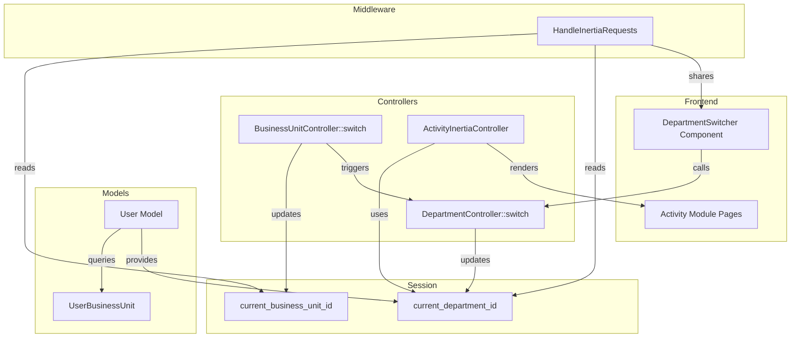

# Design Document: Multi-Department Context Switching

## Overview

This feature extends the existing business unit context switching mechanism to support department-level context within a business unit. Users who belong to multiple departments in the same business unit can switch between them, affecting which department's tasks they see and create in the Activity module.

The implementation follows the same pattern as the existing `current_business_unit_id` session-based approach, adding `current_department_id` to the session and providing helper methods and UI components for department switching.

## Architecture



## Components and Interfaces

### 1. Session Management

**New Session Key:**
- `current_department_id` - The active department ID within the current business unit

**Session Initialization Flow:**
1. On login → Set `current_department_id` to primary department in primary BU
2. On BU switch → Update `current_department_id` to primary department in new BU
3. On department switch → Update `current_department_id` directly

### 2. User Model Extensions

```php
// New methods to add to User model

/**
 * Get current department ID from session, with fallback to primary
 */
public function getCurrentDepartmentId(): ?int

/**
 * Get all departments user belongs to in current business unit
 */
public function getDepartmentsInCurrentBusinessUnit(): Collection

/**
 * Check if user has multiple departments in current business unit
 */
public function hasMultipleDepartmentsInCurrentBusinessUnit(): bool
```

### 3. Department Switch Controller

**Endpoint:** `POST /api/department/switch`

**Request:**
```json
{
  "department_id": 123
}
```

**Response:** Redirect back (Inertia pattern)

**Validation:**
- Department must exist
- User must have assignment to this department in current BU

### 4. HandleInertiaRequests Updates

**New Shared Props:**
```php
'currentDepartment' => [
    'id' => $departmentId,
    'name' => $department->name,
    'code' => $department->code,
],
'availableDepartments' => [...], // Only if user has multiple
```

### 5. Frontend Components

**DepartmentSwitcher Component:**
- Location: `resources/js/inertia/components/DepartmentSwitcher.tsx`
- Renders only when `availableDepartments.length > 1`
- Dropdown showing current department with switch options
- Calls `POST /api/department/switch` on selection

## Data Models

### Existing Tables (No Changes)

**user_business_units:**
- Already supports multiple records per user per BU with different departments
- Unique constraint: `(user_id, business_unit_id, department_id)`

### Session Data Structure

```php
session([
    'current_business_unit_id' => 1,
    'current_business_unit_name' => 'WNS',
    'current_business_unit_code' => 'WNS',
    'current_department_id' => 5,        // NEW
    'current_department_name' => 'IT',   // NEW
    'current_department_code' => 'IT',   // NEW
]);
```

## Correctness Properties

*A property is a characteristic or behavior that should hold true across all valid executions of a system-essentially, a formal statement about what the system should do. Properties serve as the bridge between human-readable specifications and machine-verifiable correctness guarantees.*

### Property 1: Session Department Initialization
*For any* user logging in or switching business units, the `current_department_id` in session SHALL be set to a valid department ID that the user is assigned to in the active business unit, or null if no assignment exists.
**Validates: Requirements 1.1, 1.2, 1.4**

### Property 2: Single Department Auto-Selection
*For any* user with exactly one department assignment in the active business unit, the system SHALL automatically use that department without requiring manual selection.
**Validates: Requirements 1.3**

### Property 3: Department Switch Updates Session
*For any* valid department switch request (where user has assignment to the target department in current BU), the `current_department_id` in session SHALL be updated to the requested department ID.
**Validates: Requirements 2.3**

### Property 4: Task Creation Uses Session Department
*For any* task created through the Activity module, the task's `department_id` SHALL equal the `current_department_id` from session at the time of creation.
**Validates: Requirements 3.1**

### Property 5: Task List Filtering by Department
*For any* task list query in the Activity module, the returned tasks SHALL include only tasks where `department_id` equals `current_department_id` OR where the user is a participant.
**Validates: Requirements 3.2, 3.4**

### Property 6: Department Users Query
*For any* query for department users (e.g., task participant suggestions), the returned users SHALL be those assigned to `current_department_id` in the current business unit.
**Validates: Requirements 3.5**

### Property 7: getCurrentDepartmentId Fallback
*For any* call to `User::getCurrentDepartmentId()`, if `current_department_id` is not set in session, the method SHALL return `primary_department_id` as fallback.
**Validates: Requirements 5.1, 5.4**

### Property 8: getDepartmentsInCurrentBusinessUnit Accuracy
*For any* user, `getDepartmentsInCurrentBusinessUnit()` SHALL return exactly the departments from `user_business_units` where `business_unit_id` equals `current_business_unit_id`.
**Validates: Requirements 5.2**

### Property 9: hasMultipleDepartmentsInCurrentBusinessUnit Correctness
*For any* user, `hasMultipleDepartmentsInCurrentBusinessUnit()` SHALL return true if and only if `getDepartmentsInCurrentBusinessUnit()->count() > 1`.
**Validates: Requirements 5.3**

## Error Handling

| Scenario | Handling |
|----------|----------|
| User has no department in current BU | Set `current_department_id` to null, show info message |
| Department switch to invalid department | Return validation error, keep current department |
| Session department not found in DB | Fall back to `primary_department_id` |
| Activity module with null department | Prevent task creation, show error message |

## Testing Strategy

### Unit Tests
- Test User model helper methods with various department configurations
- Test session initialization logic in login/BU switch flows
- Test department switch controller validation

### Property-Based Tests
- Use Pest with `pest-plugin-faker` for generating test data
- Generate random users with varying department assignments
- Verify properties hold across all generated scenarios

**PBT Library:** Pest PHP with custom generators

**Test Configuration:**
- Minimum 100 iterations per property test
- Each property test tagged with format: `**Feature: multi-department-context, Property {number}: {property_text}**`

### Integration Tests
- Test full flow: login → BU switch → department switch → task creation
- Verify Inertia props contain correct department data
- Test Activity module pages with multi-department users
