# Company Numbering System Design

## Overview

A multi-business unit numbering system built with PHP Laravel and Livewire that provides real-time, conflict-free document numbering across different business units and modules. The system initially focuses on Purchase Request (PR) numbering for Werkudara Nirwana Sakti (WNS) business unit, with scalable architecture for future business units and numbering modules.

### Key Features
- Multi-business unit support with individual numbering logic
- Real-time numbering without conflicts
- Auto re-sequencing when documents are voided
- Departmental prefix integration
- Modular architecture for different document types
- Live updates without page refresh using Livewire

## Technology Stack & Dependencies

- **Backend Framework**: PHP Laravel 10+
- **Frontend**: Laravel Livewire 3.x
- **Database**: MySQL 8.0+ with transaction support
- **Real-time Updates**: Livewire real-time events
- **Authentication**: Laravel Sanctum/Breeze
- **Caching**: Redis for number sequence caching
- **Queue System**: Laravel Queue for background processing

## Recommended Libraries & Plugins for Faster Development

### **Core Development Acceleration**

```bash
# Essential Laravel packages
composer require laravel/breeze           # Authentication scaffolding
composer require livewire/livewire        # Real-time UI components
composer require spatie/laravel-permission # Role & permission management
composer require spatie/laravel-activitylog # Activity logging
composer require barryvdh/laravel-debugbar # Development debugging
```

### **UI & Frontend Enhancement**

```bash
# UI Components & Styling
npm install @tailwindcss/forms           # Better form styling
npm install @headlessui/vue              # Unstyled UI components
npm install alpinejs                     # Lightweight JS framework
npm install @fortawesome/fontawesome-free # Icons
npm install sweetalert2                  # Beautiful alerts
npm install select2                      # Enhanced select boxes
npm install flatpickr                    # Date/time picker
```

### **Data Management & Validation**

```bash
# Backend data handling
composer require spatie/laravel-query-builder # API filtering & sorting
composer require owen-it/laravel-auditing     # Model auditing
composer require maatwebsite/excel            # Excel import/export
composer require barryvdh/laravel-dompdf      # PDF generation
composer require intervention/image           # Image processing
```

### **Development Tools**

```bash
# Development productivity
composer require --dev laravel/telescope     # Application insights
composer require --dev nunomaduro/larastan   # PHP static analysis
composer require --dev pestphp/pest          # Modern testing framework
composer require --dev spatie/laravel-ray    # Debug tool
composer require --dev barryvdh/laravel-ide-helper # IDE autocomplete
```

### **Specific Features Implementation**

#### **1. Multi-Business Unit Management**
```bash
composer require spatie/laravel-multitenancy  # Multi-tenancy support
composer require stancl/tenancy               # Alternative tenancy solution
```

#### **2. Real-time Notifications & Email**
```bash
composer require pusher/pusher-php-server     # Real-time broadcasting
npm install laravel-echo pusher-js           # Client-side real-time
composer require laravel/horizon              # Queue management dashboard
composer require spatie/laravel-mail-preview  # Preview emails in development
```

#### **3. Advanced Form Handling**
```bash
composer require livewire/livewire            # Dynamic forms
npm install alpinejs                          # Client-side reactivity
npm install tom-select                        # Advanced multi-select
```

#### **4. Data Import/Export**
```bash
composer require rap2hpoutre/fast-excel       # Fast Excel processing
composer require league/csv                   # CSV handling
composer require spatie/simple-excel          # Simple Excel operations
```

#### **5. PDF Generation & Printing**
```bash
composer require barryvdh/laravel-dompdf      # PDF generation
composer require mpdf/mpdf                    # Alternative PDF library
npm install puppeteer                         # Client-side PDF generation
```

### **Performance & Optimization**

```bash
# Caching & Performance
composer require predis/predis                # Redis client
composer require spatie/laravel-responsecache # Response caching
composer require spatie/laravel-backup        # Database backup
```

### **Testing & Quality Assurance**

```bash
# Testing tools
composer require --dev pestphp/pest-plugin-livewire  # Livewire testing
composer require --dev laravel/dusk                   # Browser testing
composer require --dev spatie/pest-plugin-snapshots  # Snapshot testing
```

### **Recommended Livewire Plugins**

```bash
# Livewire ecosystem
composer require rappasoft/laravel-livewire-tables   # Data tables
composer require wire-elements/modal                 # Modal components
composer require filament/forms                      # Advanced form builder
composer require livewire/livewire-powergrid         # Advanced data grids
```

### **Development Workflow Tools**

```bash
# Code quality & formatting
composer require --dev friendsofphp/php-cs-fixer    # Code formatting
composer require --dev phpstan/phpstan              # Static analysis
composer require --dev rector/rector                # Code refactoring

# Git hooks & automation
npm install husky                                   # Git hooks
npm install lint-staged                             # Staged files linting
```

### **Production Deployment**

```bash
# Production tools
composer require spatie/laravel-health              # Health checks
composer require spatie/laravel-schedule-monitor    # Schedule monitoring
composer require lorisleiva/laravel-deployer        # Deployment automation
```

### **Tailwind CSS Configuration for PR Templates**

```javascript
// tailwind.config.js - optimized for forms and tables
module.exports = {
  content: [
    './resources/**/*.blade.php',
    './resources/**/*.js',
    './resources/**/*.vue',
  ],
  theme: {
    extend: {
      spacing: {
        '72': '18rem',
        '84': '21rem',
        '96': '24rem',
      },
      printColorAdjust: {
        'exact': 'exact',
      }
    },
  },
  plugins: [
    require('@tailwindcss/forms'),      // Better form styling
    require('@tailwindcss/typography'), // Typography utilities
    require('@tailwindcss/aspect-ratio'), // Aspect ratio utilities
  ],
}
```

### **Alpine.js Configuration for Interactive Elements**

```javascript
// resources/js/alpine.js - for business unit switcher and modals
import Alpine from 'alpinejs'
import mask from '@alpinejs/mask'
import focus from '@alpinejs/focus'

Alpine.plugin(mask)
Alpine.plugin(focus)

// Global Alpine stores
Alpine.store('businessUnit', {
    current: null,
    available: [],
    switch(unitId) {
        // Business unit switching logic
    }
})

window.Alpine = Alpine
Alpine.start()
```

### **Recommended VS Code Extensions**

```json
// .vscode/extensions.json
{
  "recommendations": [
    "bmewburn.vscode-intelephense-client",
    "onecentlin.laravel-blade",
    "ryannaddy.laravel-artisan",
    "codingyu.laravel-goto-view",
    "austenc.livewire-goto",
    "bradlc.vscode-tailwindcss",
    "ms-vscode.vscode-json",
    "esbenp.prettier-vscode"
  ]
}
```

### **Package.json Scripts for Development**

```json
{
  "scripts": {
    "dev": "vite",
    "build": "vite build",
    "preview": "vite preview",
    "test": "pest",
    "test:coverage": "pest --coverage",
    "pint": "./vendor/bin/pint",
    "stan": "./vendor/bin/phpstan analyse",
    "format": "npm run pint && npm run prettier",
    "prettier": "prettier --write resources/js/**/*.js resources/css/**/*.css"
  }
}
```

### **Implementation Priority Suggestions**

1. **Phase 1 - Core Setup**:
   - Laravel + Livewire + Tailwind
   - Authentication (Breeze)
   - Database structure
   - Basic RBAC (Spatie Permission)

2. **Phase 2 - Business Logic**:
   - Numbering system core
   - PR creation forms
   - Multi-business unit support

3. **Phase 3 - UI/UX Enhancement**:
   - Advanced form components
   - Data tables with sorting/filtering
   - Real-time notifications
   - PDF generation

4. **Phase 4 - Production Ready**:
   - Testing suite
   - Performance optimization
   - Deployment automation
   - Monitoring & logging

## Architecture

### System Architecture Overview

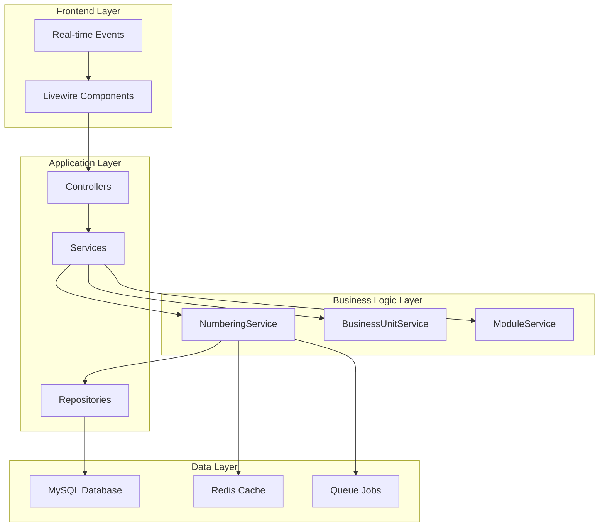
```mermaid
graph TB
    subgraph "Frontend Layer"
        A[Livewire Components]
        B[Real-time Events]
    end
    
    subgraph "Application Layer"
        C[Controllers]
        D[Services]
        E[Repositories]
    end
    
    subgraph "Business Logic Layer"
        F[NumberingService]
        G[BusinessUnitService]
        H[ModuleService]
    end
    
    subgraph "Data Layer"
        I[MySQL Database]
        J[Redis Cache]
        K[Queue Jobs]
    end
    
    A --> C
    B --> A
    C --> D
    D --> F
    D --> G
    D --> H
    F --> E
    E --> I
    F --> J
    F --> K
```

### Directory Structure

```
app/
├── Models/
│   ├── BusinessUnit.php
│   ├── Department.php
│   ├── NumberingModule.php
│   ├── NumberSequence.php
│   └── Modules/
│       └── WNS/
│           └── PurchaseRequest.php
├── Services/
│   ├── NumberingService.php
│   ├── BusinessUnitService.php
│   └── Modules/
│       └── WNS/
│           └── PRNumberingService.php
├── Repositories/
│   ├── NumberSequenceRepository.php
│   └── BusinessUnitRepository.php
├── Http/
│   ├── Controllers/
│   │   └── Modules/
│   │       └── WNS/
│   │           └── PurchaseRequestController.php
│   └── Livewire/
│       └── Modules/
│           └── WNS/
│               ├── PRCreate.php
│               └── PRList.php
└── Jobs/
    └── ResequenceNumbers.php

resources/views/
├── livewire/
│   └── modules/
│       └── wns/
│           ├── pr-create.blade.php
│           └── pr-list.blade.php
└── layouts/
    └── modules/
        └── wns/
            └── app.blade.php

database/
├── migrations/
│   ├── create_business_units_table.php
│   ├── create_departments_table.php
│   ├── create_positions_table.php
│   ├── create_users_table.php
│   ├── create_numbering_modules_table.php
│   ├── create_number_sequences_table.php
│   └── modules/
│       └── wns/
│           └── create_purchase_requests_table.php
└── seeders/
    ├── BusinessUnitSeeder.php
    ├── DepartmentSeeder.php
    ├── PositionSeeder.php
    └── UserSeeder.php
```

## Data Models & Database Schema

### Core Models

```mermaid
erDiagram
    BusinessUnit ||--o{ Department : has
    BusinessUnit ||--o{ NumberingModule : has
    BusinessUnit ||--o{ UserBusinessUnit : has
    Department ||--o{ User : belongs_to
    Department ||--o{ Position : has
    Position ||--o{ User : belongs_to
    User ||--o{ User : supervises
    User ||--o{ UserBusinessUnit : has
    UserBusinessUnit }o--|| BusinessUnit : belongs_to
    NumberingModule ||--o{ NumberSequence : has
    NumberSequence ||--o{ PurchaseRequest : generates
    
    BusinessUnit {
        int id PK
        string code UK "WNS, UT, MRP, WNN"
        string name
        json numbering_config
        boolean is_active
        timestamps
    }
    
    Department {
        int id PK
        int business_unit_id FK
        string code "GA, IT, HR, etc"
        string name
        boolean is_active
        timestamps
    }
    
    NumberingModule {
        int id PK
        int business_unit_id FK
        string module_code "PR, RT, etc"
        string module_name
        string format_pattern
        json config
        boolean is_active
        timestamps
    }
    
    NumberSequence {
        int id PK
        int business_unit_id FK
        int numbering_module_id FK
        int department_id FK
        int year
        int month
        int current_number
        int max_number
        json void_numbers
        timestamps
    }
    
    PurchaseRequest {
        int id PK
        string pr_number UK
        int business_unit_id FK
        int department_id FK
        int user_id FK
        int sequence_id FK
        string status
        datetime void_at
        json pr_data
        timestamps
    }
    
    UserBusinessUnit {
        int id PK
        int user_id FK
        int business_unit_id FK
        int department_id FK
        int position_id FK
        enum role "admin, bod, hod, leader, staff"
        boolean is_primary
        boolean is_active
        json permissions
        timestamps
    }
    
    User {
        int id PK
        int primary_department_id FK
        int primary_position_id FK
        int supervisor_id FK
        string name
        string email
        string phone_number
        enum global_role "super_admin, user"
        boolean is_active
        timestamps
    }
    
    Position {
        int id PK
        int department_id FK
        string name
        string code
        enum level "hod, leader, staff"
        int hierarchy_level
        timestamps
    }
```

### Database Tables

#### business_units
```sql
CREATE TABLE business_units (
    id BIGINT UNSIGNED AUTO_INCREMENT PRIMARY KEY,
    code VARCHAR(10) UNIQUE NOT NULL,
    name VARCHAR(255) NOT NULL,
    numbering_config JSON,
    is_active BOOLEAN DEFAULT TRUE,
    created_at TIMESTAMP NULL,
    updated_at TIMESTAMP NULL
);
```

#### departments
```sql
CREATE TABLE departments (
    id BIGINT UNSIGNED AUTO_INCREMENT PRIMARY KEY,
    business_unit_id BIGINT UNSIGNED NOT NULL,
    code VARCHAR(10) NOT NULL,
    name VARCHAR(255) NOT NULL,
    is_active BOOLEAN DEFAULT TRUE,
    created_at TIMESTAMP NULL,
    updated_at TIMESTAMP NULL,
    FOREIGN KEY (business_unit_id) REFERENCES business_units(id),
    UNIQUE KEY unique_dept_per_bu (business_unit_id, code)
);
```

#### positions
```sql
CREATE TABLE positions (
    id BIGINT UNSIGNED AUTO_INCREMENT PRIMARY KEY,
    department_id BIGINT UNSIGNED NOT NULL,
    name VARCHAR(255) NOT NULL,
    code VARCHAR(50) NOT NULL,
    level ENUM('hod', 'leader', 'staff') NOT NULL,
    hierarchy_level INT NOT NULL DEFAULT 1,
    is_active BOOLEAN DEFAULT TRUE,
    created_at TIMESTAMP NULL,
    updated_at TIMESTAMP NULL,
    FOREIGN KEY (department_id) REFERENCES departments(id),
    UNIQUE KEY unique_position_per_dept (department_id, code)
);
```

#### users
```sql
CREATE TABLE users (
    id BIGINT UNSIGNED AUTO_INCREMENT PRIMARY KEY,
    primary_department_id BIGINT UNSIGNED NOT NULL,
    primary_position_id BIGINT UNSIGNED NOT NULL,
    supervisor_id BIGINT UNSIGNED NULL,
    name VARCHAR(255) NOT NULL,
    email VARCHAR(255) UNIQUE NOT NULL,
    phone_number VARCHAR(20) NOT NULL,
    global_role ENUM('super_admin', 'user') NOT NULL DEFAULT 'user',
    email_verified_at TIMESTAMP NULL,
    password VARCHAR(255) NOT NULL,
    is_active BOOLEAN DEFAULT TRUE,
    remember_token VARCHAR(100) NULL,
    created_at TIMESTAMP NULL,
    updated_at TIMESTAMP NULL,
    FOREIGN KEY (primary_department_id) REFERENCES departments(id),
    FOREIGN KEY (primary_position_id) REFERENCES positions(id),
    FOREIGN KEY (supervisor_id) REFERENCES users(id)
);
```

#### user_business_units
```sql
CREATE TABLE user_business_units (
    id BIGINT UNSIGNED AUTO_INCREMENT PRIMARY KEY,
    user_id BIGINT UNSIGNED NOT NULL,
    business_unit_id BIGINT UNSIGNED NOT NULL,
    department_id BIGINT UNSIGNED NOT NULL,
    position_id BIGINT UNSIGNED NOT NULL,
    role ENUM('admin', 'bod', 'hod', 'leader', 'staff') NOT NULL DEFAULT 'staff',
    is_primary BOOLEAN DEFAULT FALSE,
    is_active BOOLEAN DEFAULT TRUE,
    permissions JSON NULL,
    created_at TIMESTAMP NULL,
    updated_at TIMESTAMP NULL,
    FOREIGN KEY (user_id) REFERENCES users(id) ON DELETE CASCADE,
    FOREIGN KEY (business_unit_id) REFERENCES business_units(id),
    FOREIGN KEY (department_id) REFERENCES departments(id),
    FOREIGN KEY (position_id) REFERENCES positions(id),
    UNIQUE KEY unique_user_bu_dept (user_id, business_unit_id, department_id)
);
```

#### numbering_modules
```sql
CREATE TABLE numbering_modules (
    id BIGINT UNSIGNED AUTO_INCREMENT PRIMARY KEY,
    business_unit_id BIGINT UNSIGNED NOT NULL,
    module_code VARCHAR(10) NOT NULL,
    module_name VARCHAR(255) NOT NULL,
    format_pattern VARCHAR(255) NOT NULL,
    config JSON,
    is_active BOOLEAN DEFAULT TRUE,
    created_at TIMESTAMP NULL,
    updated_at TIMESTAMP NULL,
    FOREIGN KEY (business_unit_id) REFERENCES business_units(id),
    UNIQUE KEY unique_module_per_bu (business_unit_id, module_code)
);
```

#### number_sequences
```sql
CREATE TABLE number_sequences (
    id BIGINT UNSIGNED AUTO_INCREMENT PRIMARY KEY,
    business_unit_id BIGINT UNSIGNED NOT NULL,
    numbering_module_id BIGINT UNSIGNED NOT NULL,
    department_id BIGINT UNSIGNED NOT NULL,
    year INT NOT NULL,
    month INT NOT NULL,
    current_number INT DEFAULT 0,
    max_number INT DEFAULT 0,
    void_numbers JSON DEFAULT '[]',
    created_at TIMESTAMP NULL,
    updated_at TIMESTAMP NULL,
    FOREIGN KEY (business_unit_id) REFERENCES business_units(id),
    FOREIGN KEY (numbering_module_id) REFERENCES numbering_modules(id),
    FOREIGN KEY (department_id) REFERENCES departments(id),
    UNIQUE KEY unique_sequence (business_unit_id, numbering_module_id, department_id, year, month)
);
```

#### purchase_requests (WNS Module)
```sql
CREATE TABLE purchase_requests (
    id BIGINT UNSIGNED AUTO_INCREMENT PRIMARY KEY,
    pr_number VARCHAR(50) UNIQUE NOT NULL,
    business_unit_id BIGINT UNSIGNED NOT NULL,
    department_id BIGINT UNSIGNED NOT NULL,
    user_id BIGINT UNSIGNED NOT NULL,
    sequence_id BIGINT UNSIGNED NOT NULL,
    request_date DATE NOT NULL,
    used_for TEXT NOT NULL,
    status ENUM('draft', 'pending_approval', 'approved', 'rejected', 'void') DEFAULT 'draft',
    current_approval_step INT DEFAULT 0,
    total_amount DECIMAL(15,2) DEFAULT 0.00,
    currency VARCHAR(3) DEFAULT 'IDR',
    notes TEXT NULL,
    void_at TIMESTAMP NULL,
    approved_at TIMESTAMP NULL,
    rejected_at TIMESTAMP NULL,
    created_at TIMESTAMP NULL,
    updated_at TIMESTAMP NULL,
    FOREIGN KEY (business_unit_id) REFERENCES business_units(id),
    FOREIGN KEY (department_id) REFERENCES departments(id),
    FOREIGN KEY (user_id) REFERENCES users(id),
    FOREIGN KEY (sequence_id) REFERENCES number_sequences(id)
);
```

#### pr_items
```sql
CREATE TABLE pr_items (
    id BIGINT UNSIGNED AUTO_INCREMENT PRIMARY KEY,
    pr_id BIGINT UNSIGNED NOT NULL,
    item_number INT NOT NULL,
    item_name VARCHAR(255) NOT NULL,
    brand_name VARCHAR(255) NULL,
    expense_department_id BIGINT UNSIGNED NOT NULL,
    item_description TEXT NULL,
    supplier_name VARCHAR(255) NULL,
    quantity DECIMAL(10,2) NOT NULL,
    unit VARCHAR(50) NOT NULL,
    unit_price DECIMAL(15,2) NOT NULL,
    currency VARCHAR(3) DEFAULT 'IDR',
    total_price DECIMAL(15,2) NOT NULL,
    created_at TIMESTAMP NULL,
    updated_at TIMESTAMP NULL,
    FOREIGN KEY (pr_id) REFERENCES purchase_requests(id) ON DELETE CASCADE,
    FOREIGN KEY (expense_department_id) REFERENCES departments(id)
);
```

#### pr_approvals
```sql
CREATE TABLE pr_approvals (
    id BIGINT UNSIGNED AUTO_INCREMENT PRIMARY KEY,
    pr_id BIGINT UNSIGNED NOT NULL,
    approver_id BIGINT UNSIGNED NOT NULL,
    approval_step INT NOT NULL,
    status ENUM('pending', 'approved', 'rejected') DEFAULT 'pending',
    approved_at TIMESTAMP NULL,
    rejected_at TIMESTAMP NULL,
    rejection_reason TEXT NULL,
    notes TEXT NULL,
    created_at TIMESTAMP NULL,
    updated_at TIMESTAMP NULL,
    FOREIGN KEY (pr_id) REFERENCES purchase_requests(id) ON DELETE CASCADE,
    FOREIGN KEY (approver_id) REFERENCES users(id)
);
```

#### pr_approval_history
```sql
CREATE TABLE pr_approval_history (
    id BIGINT UNSIGNED AUTO_INCREMENT PRIMARY KEY,
    pr_id BIGINT UNSIGNED NOT NULL,
    approver_id BIGINT UNSIGNED NOT NULL,
    action ENUM('approved', 'rejected', 'requested_changes') NOT NULL,
    comments TEXT NULL,
    created_at TIMESTAMP NULL,
    FOREIGN KEY (pr_id) REFERENCES purchase_requests(id) ON DELETE CASCADE,
    FOREIGN KEY (approver_id) REFERENCES users(id)
);
```

## Scalable Dashboard & Login System

### Multi-Business Unit Dashboard Architecture

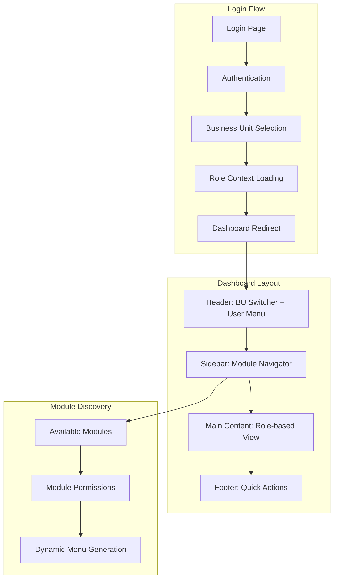
```mermaid
graph TB
    subgraph "Login Flow"
        A[Login Page] --> B[Authentication]
        B --> C[Business Unit Selection]
        C --> D[Role Context Loading]
        D --> E[Dashboard Redirect]
    end
    
    subgraph "Dashboard Layout"
        F[Header: BU Switcher + User Menu]
        G[Sidebar: Module Navigator]
        H[Main Content: Role-based View]
        I[Footer: Quick Actions]
    end
    
    subgraph "Module Discovery"
        J[Available Modules]
        K[Module Permissions]
        L[Dynamic Menu Generation]
    end
    
    E --> F
    F --> G
    G --> H
    H --> I
    
    G --> J
    J --> K
    K --> L
```

### Login System with BU Selection

```php
// app/Http/Livewire/Auth/Login.php
class Login extends Component
{
    public $email;
    public $password;
    public $selectedBusinessUnit;
    public $availableBusinessUnits = [];
    public $showBusinessUnitSelection = false;
    public $user;
    
    public function authenticate()
    {
        $this->validate([
            'email' => 'required|email',
            'password' => 'required'
        ]);
        
        if (Auth::attempt(['email' => $this->email, 'password' => $this->password])) {
            $this->user = Auth::user();
            $this->loadAvailableBusinessUnits();
            
            if (count($this->availableBusinessUnits) > 1) {
                $this->showBusinessUnitSelection = true;
            } else {
                $this->selectBusinessUnit($this->availableBusinessUnits[0]['id']);
            }
        } else {
            $this->addError('email', 'Invalid credentials');
        }
    }
    
    public function loadAvailableBusinessUnits()
    {
        $this->availableBusinessUnits = $this->user->businessUnits
            ->where('is_active', true)
            ->map(function($buAssignment) {
                return [
                    'id' => $buAssignment->business_unit_id,
                    'code' => $buAssignment->businessUnit->code,
                    'name' => $buAssignment->businessUnit->name,
                    'role' => $buAssignment->role,
                    'department' => $buAssignment->department->name
                ];
            })->toArray();
    }
    
    public function selectBusinessUnit($businessUnitId)
    {
        session([
            'current_business_unit_id' => $businessUnitId,
            'current_user_role' => $this->getUserRoleInBU($businessUnitId)
        ]);
        
        return redirect()->route('dashboard');
    }
    
    private function getUserRoleInBU($businessUnitId)
    {
        return $this->user->businessUnits
            ->where('business_unit_id', $businessUnitId)
            ->first()->role;
    }
    
    public function render()
    {
        return view('livewire.auth.login');
    }
}
```

### Dynamic Dashboard Component

```php
// app/Http/Livewire/Dashboard/MainDashboard.php
class MainDashboard extends Component
{
    public $currentBusinessUnit;
    public $currentRole;
    public $availableModules = [];
    public $recentActivities = [];
    public $quickStats = [];
    
    public function mount()
    {
        $this->loadCurrentContext();
        $this->loadAvailableModules();
        $this->loadRecentActivities();
        $this->loadQuickStats();
    }
    
    public function loadCurrentContext()
    {
        $this->currentBusinessUnit = BusinessUnit::find(session('current_business_unit_id'));
        $this->currentRole = session('current_user_role');
    }
    
    public function loadAvailableModules()
    {
        $user = auth()->user();
        $buId = session('current_business_unit_id');
        
        // Get modules available for current business unit
        $modules = NumberingModule::where('business_unit_id', $buId)
            ->where('is_active', true)
            ->get();
        
        $this->availableModules = $modules->map(function($module) use ($user) {
            $userBU = $user->businessUnits
                ->where('business_unit_id', $module->business_unit_id)
                ->first();
            
            return [
                'code' => $module->module_code,
                'name' => $module->module_name,
                'icon' => $this->getModuleIcon($module->module_code),
                'route' => $this->getModuleRoute($module->module_code),
                'has_permission' => $this->checkModulePermission($module, $userBU),
                'recent_count' => $this->getRecentCount($module)
            ];
        })->filter(function($module) {
            return $module['has_permission'];
        })->values()->toArray();
    }
    
    public function loadRecentActivities()
    {
        $user = auth()->user();
        $buId = session('current_business_unit_id');
        $role = session('current_user_role');
        
        // Load recent activities based on role permissions
        $query = PurchaseRequest::with(['user', 'department'])
            ->where('business_unit_id', $buId)
            ->orderBy('created_at', 'desc')
            ->limit(10);
        
        // Apply role-based filtering
        switch ($role) {
            case 'admin':
            case 'bod':
                // See all activities
                break;
            case 'hod':
                $userBU = $user->businessUnits->where('business_unit_id', $buId)->first();
                $query->where('department_id', $userBU->department_id);
                break;
            case 'leader':
                $subordinateIds = $user->getSubordinatesInBU($buId)->pluck('user_id')->toArray();
                $subordinateIds[] = $user->id;
                $query->whereIn('user_id', $subordinateIds);
                break;
            case 'staff':
                $query->where('user_id', $user->id);
                break;
        }
        
        $this->recentActivities = $query->get()->map(function($activity) {
            return [
                'type' => 'PR Created',
                'description' => "PR {$activity->pr_number} created by {$activity->user->name}",
                'time' => $activity->created_at->diffForHumans(),
                'status' => $activity->status
            ];
        })->toArray();
    }
    
    public function switchBusinessUnit($businessUnitId)
    {
        $user = auth()->user();
        $userBU = $user->businessUnits->where('business_unit_id', $businessUnitId)->first();
        
        if ($userBU) {
            session([
                'current_business_unit_id' => $businessUnitId,
                'current_user_role' => $userBU->role
            ]);
            
            return redirect()->route('dashboard');
        }
    }
    
    private function getModuleIcon($moduleCode)
    {
        $icons = [
            'PR' => 'fas fa-file-invoice',
            'RT' => 'fas fa-tags',
            'PO' => 'fas fa-shopping-cart',
            'INV' => 'fas fa-receipt'
        ];
        
        return $icons[$moduleCode] ?? 'fas fa-file';
    }
    
    private function getModuleRoute($moduleCode)
    {
        $routes = [
            'PR' => 'modules.pr.index',
            'RT' => 'modules.rt.index',
            'PO' => 'modules.po.index',
            'INV' => 'modules.inv.index'
        ];
        
        return $routes[$moduleCode] ?? '#';
    }
    
    private function checkModulePermission($module, $userBU)
    {
        // Check if user has permission for this module
        $permissions = $userBU->permissions ?? [];
        
        return in_array($userBU->role, ['admin', 'bod']) || 
               in_array($module->module_code, $permissions) ||
               empty($permissions); // Default allow if no specific permissions set
    }
    
    public function render()
    {
        return view('livewire.dashboard.main-dashboard');
    }
}
```

### Business Unit Switcher Component

```php
// app/Http/Livewire/Components/BusinessUnitSwitcher.php
class BusinessUnitSwitcher extends Component
{
    public $currentBusinessUnit;
    public $availableBusinessUnits = [];
    public $showDropdown = false;
    
    public function mount()
    {
        $this->loadCurrentBusinessUnit();
        $this->loadAvailableBusinessUnits();
    }
    
    public function loadCurrentBusinessUnit()
    {
        $this->currentBusinessUnit = BusinessUnit::find(session('current_business_unit_id'));
    }
    
    public function loadAvailableBusinessUnits()
    {
        $user = auth()->user();
        $this->availableBusinessUnits = $user->businessUnits
            ->where('is_active', true)
            ->map(function($buAssignment) {
                return [
                    'id' => $buAssignment->business_unit_id,
                    'code' => $buAssignment->businessUnit->code,
                    'name' => $buAssignment->businessUnit->name,
                    'role' => $buAssignment->role,
                    'department' => $buAssignment->department->name,
                    'is_current' => $buAssignment->business_unit_id == session('current_business_unit_id')
                ];
            })->toArray();
    }
    
    public function switchTo($businessUnitId)
    {
        $user = auth()->user();
        $userBU = $user->businessUnits->where('business_unit_id', $businessUnitId)->first();
        
        if ($userBU && $userBU->is_active) {
            session([
                'current_business_unit_id' => $businessUnitId,
                'current_user_role' => $userBU->role,
                'current_department_id' => $userBU->department_id
            ]);
            
            $this->emit('businessUnitSwitched', $businessUnitId);
            $this->showDropdown = false;
            
            return redirect()->route('dashboard');
        }
    }
    
    public function toggleDropdown()
    {
        $this->showDropdown = !$this->showDropdown;
    }
    
    public function render()
    {
        return view('livewire.components.business-unit-switcher');
    }
}
```

### Updated User Model for Multi-BU Support

```php
// app/Models/User.php (Updated)
class User extends Authenticatable
{
    protected $fillable = [
        'name', 'email', 'phone_number', 'primary_department_id', 
        'primary_position_id', 'supervisor_id', 'global_role', 'is_active'
    ];
    
    public function primaryDepartment()
    {
        return $this->belongsTo(Department::class, 'primary_department_id');
    }
    
    public function primaryPosition()
    {
        return $this->belongsTo(Position::class, 'primary_position_id');
    }
    
    public function businessUnits()
    {
        return $this->hasMany(UserBusinessUnit::class);
    }
    
    public function activeBusinessUnits()
    {
        return $this->businessUnits()->where('is_active', true);
    }
    
    public function getCurrentBusinessUnit()
    {
        $buId = session('current_business_unit_id');
        return $this->businessUnits()->where('business_unit_id', $buId)->first();
    }
    
    public function getCurrentRole()
    {
        return session('current_user_role') ?? 'staff';
    }
    
    public function hasAccessToBusinessUnit($businessUnitId)
    {
        return $this->businessUnits()
            ->where('business_unit_id', $businessUnitId)
            ->where('is_active', true)
            ->exists();
    }
    
    public function getRoleInBusinessUnit($businessUnitId)
    {
        $userBU = $this->businessUnits()
            ->where('business_unit_id', $businessUnitId)
            ->first();
            
        return $userBU ? $userBU->role : null;
    }
    
    public function getSubordinatesInBU($businessUnitId)
    {
        // Get subordinates in specific business unit
        return UserBusinessUnit::where('business_unit_id', $businessUnitId)
            ->whereIn('user_id', $this->getAllSubordinates()->pluck('id'))
            ->where('is_active', true)
            ->get();
    }
    
    public function canViewPRInCurrentContext($pr)
    {
        $currentRole = $this->getCurrentRole();
        $currentBU = $this->getCurrentBusinessUnit();
        
        if (!$currentBU || $pr->business_unit_id != $currentBU->business_unit_id) {
            return false;
        }
        
        switch ($currentRole) {
            case 'admin':
            case 'bod':
                return true;
                
            case 'hod':
                return $pr->department_id === $currentBU->department_id;
                
            case 'leader':
                $subordinateIds = $this->getSubordinatesInBU($currentBU->business_unit_id)
                    ->pluck('user_id')->toArray();
                return $pr->user_id === $this->id || in_array($pr->user_id, $subordinateIds);
                
            case 'staff':
                return $pr->user_id === $this->id;
                
            default:
                return false;
        }
    }
}

// app/Models/UserBusinessUnit.php
class UserBusinessUnit extends Model
{
    protected $fillable = [
        'user_id', 'business_unit_id', 'department_id', 'position_id',
        'role', 'is_primary', 'is_active', 'permissions'
    ];
    
    protected $casts = [
        'permissions' => 'array',
        'is_primary' => 'boolean',
        'is_active' => 'boolean'
    ];
    
    public function user()
    {
        return $this->belongsTo(User::class);
    }
    
    public function businessUnit()
    {
        return $this->belongsTo(BusinessUnit::class);
    }
    
    public function department()
    {
        return $this->belongsTo(Department::class);
    }
    
    public function position()
    {
        return $this->belongsTo(Position::class);
    }
}
```

### WNS PR Models with Full Relationships

```php
// app/Models/Modules/WNS/PurchaseRequest.php
class PurchaseRequest extends Model
{
    protected $fillable = [
        'pr_number', 'business_unit_id', 'department_id', 'user_id', 
        'sequence_id', 'request_date', 'used_for', 'status', 
        'current_approval_step', 'total_amount', 'currency', 'notes',
        'void_at', 'approved_at', 'rejected_at'
    ];
    
    protected $casts = [
        'request_date' => 'date',
        'total_amount' => 'decimal:2',
        'void_at' => 'datetime',
        'approved_at' => 'datetime',
        'rejected_at' => 'datetime'
    ];
    
    public function businessUnit()
    {
        return $this->belongsTo(BusinessUnit::class);
    }
    
    public function department()
    {
        return $this->belongsTo(Department::class);
    }
    
    public function user()
    {
        return $this->belongsTo(User::class);
    }
    
    public function sequence()
    {
        return $this->belongsTo(NumberSequence::class);
    }
    
    public function items()
    {
        return $this->hasMany(PRItem::class, 'pr_id');
    }
    
    public function approvals()
    {
        return $this->hasMany(PRApproval::class, 'pr_id');
    }
    
    public function approvalHistory()
    {
        return $this->hasMany(PRApprovalHistory::class, 'pr_id');
    }
    
    public function currentApprovers()
    {
        return $this->approvals()
            ->where('approval_step', $this->current_approval_step)
            ->where('status', 'pending');
    }
    
    public function calculateTotal()
    {
        $total = $this->items()->sum('total_price');
        $this->update(['total_amount' => $total]);
        return $total;
    }
    
    public function canBeEditedBy(User $user)
    {
        // Can edit if: owner (items editable with approval reset), or admin
        // Used For field is locked after submission for approval
        return ($this->user_id === $user->id) ||
               $user->getCurrentRole() === 'admin';
    }
    
    public function canEditUsedFor(User $user)
    {
        // Used For can only be edited by creator during draft status
        return $this->user_id === $user->id && $this->status === 'draft';
    }
    
    public function canEditItems(User $user)
    {
        // Items can be edited by creator at any time (will reset approvals)
        return $this->user_id === $user->id || $user->getCurrentRole() === 'admin';
    }
    
    public function resetApprovalWorkflow()
    {
        // Reset all approvals when items are modified
        $this->approvals()->update([
            'status' => 'pending',
            'approved_at' => null,
            'rejected_at' => null,
            'rejection_reason' => null,
            'notes' => null
        ]);
        
        // Reset PR status and approval step
        $this->update([
            'status' => 'pending_approval',
            'current_approval_step' => 1,
            'approved_at' => null,
            'rejected_at' => null
        ]);
        
        // Log approval reset activity
        activity('approval_reset')
            ->performedOn($this)
            ->withProperties([
                'reason' => 'Items modified after approval submission',
                'reset_at' => now()
            ])
            ->log('Approval workflow reset due to item modifications');
        
        // Notify all approvers about reset
        $this->notifyApprovalReset();
    }
    
    private function notifyApprovalReset()
    {
        $allApprovers = $this->approvals()->with('approver')->get();
        
        foreach ($allApprovers as $approval) {
            Mail::to($approval->approver->email)
                ->send(new PRApprovalResetMail($this, $approval->approver));
        }
    }
    
    public function canBeApprovedBy(User $user)
    {
        return $this->currentApprovers()
            ->where('approver_id', $user->id)
            ->exists();
    }
    
    public function submitForApproval()
    {
        if ($this->status !== 'draft') {
            throw new \Exception('PR must be in draft status to submit for approval');
        }
        
        $this->update([
            'status' => 'pending_approval',
            'current_approval_step' => 1
        ]);
        
        // Notify first level approvers
        $this->notifyCurrentApprovers();
    }
    
    public function approve(User $approver, string $notes = null)
    {
        $approval = $this->currentApprovers()
            ->where('approver_id', $approver->id)
            ->first();
            
        if (!$approval) {
            throw new \Exception('You are not authorized to approve this PR');
        }
        
        $approval->update([
            'status' => 'approved',
            'approved_at' => now(),
            'notes' => $notes
        ]);
        
        // Log approval history
        $this->approvalHistory()->create([
            'approver_id' => $approver->id,
            'action' => 'approved',
            'comments' => $notes
        ]);
        
        // Check if all approvers at current step approved
        $pendingApprovals = $this->currentApprovers()->count();
        
        if ($pendingApprovals === 0) {
            $this->moveToNextApprovalStep();
        }
    }
    
    public function reject(User $approver, string $reason)
    {
        $approval = $this->currentApprovers()
            ->where('approver_id', $approver->id)
            ->first();
            
        if (!$approval) {
            throw new \Exception('You are not authorized to reject this PR');
        }
        
        $approval->update([
            'status' => 'rejected',
            'rejected_at' => now(),
            'rejection_reason' => $reason
        ]);
        
        // Log rejection history
        $this->approvalHistory()->create([
            'approver_id' => $approver->id,
            'action' => 'rejected',
            'comments' => $reason
        ]);
        
        $this->update([
            'status' => 'rejected',
            'rejected_at' => now()
        ]);
    }
    
    private function moveToNextApprovalStep()
    {
        $nextStep = $this->current_approval_step + 1;
        $nextApprovers = $this->approvals()
            ->where('approval_step', $nextStep)
            ->exists();
            
        if ($nextApprovers) {
            $this->update(['current_approval_step' => $nextStep]);
            $this->notifyCurrentApprovers();
        } else {
            // No more approvers, mark as approved
            $this->update([
                'status' => 'approved',
                'approved_at' => now()
            ]);
        }
    }
    
### Approval Workflow Specifications

#### **Sequential Approval with Parallel Display**

```php
// Approval workflow logic - sequential execution, parallel display
public function submitForApproval()
{
    if ($this->status !== 'draft') {
        throw new \Exception('PR must be in draft status to submit for approval');
    }
    
    $this->update([
        'status' => 'pending_approval',
        'current_approval_step' => 1
    ]);
    
    // Display all approvers but only notify first step
    $this->notifyCurrentStepApprovers();
    
    // Send email notifications to current step approvers
    $this->sendApprovalEmailNotifications();
}

public function approve(User $approver, string $notes = null)
{
    $approval = $this->currentApprovers()
        ->where('approver_id', $approver->id)
        ->first();
        
    if (!$approval) {
        throw new \Exception('You are not authorized to approve this PR');
    }
    
    $approval->update([
        'status' => 'approved',
        'approved_at' => now(),
        'notes' => $notes
    ]);
    
    // Log approval history
    $this->approvalHistory()->create([
        'approver_id' => $approver->id,
        'action' => 'approved',
        'comments' => $notes
    ]);
    
    // Check if all approvers at current step approved
    $pendingAtCurrentStep = $this->currentApprovers()->count();
    
    if ($pendingAtCurrentStep === 0) {
        // Move to next step automatically
        $this->moveToNextApprovalStep();
    }
}

private function moveToNextApprovalStep()
{
    $nextStep = $this->current_approval_step + 1;
    $nextApprovers = $this->approvals()
        ->where('approval_step', $nextStep)
        ->exists();
        
    if ($nextApprovers) {
        $this->update(['current_approval_step' => $nextStep]);
        $this->notifyCurrentStepApprovers();
        $this->sendApprovalEmailNotifications();
    } else {
        // No more approvers, mark as approved
        $this->update([
            'status' => 'approved',
            'approved_at' => now()
        ]);
        $this->sendFinalApprovalNotification();
    }
}

// Email notification system
private function sendApprovalEmailNotifications()
{
    $currentApprovers = $this->currentApprovers()->with('approver')->get();
    
    foreach ($currentApprovers as $approval) {
        Mail::to($approval->approver->email)
            ->send(new PRApprovalRequestMail($this, $approval->approver));
    }
}

public function reject(User $approver, string $reason)
{
    $approval = $this->currentApprovers()
        ->where('approver_id', $approver->id)
        ->first();
        
    if (!$approval) {
        throw new \Exception('You are not authorized to reject this PR');
    }
    
    // PR items cannot be modified - only approve/reject with notes
    $approval->update([
        'status' => 'rejected',
        'rejected_at' => now(),
        'rejection_reason' => $reason
    ]);
    
    // Log rejection history
    $this->approvalHistory()->create([
        'approver_id' => $approver->id,
        'action' => 'rejected',
        'comments' => $reason
    ]);
    
    $this->update([
        'status' => 'rejected',
        'rejected_at' => now()
    ]);
    
    // Send rejection notification to creator
    Mail::to($this->user->email)
        ->send(new PRRejectedMail($this, $approver, $reason));
}
```

// app/Models/Modules/WNS/PRItem.php
class PRItem extends Model
{
    protected $table = 'pr_items';
    
    protected $fillable = [
        'pr_id', 'item_number', 'item_name', 'brand_name', 
        'expense_department_id', 'item_description', 'supplier_name',
        'quantity', 'unit', 'unit_price', 'currency', 'total_price'
    ];
    
    protected $casts = [
        'quantity' => 'decimal:2',
        'unit_price' => 'decimal:2',
        'total_price' => 'decimal:2'
    ];
    
    public function purchaseRequest()
    {
        return $this->belongsTo(PurchaseRequest::class, 'pr_id');
    }
    
    public function expenseDepartment()
    {
        return $this->belongsTo(Department::class, 'expense_department_id');
    }
    
    public function calculateTotal()
    {
        $this->total_price = $this->quantity * $this->unit_price;
        return $this->total_price;
    }
    
    protected static function boot()
    {
        parent::boot();
        
        static::saving(function ($item) {
            $item->calculateTotal();
        });
        
        static::saved(function ($item) {
            $item->purchaseRequest->calculateTotal();
        });
        
        static::deleted(function ($item) {
            $item->purchaseRequest->calculateTotal();
        });
    }
}

// app/Models/Modules/WNS/PRApproval.php
class PRApproval extends Model
{
    protected $table = 'pr_approvals';
    
    protected $fillable = [
        'pr_id', 'approver_id', 'approval_step', 'status',
        'approved_at', 'rejected_at', 'rejection_reason', 'notes'
    ];
    
    protected $casts = [
        'approved_at' => 'datetime',
        'rejected_at' => 'datetime'
    ];
    
    public function purchaseRequest()
    {
        return $this->belongsTo(PurchaseRequest::class, 'pr_id');
    }
    
    public function approver()
    {
        return $this->belongsTo(User::class, 'approver_id');
    }
}

// app/Models/Modules/WNS/PRApprovalHistory.php
class PRApprovalHistory extends Model
{
    protected $table = 'pr_approval_history';
    
    protected $fillable = [
        'pr_id', 'approver_id', 'action', 'comments'
    ];
    
    public function purchaseRequest()
    {
        return $this->belongsTo(PurchaseRequest::class, 'pr_id');
    }
    
    public function approver()
    {
        return $this->belongsTo(User::class, 'approver_id');
    }
}
```

## Role-Based Access Control (RBAC)

### User Hierarchy & Roles

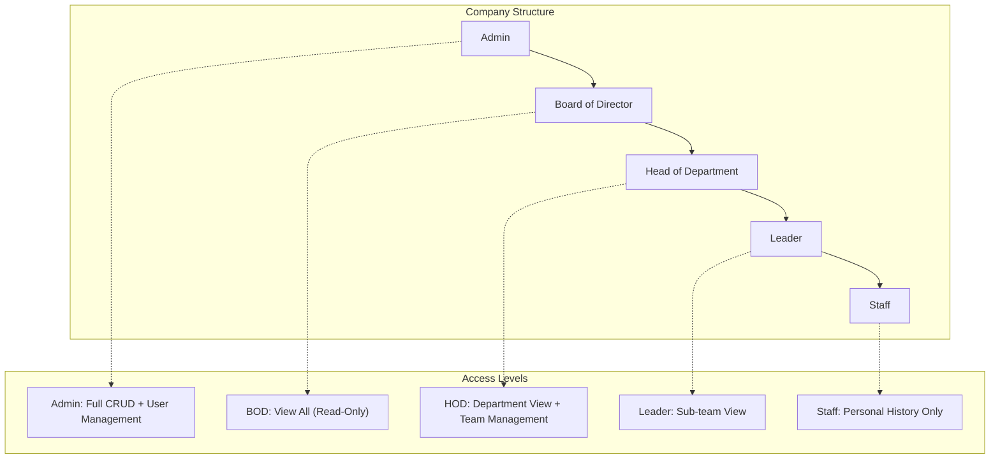
```mermaid
graph TB
    subgraph "Company Structure"
        A[Admin] --> B[Board of Director]
        B --> C[Head of Department]
        C --> D[Leader]
        D --> E[Staff]
    end
    
    subgraph "Access Levels"
        F["Admin: Full CRUD + User Management"]
        G["BOD: View All (Read-Only)"]
        H["HOD: Department View + Team Management"]
        I["Leader: Sub-team View"]
        J["Staff: Personal History Only"]
    end
    
    A -.-> F
    B -.-> G
    C -.-> H
    D -.-> I
    E -.-> J
```

### Permission Matrix

| Role | View All Data | View Department | View Sub-team | View Personal | Create PR | Void PR | User Management | Reports |
|------|---------------|-----------------|---------------|---------------|-----------|---------|-----------------|--------|
| Admin | ✅ | ✅ | ✅ | ✅ | ✅ | ✅ | ✅ | ✅ |
| BOD | ✅ | ✅ | ✅ | ✅ | ❌ | ❌ | ❌ | ✅ |
| HOD | ❌ | ✅ | ✅ | ✅ | ✅ | ✅* | ❌ | ✅* |
| Leader | ❌ | ❌ | ✅ | ✅ | ✅ | ✅* | ❌ | ❌ |
| Staff | ❌ | ❌ | ❌ | ✅ | ✅ | ✅* | ❌ | ❌ |

*Only for own/subordinate PRs

### Role Implementation

```php
// app/Models/User.php
class User extends Authenticatable
{
    protected $fillable = [
        'name', 'email', 'phone_number', 'department_id', 
        'position_id', 'supervisor_id', 'role', 'is_active'
    ];
    
    public function department()
    {
        return $this->belongsTo(Department::class);
    }
    
    public function position()
    {
        return $this->belongsTo(Position::class);
    }
    
    public function supervisor()
    {
        return $this->belongsTo(User::class, 'supervisor_id');
    }
    
    public function subordinates()
    {
        return $this->hasMany(User::class, 'supervisor_id');
    }
    
    public function getAllSubordinates()
    {
        $subordinates = collect();
        foreach ($this->subordinates as $subordinate) {
            $subordinates->push($subordinate);
            $subordinates = $subordinates->merge($subordinate->getAllSubordinates());
        }
        return $subordinates;
    }
    
    public function canViewPR($pr)
    {
        switch ($this->role) {
            case 'admin':
            case 'bod':
                return true;
                
            case 'hod':
                return $pr->department_id === $this->department_id;
                
            case 'leader':
                $subordinateIds = $this->getAllSubordinates()->pluck('id')->toArray();
                return $pr->user_id === $this->id || in_array($pr->user_id, $subordinateIds);
                
            case 'staff':
                return $pr->user_id === $this->id;
                
            default:
                return false;
        }
    }
    
    public function canVoidPR($pr)
    {
        if ($this->role === 'admin') {
            return true;
        }
        
        if ($this->role === 'bod') {
            return false;
        }
        
        // HOD, Leader, Staff can only void their own or subordinates' PRs
        return $this->canViewPR($pr) && ($pr->user_id === $this->id || $this->isSubordinate($pr->user_id));
    }
    
    public function isSubordinate($userId)
    {
        return $this->getAllSubordinates()->pluck('id')->contains($userId);
    }
}
```

### Position Model

```php
// app/Models/Position.php
class Position extends Model
{
    protected $fillable = [
        'department_id', 'name', 'code', 'level', 'hierarchy_level', 'is_active'
    ];
    
    public function department()
    {
        return $this->belongsTo(Department::class);
    }
    
    public function users()
    {
        return $this->hasMany(User::class);
    }
    
    public function isHigherThan(Position $position)
    {
        return $this->hierarchy_level > $position->hierarchy_level;
    }
}
```

### Access Control Middleware

```php
// app/Http/Middleware/RoleBasedAccess.php
class RoleBasedAccess
{
    public function handle($request, Closure $next, ...$roles)
    {
        if (!auth()->check()) {
            return redirect('/login');
        }
        
        $user = auth()->user();
        
        if (!in_array($user->role, $roles)) {
            abort(403, 'Unauthorized access');
        }
        
        return $next($request);
    }
}

// app/Http/Middleware/PRAccess.php
class PRAccess
{
    public function handle($request, Closure $next)
    {
        $prNumber = $request->route('number') ?? $request->input('pr_number');
        
        if ($prNumber) {
            $pr = PurchaseRequest::where('pr_number', $prNumber)->first();
            
            if ($pr && !auth()->user()->canViewPR($pr)) {
                abort(403, 'You do not have permission to access this PR');
            }
        }
        
        return $next($request);
    }
}
```

## PR Auto-Population Logic

### Header Fields Auto-Population

All PR header fields are automatically populated from the logged user's session and system data:

```php
// app/Http/Livewire/Modules/WNS/PRCreate.php
public function mount($prNumber = null)
{
    // Auto-populate from user session context
    $this->businessUnit = BusinessUnit::find(session('current_business_unit_id'));
    $this->department = auth()->user()->getCurrentBusinessUnit()->department;
    
    // All header fields are automatically set:
    // 1. Create By: auth()->user()->name
    // 2. Department: current user's department in selected BU context
    // 3. Request No: auto-generated when PR is created
    // 4. Date of Request: current system date
    
    $this->loadAvailableDepartments();
    $this->loadAvailableApprovers();
    
    if ($prNumber) {
        $this->loadExistingPR($prNumber);
    } else {
        $this->initializeNewPR();
    }
}

// Auto-population when generating PR number
public function generatePRNumber()
{
    // Get user context automatically
    $currentUser = auth()->user();
    $currentBU = $currentUser->getCurrentBusinessUnit();
    
    // All data pulled from session/user context:
    $prNumber = app(NumberingService::class)->generateNumber(
        'PR',
        $this->businessUnit->id,      // From session: current_business_unit_id
        $currentBU->department_id,    // From user's current department in BU
        $currentUser->id              // From authenticated user
    );
    
    // PR record created with auto-populated fields:
    // - user_id: from auth()->user()->id
    // - department_id: from user's current department
    // - business_unit_id: from session context
    // - request_date: from now()
    // - pr_number: auto-generated format
}
```

### Data Flow for Auto-Population

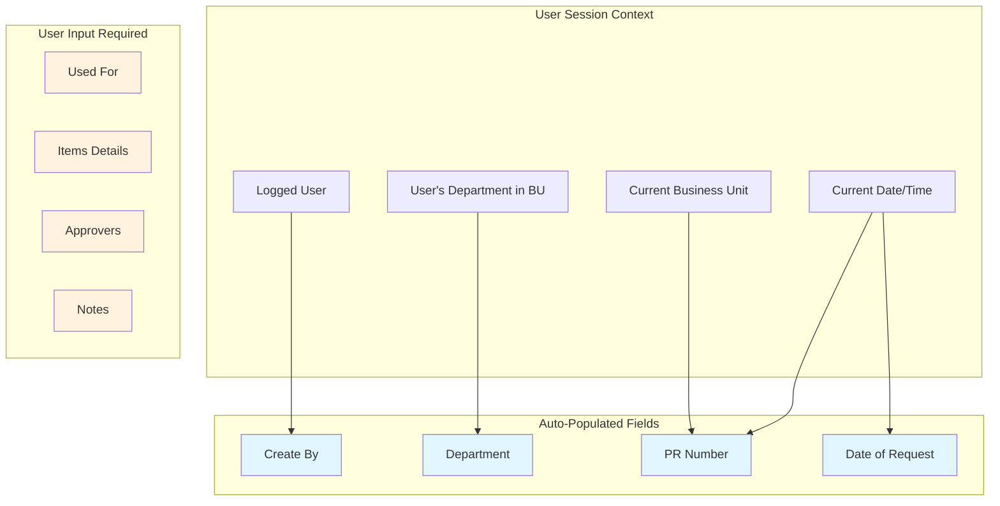
```mermaid
graph TB
    subgraph "User Session Context"
        A[Logged User]
        B[Current Business Unit]
        C[User's Department in BU]
        D[Current Date/Time]
    end
    
    subgraph "Auto-Populated Fields"
        E[Create By]
        F[Department]
        G[PR Number]
        H[Date of Request]
    end
    
    subgraph "User Input Required"
        I[Used For]
        J[Items Details]
        K[Approvers]
        L[Notes]
    end
    
    A --> E
    C --> F
    B --> G
    D --> G
    D --> H
    
    style E fill:#e1f5fe
    style F fill:#e1f5fe
    style G fill:#e1f5fe
    style H fill:#e1f5fe
    style I fill:#fff3e0
    style J fill:#fff3e0
    style K fill:#fff3e0
    style L fill:#fff3e0
```

### Template Display Logic

```php
// All header fields are read-only in template as they're auto-populated
// resources/views/modules/wns/pr-template.blade.php

// Create By: Pulled from PR relationship
{{ $pr->user->name }}

// Department: Pulled from PR relationship  
{{ $pr->department->name }}

// Request No: The generated PR number
{{ $pr->pr_number }}

// Date of Request: Set when PR was created
{{ $pr->request_date->format('d/m/Y') }}

// Used For: User input during creation
{{ $pr->used_for }}
```

### Validation and Business Rules

```php
// app/Models/Modules/WNS/PurchaseRequest.php
protected static function boot()
{
    parent::boot();
    
    static::creating(function ($pr) {
        // Ensure all auto-populated fields are set
        if (!$pr->user_id) {
            $pr->user_id = auth()->id();
        }
        
        if (!$pr->request_date) {
            $pr->request_date = now()->toDateString();
        }
        
        if (!$pr->department_id) {
            $currentBU = auth()->user()->getCurrentBusinessUnit();
            $pr->department_id = $currentBU->department_id;
        }
        
        if (!$pr->business_unit_id) {
            $pr->business_unit_id = session('current_business_unit_id');
        }
    });
}

public function getAutoPopulatedFields()
{
    return [
        'create_by' => $this->user->name,
        'department' => $this->department->name,
        'request_no' => $this->pr_number,
        'date_of_request' => $this->request_date->format('d/m/Y'),
        'business_unit' => $this->businessUnit->name
    ];
}
```

### Email Notification System

```php
// app/Mail/PRApprovalRequestMail.php
class PRApprovalRequestMail extends Mailable
{
    use Queueable, SerializesModels;
    
    public $purchaseRequest;
    public $approver;
    
    public function __construct(PurchaseRequest $purchaseRequest, User $approver)
    {
        $this->purchaseRequest = $purchaseRequest;
        $this->approver = $approver;
    }
    
    public function build()
    {
        return $this->subject('PR Approval Required: ' . $this->purchaseRequest->pr_number)
                    ->view('emails.pr-approval-request')
                    ->with([
                        'pr' => $this->purchaseRequest,
                        'approver' => $this->approver,
                        'approvalUrl' => route('wns.pr.approval', ['pr' => $this->purchaseRequest->pr_number])
                    ]);
    }
}

// app/Mail/PRRejectedMail.php
class PRRejectedMail extends Mailable
{
    public $purchaseRequest;
    public $rejectedBy;
    public $reason;
    
    public function __construct(PurchaseRequest $purchaseRequest, User $rejectedBy, string $reason)
    {
        $this->purchaseRequest = $purchaseRequest;
        $this->rejectedBy = $rejectedBy;
        $this->reason = $reason;
    }
    
    public function build()
    {
        return $this->subject('PR Rejected: ' . $this->purchaseRequest->pr_number)
                    ->view('emails.pr-rejected')
                    ->with([
                        'pr' => $this->purchaseRequest,
                        'rejectedBy' => $this->rejectedBy,
                        'reason' => $this->reason,
                        'editUrl' => route('wns.pr.edit', ['pr' => $this->purchaseRequest->pr_number])
                    ]);
    }
}

// app/Mail/PRApprovalResetMail.php
class PRApprovalResetMail extends Mailable
{
    public $purchaseRequest;
    public $approver;
    
    public function __construct(PurchaseRequest $purchaseRequest, User $approver)
    {
        $this->purchaseRequest = $purchaseRequest;
        $this->approver = $approver;
    }
    
    public function build()
    {
        return $this->subject('PR Approval Reset: ' . $this->purchaseRequest->pr_number)
                    ->view('emails.pr-approval-reset')
                    ->with([
                        'pr' => $this->purchaseRequest,
                        'approver' => $this->approver,
                        'approvalUrl' => route('wns.pr.approval', ['pr' => $this->purchaseRequest->pr_number])
                    ]);
    }
}

// app/Mail/PRApprovedMail.php
class PRApprovedMail extends Mailable
{
    public $purchaseRequest;
    
    public function __construct(PurchaseRequest $purchaseRequest)
    {
        $this->purchaseRequest = $purchaseRequest;
    }
    
    public function build()
    {
        return $this->subject('PR Approved: ' . $this->purchaseRequest->pr_number)
                    ->view('emails.pr-approved')
                    ->with([
                        'pr' => $this->purchaseRequest,
                        'viewUrl' => route('wns.pr.show', ['pr' => $this->purchaseRequest->pr_number])
                    ]);
    }
}
```

### Email Templates

```html
<!-- resources/views/emails/pr-approval-request.blade.php -->
<!DOCTYPE html>
<html>
<head>
    <meta charset="utf-8">
    <title>PR Approval Required</title>
    <style>
        body { font-family: Arial, sans-serif; line-height: 1.6; color: #333; }
        .container { max-width: 600px; margin: 0 auto; padding: 20px; }
        .header { background: #f8f9fa; padding: 20px; border-radius: 5px; margin-bottom: 20px; }
        .pr-details { background: #fff; border: 1px solid #ddd; padding: 15px; margin: 15px 0; }
        .button { display: inline-block; padding: 12px 24px; background: #007bff; color: white; text-decoration: none; border-radius: 5px; }
        .items-table { width: 100%; border-collapse: collapse; margin: 15px 0; }
        .items-table th, .items-table td { border: 1px solid #ddd; padding: 8px; text-align: left; }
        .items-table th { background: #f8f9fa; }
    </style>
</head>
<body>
    <div class="container">
        <div class="header">
            <h2>Purchase Request Approval Required</h2>
            <p>Dear {{ $approver->name }},</p>
            <p>A new purchase request requires your approval.</p>
        </div>
        
        <div class="pr-details">
            <h3>PR Details</h3>
            <table style="width: 100%;">
                <tr><td><strong>PR Number:</strong></td><td>{{ $pr->pr_number }}</td></tr>
                <tr><td><strong>Created By:</strong></td><td>{{ $pr->user->name }}</td></tr>
                <tr><td><strong>Department:</strong></td><td>{{ $pr->department->name }}</td></tr>
                <tr><td><strong>Date:</strong></td><td>{{ $pr->request_date->format('d/m/Y') }}</td></tr>
                <tr><td><strong>Used For:</strong></td><td>{{ $pr->used_for }}</td></tr>
                <tr><td><strong>Total Amount:</strong></td><td>{{ number_format($pr->total_amount, 2) }} {{ $pr->currency }}</td></tr>
            </table>
        </div>
        
        <div class="pr-details">
            <h3>Items Requested</h3>
            <table class="items-table">
                <thead>
                    <tr>
                        <th>Item Name</th>
                        <th>Qty</th>
                        <th>Unit Price</th>
                        <th>Total</th>
                    </tr>
                </thead>
                <tbody>
                    @foreach($pr->items as $item)
                    <tr>
                        <td>{{ $item->item_name }}</td>
                        <td>{{ $item->quantity }} {{ $item->unit }}</td>
                        <td>{{ number_format($item->unit_price, 2) }}</td>
                        <td>{{ number_format($item->total_price, 2) }}</td>
                    </tr>
                    @endforeach
                </tbody>
            </table>
        </div>
        
        <div style="text-align: center; margin: 30px 0;">
            <a href="{{ $approvalUrl }}" class="button">Review & Approve PR</a>
        </div>
        
        <p><small>Please review this PR and provide your approval or rejection with appropriate notes.</small></p>
        
        <hr>
        <p><small>This is an automated email from {{ config('app.name') }} Purchase Request System.</small></p>
    </div>
</body>
</html>
```

```html
<!-- resources/views/emails/pr-approval-reset.blade.php -->
<!DOCTYPE html>
<html>
<head>
    <meta charset="utf-8">
    <title>PR Approval Reset</title>
    <style>
        body { font-family: Arial, sans-serif; line-height: 1.6; color: #333; }
        .container { max-width: 600px; margin: 0 auto; padding: 20px; }
        .header { background: #fff3cd; padding: 20px; border-radius: 5px; margin-bottom: 20px; border-left: 4px solid #ffc107; }
        .pr-details { background: #fff; border: 1px solid #ddd; padding: 15px; margin: 15px 0; }
        .button { display: inline-block; padding: 12px 24px; background: #ffc107; color: #212529; text-decoration: none; border-radius: 5px; }
        .warning { background: #f8d7da; color: #721c24; padding: 10px; border-radius: 3px; margin: 10px 0; }
    </style>
</head>
<body>
    <div class="container">
        <div class="header">
            <h2>⚠️ PR Approval Reset Required</h2>
            <p>Dear {{ $approver->name }},</p>
            <p>The purchase request items have been modified by the creator. All previous approvals have been reset.</p>
        </div>
        
        <div class="warning">
            <strong>Important:</strong> This PR requires your approval again due to item modifications.
        </div>
        
        <div class="pr-details">
            <h3>PR Details</h3>
            <table style="width: 100%;">
                <tr><td><strong>PR Number:</strong></td><td>{{ $pr->pr_number }}</td></tr>
                <tr><td><strong>Created By:</strong></td><td>{{ $pr->user->name }}</td></tr>
                <tr><td><strong>Department:</strong></td><td>{{ $pr->department->name }}</td></tr>
                <tr><td><strong>Modified Date:</strong></td><td>{{ $pr->updated_at->format('d/m/Y H:i') }}</td></tr>
                <tr><td><strong>Used For:</strong></td><td>{{ $pr->used_for }}</td></tr>
                <tr><td><strong>New Total Amount:</strong></td><td>{{ number_format($pr->total_amount, 2) }} {{ $pr->currency }}</td></tr>
            </table>
        </div>
        
        <div style="text-align: center; margin: 30px 0;">
            <a href="{{ $approvalUrl }}" class="button">Review Modified PR</a>
        </div>
        
        <p><strong>What happened?</strong><br>
        The PR creator modified the items after the original submission. As per company policy, all approvals have been reset and the approval process will start from the beginning.</p>
        
        <p><small>Please review the modified PR and provide your approval or rejection.</small></p>
        
        <hr>
        <p><small>This is an automated email from {{ config('app.name') }} Purchase Request System.</small></p>
    </div>
</body>
</html>
```

### Currency Display (IDR Manual Input)

```php
// Currency handling - display only, user manual input
class PRItem extends Model
{
    protected $casts = [
        'quantity' => 'decimal:2',
        'unit_price' => 'decimal:2',
        'total_price' => 'decimal:2'
    ];
    
    // Display currency formatting
    public function getFormattedUnitPriceAttribute()
    {
        return $this->currency . ' ' . number_format($this->unit_price, 2);
    }
    
    public function getFormattedTotalPriceAttribute()
    {
        return $this->currency . ' ' . number_format($this->total_price, 2);
    }
    
    // Available currencies (display only, no conversion)
    public static function getAvailableCurrencies()
    {
        return [
            'IDR' => 'Indonesian Rupiah',
            'USD' => 'US Dollar',
            'EUR' => 'Euro',
            'SGD' => 'Singapore Dollar'
        ];
    }
}
```

## Action Flow & User Journey

### Complete System Action Flow

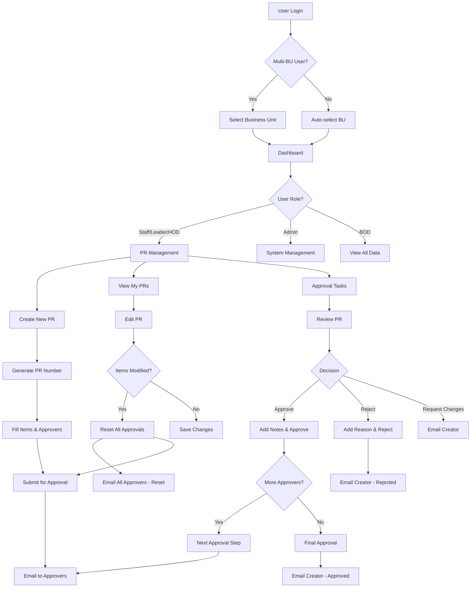
```mermaid
flowchart TD
    A[User Login] --> B{Multi-BU User?}
    B -->|Yes| C[Select Business Unit]
    B -->|No| D[Auto-select BU]
    C --> E[Dashboard]
    D --> E
    
    E --> F{User Role?}
    F -->|Staff/Leader/HOD| G[PR Management]
    F -->|Admin| H[System Management]
    F -->|BOD| I[View All Data]
    
    G --> J[Create New PR]
    G --> K[View My PRs]
    G --> L[Approval Tasks]
    
    J --> M[Generate PR Number]
    M --> N[Fill Items & Approvers]
    N --> O[Submit for Approval]
    O --> P[Email to Approvers]
    
    L --> Q[Review PR]
    Q --> R{Decision}
    R -->|Approve| S[Add Notes & Approve]
    R -->|Reject| T[Add Reason & Reject]
    R -->|Request Changes| U[Email Creator]
    
    S --> V{More Approvers?}
    V -->|Yes| W[Next Approval Step]
    V -->|No| X[Final Approval]
    
    T --> Y[Email Creator - Rejected]
    W --> P
    X --> Z[Email Creator - Approved]
    
    K --> AA[Edit PR]
    AA --> BB{Items Modified?}
    BB -->|Yes| CC[Reset All Approvals]
    BB -->|No| DD[Save Changes]
    CC --> EE[Email All Approvers - Reset]
    CC --> O
```

### 1. User Authentication & Business Unit Selection Flow

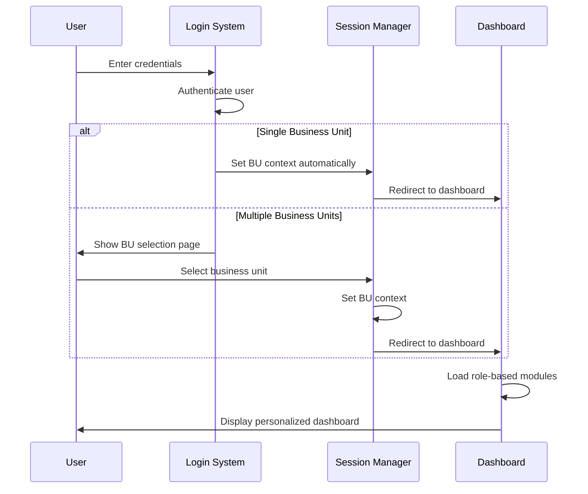
```mermaid
sequenceDiagram
    participant U as User
    participant L as Login System
    participant S as Session Manager
    participant D as Dashboard
    
    U->>L: Enter credentials
    L->>L: Authenticate user
    
    alt Single Business Unit
        L->>S: Set BU context automatically
        S->>D: Redirect to dashboard
    else Multiple Business Units
        L->>U: Show BU selection page
        U->>S: Select business unit
        S->>S: Set BU context
        S->>D: Redirect to dashboard
    end
    
    D->>D: Load role-based modules
    D->>U: Display personalized dashboard
```

### 2. PR Creation Action Flow

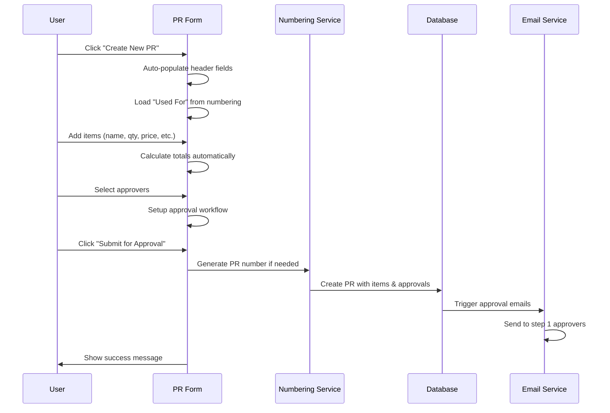
```mermaid
sequenceDiagram
    participant U as User
    participant F as PR Form
    participant N as Numbering Service
    participant D as Database
    participant E as Email Service
    
    U->>F: Click "Create New PR"
    F->>F: Auto-populate header fields
    F->>F: Load "Used For" from numbering
    
    U->>F: Add items (name, qty, price, etc.)
    F->>F: Calculate totals automatically
    
    U->>F: Select approvers
    F->>F: Setup approval workflow
    
    U->>F: Click "Submit for Approval"
    F->>N: Generate PR number if needed
    N->>D: Create PR with items & approvals
    
    D->>E: Trigger approval emails
    E->>E: Send to step 1 approvers
    F->>U: Show success message
```

### 3. Approval Process Action Flow

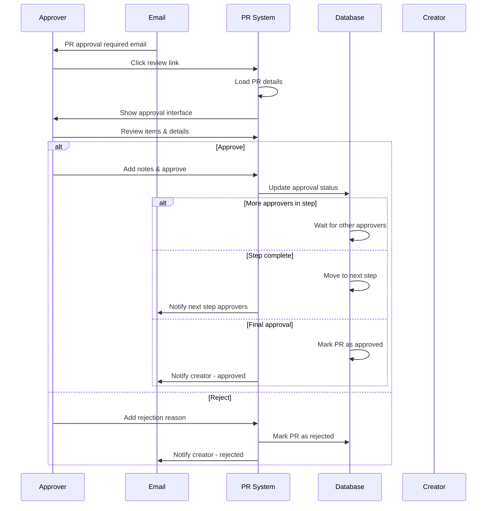
```mermaid
sequenceDiagram
    participant A as Approver
    participant E as Email
    participant P as PR System
    participant D as Database
    participant C as Creator
    
    E->>A: PR approval required email
    A->>P: Click review link
    P->>P: Load PR details
    P->>A: Show approval interface
    
    A->>P: Review items & details
    
    alt Approve
        A->>P: Add notes & approve
        P->>D: Update approval status
        
        alt More approvers in step
            D->>D: Wait for other approvers
        else Step complete
            D->>D: Move to next step
            P->>E: Notify next step approvers
        else Final approval
            D->>D: Mark PR as approved
            P->>E: Notify creator - approved
        end
        
    else Reject
        A->>P: Add rejection reason
        P->>D: Mark PR as rejected
        P->>E: Notify creator - rejected
        
    end
```

### 4. PR Modification Action Flow

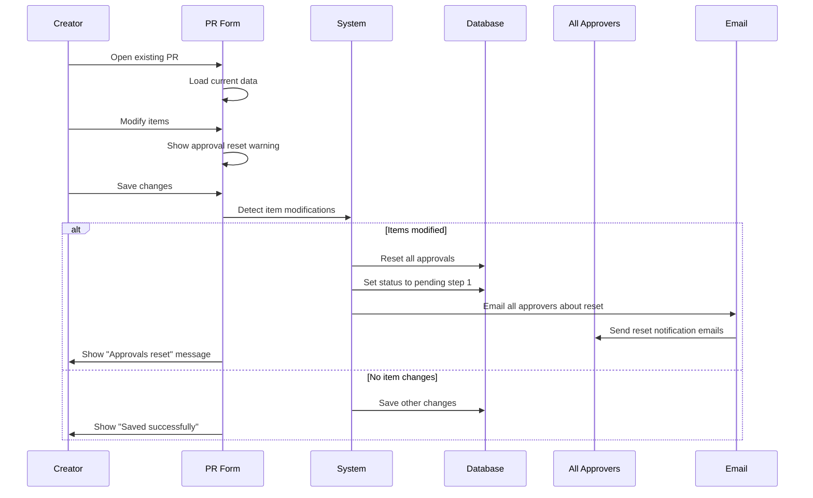
```mermaid
sequenceDiagram
    participant U as Creator
    participant F as PR Form
    participant S as System
    participant D as Database
    participant A as All Approvers
    participant E as Email
    
    U->>F: Open existing PR
    F->>F: Load current data
    
    U->>F: Modify items
    F->>F: Show approval reset warning
    
    U->>F: Save changes
    F->>S: Detect item modifications
    
    alt Items modified
        S->>D: Reset all approvals
        S->>D: Set status to pending step 1
        S->>E: Email all approvers about reset
        E->>A: Send reset notification emails
        F->>U: Show "Approvals reset" message
    else No item changes
        S->>D: Save other changes
        F->>U: Show "Saved successfully"
    end
```

### 5. Business Unit Switching Action Flow

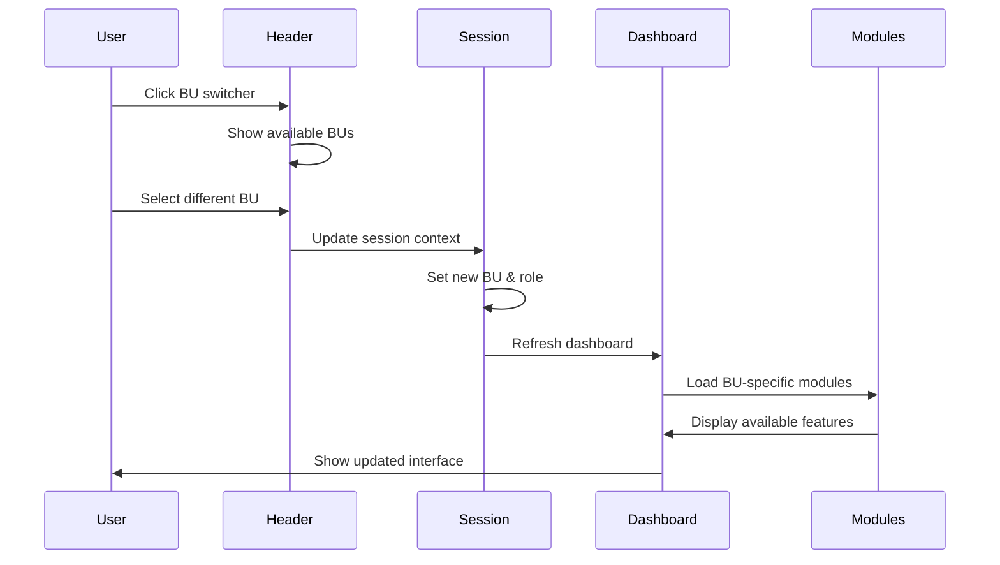
```mermaid
sequenceDiagram
    participant U as User
    participant H as Header
    participant S as Session
    participant D as Dashboard
    participant M as Modules
    
    U->>H: Click BU switcher
    H->>H: Show available BUs
    
    U->>H: Select different BU
    H->>S: Update session context
    S->>S: Set new BU & role
    
    S->>D: Refresh dashboard
    D->>M: Load BU-specific modules
    M->>D: Display available features
    D->>U: Show updated interface
```

### 6. Number Voiding & Resequencing Flow

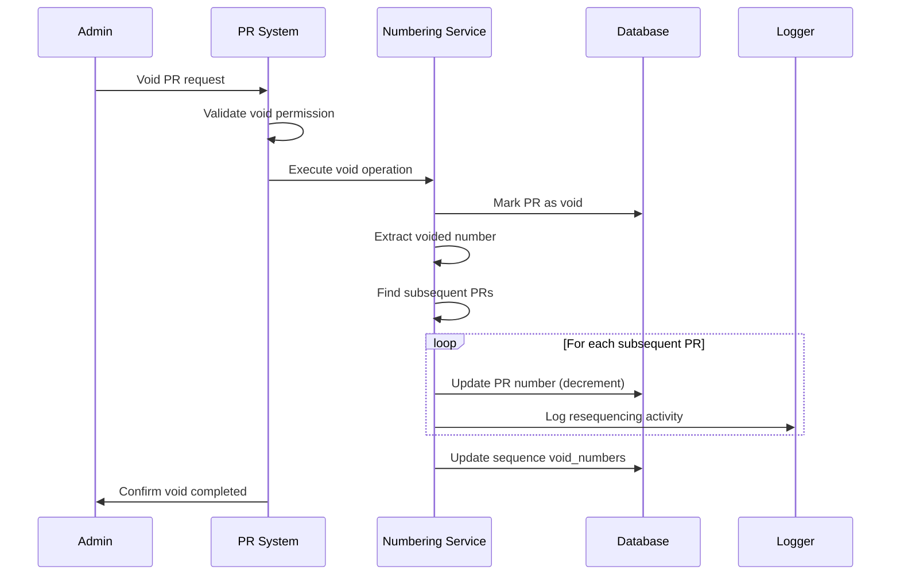
```mermaid
sequenceDiagram
    participant A as Admin
    participant P as PR System
    participant N as Numbering Service
    participant D as Database
    participant L as Logger
    
    A->>P: Void PR request
    P->>P: Validate void permission
    
    P->>N: Execute void operation
    N->>D: Mark PR as void
    N->>N: Extract voided number
    
    N->>N: Find subsequent PRs
    loop For each subsequent PR
        N->>D: Update PR number (decrement)
        N->>L: Log resequencing activity
    end
    
    N->>D: Update sequence void_numbers
    P->>A: Confirm void completed
```

### 7. Real-time Notification Flow

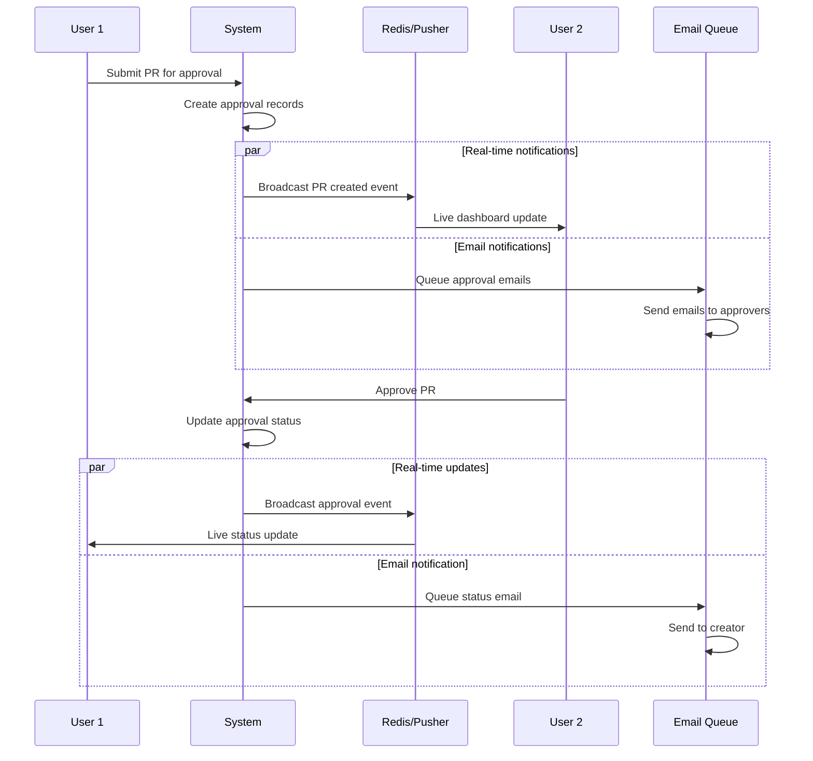
```mermaid
sequenceDiagram
    participant U1 as User 1
    participant S as System
    participant R as Redis/Pusher
    participant U2 as User 2
    participant E as Email Queue
    
    U1->>S: Submit PR for approval
    S->>S: Create approval records
    
    par Real-time notifications
        S->>R: Broadcast PR created event
        R->>U2: Live dashboard update
    and Email notifications
        S->>E: Queue approval emails
        E->>E: Send emails to approvers
    end
    
    U2->>S: Approve PR
    S->>S: Update approval status
    
    par Real-time updates
        S->>R: Broadcast approval event
        R->>U1: Live status update
    and Email notification
        S->>E: Queue status email
        E->>E: Send to creator
    end
```

### 8. Error Handling & Recovery Flow

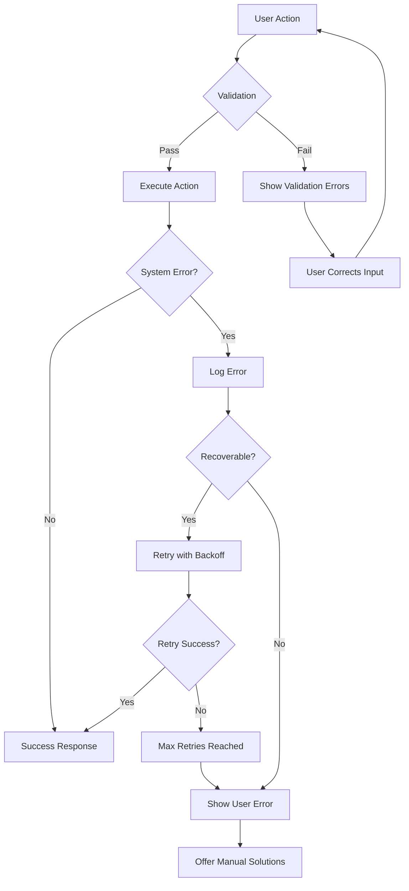
```mermaid
flowchart TD
    A[User Action] --> B{Validation}
    B -->|Pass| C[Execute Action]
    B -->|Fail| D[Show Validation Errors]
    
    C --> E{System Error?}
    E -->|No| F[Success Response]
    E -->|Yes| G[Log Error]
    
    G --> H{Recoverable?}
    H -->|Yes| I[Retry with Backoff]
    H -->|No| J[Show User Error]
    
    I --> K{Retry Success?}
    K -->|Yes| F
    K -->|No| L[Max Retries Reached]
    L --> J
    
    J --> M[Offer Manual Solutions]
    D --> N[User Corrects Input]
    N --> A
```

### 9. Role-Based Action Permissions

| Action | Super Admin | Admin | BOD | HOD | Leader | Staff |
|--------|-------------|-------|-----|-----|--------|-------|
| **User Management** |
| Create Users | ✅ | ✅ | ❌ | ❌ | ❌ | ❌ |
| Edit Users | ✅ | ✅ | ❌ | ❌ | ❌ | ❌ |
| Assign BU Roles | ✅ | ✅ | ❌ | ❌ | ❌ | ❌ |
| **PR Management** |
| Create PR | ✅ | ✅ | ❌ | ✅ | ✅ | ✅ |
| Edit Own PR | ✅ | ✅ | ❌ | ✅ | ✅ | ✅ |
| Edit Any PR | ✅ | ✅ | ❌ | ❌ | ❌ | ❌ |
| Void PR | ✅ | ✅ | ❌ | ✅* | ✅* | ✅* |
| **Approval Actions** |
| Approve PRs | ✅ | ✅ | ✅ | ✅ | ✅ | ❌ |
| Setup Approvers | ✅ | ✅ | ❌ | ✅ | ✅ | ✅ |
| **Viewing Rights** |
| View All PRs | ✅ | ✅ | ✅ | ❌ | ❌ | ❌ |
| View Dept PRs | ✅ | ✅ | ✅ | ✅ | ❌ | ❌ |
| View Team PRs | ✅ | ✅ | ✅ | ✅ | ✅ | ❌ |
| View Own PRs | ✅ | ✅ | ✅ | ✅ | ✅ | ✅ |
| **System Actions** |
| Manage BUs | ✅ | ❌ | ❌ | ❌ | ❌ | ❌ |
| System Reports | ✅ | ✅ | ✅ | ❌ | ❌ | ❌ |
| Number Resequence | ✅ | ✅ | ❌ | ❌ | ❌ | ❌ |

*Only for own/subordinate PRs

### 10. State Transition Diagram

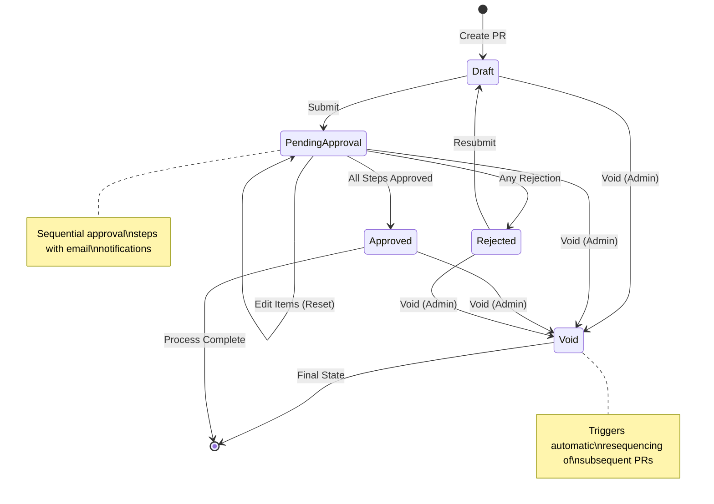
```mermaid
stateDiagram-v2
    [*] --> Draft : Create PR
    Draft --> PendingApproval : Submit
    Draft --> Void : Void (Admin)
    
    PendingApproval --> Approved : All Steps Approved
    PendingApproval --> Rejected : Any Rejection
    PendingApproval --> PendingApproval : Edit Items (Reset)
    PendingApproval --> Void : Void (Admin)
    
    Approved --> Void : Void (Admin)
    Rejected --> Draft : Resubmit
    Rejected --> Void : Void (Admin)
    
    Void --> [*] : Final State
    Approved --> [*] : Process Complete
    
    note right of PendingApproval : Sequential approval\nsteps with email\nnotifications
    
    note right of Void : Triggers automatic\nresequencing of\nsubsequent PRs
```

### Core Numbering Service Architecture

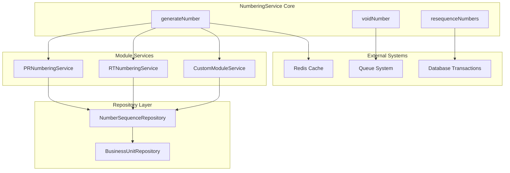
```mermaid
graph TB
    subgraph "NumberingService Core"
        A[generateNumber]
        B[voidNumber]
        C[resequenceNumbers]
    end
    
    subgraph "Module Services"
        D[PRNumberingService]
        E[RTNumberingService]
        F[CustomModuleService]
    end
    
    subgraph "Repository Layer"
        G[NumberSequenceRepository]
        H[BusinessUnitRepository]
    end
    
    subgraph "External Systems"
        I[Redis Cache]
        J[Queue System]
        K[Database Transactions]
    end
    
    A --> D
    A --> E
    A --> F
    D --> G
    E --> G
    F --> G
    G --> H
    A --> I
    B --> J
    C --> K
```

### NumberingService Implementation

```php
// app/Services/NumberingService.php
interface NumberingServiceInterface
{
    public function generateNumber(string $moduleCode, int $businessUnitId, int $departmentId, int $userId): string;
    public function voidNumber(string $number, string $moduleCode): bool;
    public function resequenceModule(string $moduleCode, int $businessUnitId, int $departmentId, int $year, int $month): void;
}

class NumberingService implements NumberingServiceInterface
{
    private $cache;
    private $repository;
    private $moduleServices = [];
    
    public function generateNumber(string $moduleCode, int $businessUnitId, int $departmentId, int $userId): string
    {
        return DB::transaction(function () use ($moduleCode, $businessUnitId, $departmentId, $userId) {
            // Lock sequence for concurrent access
            $lockKey = "numbering:$businessUnitId:$moduleCode:$departmentId:" . date('Y:m');
            
            return Cache::lock($lockKey, 10)->block(5, function () use ($moduleCode, $businessUnitId, $departmentId, $userId) {
                $moduleService = $this->getModuleService($moduleCode, $businessUnitId);
                return $moduleService->generateNumber($businessUnitId, $departmentId, $userId);
            });
        });
    }
    
    public function voidNumber(string $number, string $moduleCode): bool
    {
        return DB::transaction(function () use ($number, $moduleCode) {
            $moduleService = $this->getModuleService($moduleCode);
            $result = $moduleService->voidNumber($number);
            
            if ($result) {
                // Queue resequencing job
                ResequenceNumbers::dispatch($moduleCode, $number);
            }
            
            return $result;
        });
    }
}
```

### WNS PR Numbering Service

```php
// app/Services/Modules/WNS/PRNumberingService.php
class PRNumberingService implements ModuleNumberingInterface
{
    public function generateNumber(int $businessUnitId, int $departmentId, int $userId): string
    {
        $year = date('Y');
        $month = date('m');
        
        // Get or create sequence
        $sequence = $this->getOrCreateSequence($businessUnitId, $departmentId, $year, $month);
        
        // Check for void numbers to reuse
        $voidNumbers = $sequence->void_numbers ?? [];
        
        if (!empty($voidNumbers)) {
            $nextNumber = min($voidNumbers);
            $sequence->void_numbers = array_values(array_diff($voidNumbers, [$nextNumber]));
        } else {
            $nextNumber = $sequence->current_number + 1;
            $sequence->current_number = $nextNumber;
            $sequence->max_number = max($sequence->max_number, $nextNumber);
        }
        
        $sequence->save();
        
        // Generate formatted number: PR.GA/2025/07/080
        $department = Department::find($departmentId);
        $formattedNumber = sprintf(
            'PR.%s/%04d/%02d/%03d',
            $department->code,
            $year,
            $month,
            $nextNumber
        );
        
        // Create PR record
        PurchaseRequest::create([
            'pr_number' => $formattedNumber,
            'business_unit_id' => $businessUnitId,
            'department_id' => $departmentId,
            'user_id' => $userId,
            'sequence_id' => $sequence->id,
            'status' => 'active'
        ]);
        
        // Broadcast real-time event
        broadcast(new PRNumberGenerated($formattedNumber, $businessUnitId, $departmentId));
        
        return $formattedNumber;
    }
    
    public function voidNumber(string $prNumber): bool
    {
        $pr = PurchaseRequest::where('pr_number', $prNumber)->first();
        
        if (!$pr || $pr->status === 'void') {
            return false;
        }
        
        DB::transaction(function () use ($pr) {
            $pr->update([
                'status' => 'void',
                'void_at' => now()
            ]);
            
            // Automatic resequencing - get number from voided PR
            $sequence = $pr->sequence;
            $voidedNumber = $this->extractNumberFromPR($pr->pr_number);
            
            // Add to void numbers for reuse
            $voidNumbers = $sequence->void_numbers ?? [];
            $voidNumbers[] = $voidedNumber;
            sort($voidNumbers);
            $sequence->void_numbers = $voidNumbers;
            $sequence->save();
            
            // Automatic resequencing for subsequent PRs
            $this->resequenceSubsequentPRs($pr);
        });
        
        return true;
    }
    
    private function resequenceSubsequentPRs(PurchaseRequest $voidedPR)
    {
        $voidedNumber = $this->extractNumberFromPR($voidedPR->pr_number);
        $year = $voidedPR->request_date->year;
        $month = $voidedPR->request_date->month;
        
        // Get all PRs after the voided one in same department/year/month
        $subsequentPRs = PurchaseRequest::where('business_unit_id', $voidedPR->business_unit_id)
            ->where('department_id', $voidedPR->department_id)
            ->whereYear('request_date', $year)
            ->whereMonth('request_date', $month)
            ->where('status', '!=', 'void')
            ->get()
            ->filter(function ($pr) use ($voidedNumber) {
                $prNumber = $this->extractNumberFromPR($pr->pr_number);
                return $prNumber > $voidedNumber;
            })
            ->sortBy(function ($pr) {
                return $this->extractNumberFromPR($pr->pr_number);
            });
        
        // Resequence all subsequent PRs
        $newSequenceNumber = $voidedNumber;
        foreach ($subsequentPRs as $pr) {
            $department = $pr->department;
            $oldPRNumber = $pr->pr_number;
            
            // Generate new PR number with decremented sequence
            $newPRNumber = sprintf(
                'PR.%s/%04d/%02d/%03d',
                $department->code,
                $year,
                $month,
                $newSequenceNumber
            );
            
            // Update PR number
            $pr->update(['pr_number' => $newPRNumber]);
            
            // Log resequencing activity
            activity('pr_resequenced')
                ->performedOn($pr)
                ->withProperties([
                    'old_pr_number' => $oldPRNumber,
                    'new_pr_number' => $newPRNumber,
                    'reason' => 'Automatic resequencing due to voided PR'
                ])
                ->log('PR number resequenced');
            
            $newSequenceNumber++;
        }
    }
    
### Database Seeders

```php
// database/seeders/BusinessUnitSeeder.php
class BusinessUnitSeeder extends Seeder
{
    public function run()
    {
        $businessUnits = [
            ['code' => 'WNS', 'name' => 'Werkudara Nirwana Sakti'],
            ['code' => 'UT', 'name' => 'Utama Kalpana'],
            ['code' => 'MRP', 'name' => 'Maharaja Pratama'],
            ['code' => 'WNN', 'name' => 'Werkudara Nirwana Nadi'],
        ];
        
        foreach ($businessUnits as $unit) {
            BusinessUnit::create($unit);
        }
    }
}

// database/seeders/DepartmentSeeder.php
class DepartmentSeeder extends Seeder
{
    public function run()
    {
        $wns = BusinessUnit::where('code', 'WNS')->first();
        
        $departments = [
            ['code' => 'GA', 'name' => 'General Affairs'],
            ['code' => 'IT', 'name' => 'Information Technology'],
            ['code' => 'HR', 'name' => 'Human Resources'],
            ['code' => 'FIN', 'name' => 'Finance'],
            ['code' => 'OPS', 'name' => 'Operations'],
        ];
        
        foreach ($departments as $dept) {
            Department::create([
                'business_unit_id' => $wns->id,
                'code' => $dept['code'],
                'name' => $dept['name']
            ]);
        }
    }
}

// database/seeders/PositionSeeder.php
class PositionSeeder extends Seeder
{
    public function run()
    {
        $departments = Department::all();
        
        foreach ($departments as $department) {
            $positions = [
                [
                    'name' => 'Head of ' . $department->name,
                    'code' => 'HOD_' . $department->code,
                    'level' => 'hod',
                    'hierarchy_level' => 3
                ],
                [
                    'name' => 'Team Leader ' . $department->code,
                    'code' => 'TL_' . $department->code,
                    'level' => 'leader', 
                    'hierarchy_level' => 2
                ],
                [
                    'name' => 'Senior Staff ' . $department->code,
                    'code' => 'SS_' . $department->code,
                    'level' => 'staff',
                    'hierarchy_level' => 1
                ],
                [
                    'name' => 'Junior Staff ' . $department->code,
                    'code' => 'JS_' . $department->code,
                    'level' => 'staff',
                    'hierarchy_level' => 1
                ]
            ];
            
            foreach ($positions as $position) {
                Position::create([
                    'department_id' => $department->id,
                    'name' => $position['name'],
                    'code' => $position['code'],
                    'level' => $position['level'],
                    'hierarchy_level' => $position['hierarchy_level']
                ]);
            }
        }
    }
}

// database/seeders/UserSeeder.php
class UserSeeder extends Seeder
{
    public function run()
    {
        // Create Super Admin
        $superAdmin = User::create([
            'name' => 'Super Administrator',
            'email' => 'superadmin@company.com',
            'phone_number' => '+62812345678901',
            'primary_department_id' => Department::where('code', 'GA')->first()->id,
            'primary_position_id' => Position::where('code', 'HOD_GA')->first()->id,
            'global_role' => 'super_admin',
            'password' => Hash::make('password'),
            'email_verified_at' => now()
        ]);
        
        // Assign super admin to all business units as admin
        $businessUnits = BusinessUnit::all();
        foreach ($businessUnits as $bu) {
            $gaDept = Department::where('business_unit_id', $bu->id)->where('code', 'GA')->first();
            if ($gaDept) {
                UserBusinessUnit::create([
                    'user_id' => $superAdmin->id,
                    'business_unit_id' => $bu->id,
                    'department_id' => $gaDept->id,
                    'position_id' => Position::where('department_id', $gaDept->id)->where('level', 'hod')->first()->id,
                    'role' => 'admin',
                    'is_primary' => $bu->code === 'WNS',
                    'is_active' => true
                ]);
            }
        }
        
        // Create WNS users
        $wns = BusinessUnit::where('code', 'WNS')->first();
        $this->createBusinessUnitUsers($wns);
        
        // Create UT users
        $ut = BusinessUnit::where('code', 'UT')->first();
        $this->createBusinessUnitUsers($ut);
        
        // Create cross-business unit user
        $this->createCrossBusinessUnitUser();
    }
    
    private function createBusinessUnitUsers($businessUnit)
    {
        $gaDept = Department::where('business_unit_id', $businessUnit->id)->where('code', 'GA')->first();
        $itDept = Department::where('business_unit_id', $businessUnit->id)->where('code', 'IT')->first();
        
        // Create BOD
        $bod = User::create([
            'name' => 'Board of Director ' . $businessUnit->code,
            'email' => 'bod@' . strtolower($businessUnit->code) . '.com',
            'phone_number' => '+6281234567890' . $businessUnit->id,
            'primary_department_id' => $gaDept->id,
            'primary_position_id' => Position::where('department_id', $gaDept->id)->where('level', 'hod')->first()->id,
            'global_role' => 'user',
            'password' => Hash::make('password'),
            'email_verified_at' => now()
        ]);
        
        UserBusinessUnit::create([
            'user_id' => $bod->id,
            'business_unit_id' => $businessUnit->id,
            'department_id' => $gaDept->id,
            'position_id' => Position::where('department_id', $gaDept->id)->where('level', 'hod')->first()->id,
            'role' => 'bod',
            'is_primary' => true,
            'is_active' => true
        ]);
        
        // Create HOD for GA
        $hodGA = User::create([
            'name' => 'Head of GA ' . $businessUnit->code,
            'email' => 'hod.ga@' . strtolower($businessUnit->code) . '.com',
            'phone_number' => '+6281234567891' . $businessUnit->id,
            'primary_department_id' => $gaDept->id,
            'primary_position_id' => Position::where('department_id', $gaDept->id)->where('level', 'hod')->first()->id,
            'global_role' => 'user',
            'password' => Hash::make('password'),
            'email_verified_at' => now()
        ]);
        
        UserBusinessUnit::create([
            'user_id' => $hodGA->id,
            'business_unit_id' => $businessUnit->id,
            'department_id' => $gaDept->id,
            'position_id' => Position::where('department_id', $gaDept->id)->where('level', 'hod')->first()->id,
            'role' => 'hod',
            'is_primary' => true,
            'is_active' => true
        ]);
        
        // Create Leader under HOD
        $leaderGA = User::create([
            'name' => 'Team Leader GA ' . $businessUnit->code,
            'email' => 'leader.ga@' . strtolower($businessUnit->code) . '.com',
            'phone_number' => '+6281234567892' . $businessUnit->id,
            'primary_department_id' => $gaDept->id,
            'primary_position_id' => Position::where('department_id', $gaDept->id)->where('level', 'leader')->first()->id,
            'supervisor_id' => $hodGA->id,
            'global_role' => 'user',
            'password' => Hash::make('password'),
            'email_verified_at' => now()
        ]);
        
        UserBusinessUnit::create([
            'user_id' => $leaderGA->id,
            'business_unit_id' => $businessUnit->id,
            'department_id' => $gaDept->id,
            'position_id' => Position::where('department_id', $gaDept->id)->where('level', 'leader')->first()->id,
            'role' => 'leader',
            'is_primary' => true,
            'is_active' => true
        ]);
        
        // Create Staff under Leader
        $staffGA = User::create([
            'name' => 'Staff GA ' . $businessUnit->code,
            'email' => 'staff.ga@' . strtolower($businessUnit->code) . '.com',
            'phone_number' => '+6281234567893' . $businessUnit->id,
            'primary_department_id' => $gaDept->id,
            'primary_position_id' => Position::where('department_id', $gaDept->id)->where('level', 'staff')->first()->id,
            'supervisor_id' => $leaderGA->id,
            'global_role' => 'user',
            'password' => Hash::make('password'),
            'email_verified_at' => now()
        ]);
        
        UserBusinessUnit::create([
            'user_id' => $staffGA->id,
            'business_unit_id' => $businessUnit->id,
            'department_id' => $gaDept->id,
            'position_id' => Position::where('department_id', $gaDept->id)->where('level', 'staff')->first()->id,
            'role' => 'staff',
            'is_primary' => true,
            'is_active' => true
        ]);
        
        // Create IT Staff
        if ($itDept) {
            $staffIT = User::create([
                'name' => 'Staff IT ' . $businessUnit->code,
                'email' => 'staff.it@' . strtolower($businessUnit->code) . '.com',
                'phone_number' => '+6281234567894' . $businessUnit->id,
                'primary_department_id' => $itDept->id,
                'primary_position_id' => Position::where('department_id', $itDept->id)->where('level', 'staff')->first()->id,
                'global_role' => 'user',
                'password' => Hash::make('password'),
                'email_verified_at' => now()
            ]);
            
            UserBusinessUnit::create([
                'user_id' => $staffIT->id,
                'business_unit_id' => $businessUnit->id,
                'department_id' => $itDept->id,
                'position_id' => Position::where('department_id', $itDept->id)->where('level', 'staff')->first()->id,
                'role' => 'staff',
                'is_primary' => true,
                'is_active' => true
            ]);
        }
    }
    
    private function createCrossBusinessUnitUser()
    {
        // Create user assigned to multiple business units
        $wns = BusinessUnit::where('code', 'WNS')->first();
        $ut = BusinessUnit::where('code', 'UT')->first();
        
        $crossUser = User::create([
            'name' => 'Cross BU Manager',
            'email' => 'cross.manager@company.com',
            'phone_number' => '+62812345678999',
            'primary_department_id' => Department::where('business_unit_id', $wns->id)->where('code', 'GA')->first()->id,
            'primary_position_id' => Position::where('department_id', Department::where('business_unit_id', $wns->id)->where('code', 'GA')->first()->id)->where('level', 'hod')->first()->id,
            'global_role' => 'user',
            'password' => Hash::make('password'),
            'email_verified_at' => now()
        ]);
        
        // Assign to WNS as HOD
        UserBusinessUnit::create([
            'user_id' => $crossUser->id,
            'business_unit_id' => $wns->id,
            'department_id' => Department::where('business_unit_id', $wns->id)->where('code', 'GA')->first()->id,
            'position_id' => Position::where('department_id', Department::where('business_unit_id', $wns->id)->where('code', 'GA')->first()->id)->where('level', 'hod')->first()->id,
            'role' => 'hod',
            'is_primary' => true,
            'is_active' => true
        ]);
        
        // Assign to UT as Leader
        UserBusinessUnit::create([
            'user_id' => $crossUser->id,
            'business_unit_id' => $ut->id,
            'department_id' => Department::where('business_unit_id', $ut->id)->where('code', 'GA')->first()->id,
            'position_id' => Position::where('department_id', Department::where('business_unit_id', $ut->id)->where('code', 'GA')->first()->id)->where('level', 'leader')->first()->id,
            'role' => 'leader',
            'is_primary' => false,
            'is_active' => true
        ]);
    }
}
```

## Component Architecture

### Livewire Component Hierarchy

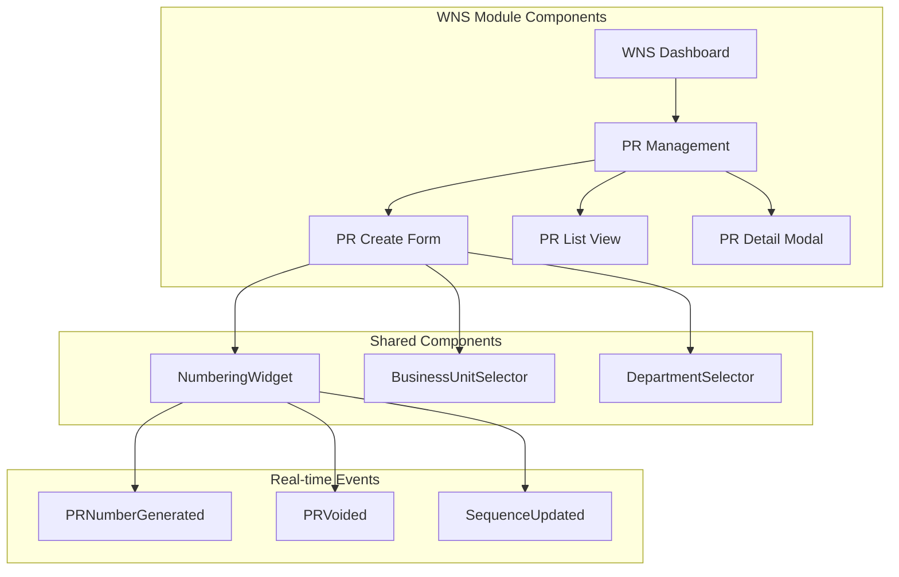
```mermaid
graph TB
    subgraph "WNS Module Components"
        A[WNS Dashboard]
        B[PR Management]
        C[PR Create Form]
        D[PR List View]
        E[PR Detail Modal]
    end
    
    subgraph "Shared Components"
        F[NumberingWidget]
        G[BusinessUnitSelector]
        H[DepartmentSelector]
    end
    
    subgraph "Real-time Events"
        I[PRNumberGenerated]
        J[PRVoided]
        K[SequenceUpdated]
    end
    
    A --> B
    B --> C
    B --> D
    B --> E
    C --> F
    C --> G
    C --> H
    
    F --> I
    F --> J
    F --> K
```

### PR Create Component

```php
// app/Http/Livewire/Modules/WNS/PRCreate.php
class PRCreate extends Component
{
    public $businessUnit;
    public $department;
    public $prNumber;
    public $usedFor = '';
    public $notes = '';
    public $items = [];
    public $approvers = [];
    public $availableDepartments = [];
    public $availableApprovers = [];
    public $isGenerating = false;
    public $pr;
    
    public $showApproverModal = false;
    public $selectedApproverStep = 1;
    
    protected $listeners = [
        'refreshNumbers' => '$refresh',
        'prNumberGenerated' => 'handleNewPRNumber'
    ];
    
    protected $rules = [
        // Used For is pulled from numbering data - no validation needed
        'items.*.item_name' => 'required|string|max:255',
        'items.*.quantity' => 'required|numeric|min:0.01',
        'items.*.unit' => 'required|string|max:50',
        'items.*.unit_price' => 'required|numeric|min:0',
        'items.*.expense_department_id' => 'required|exists:departments,id',
        'approvers.*.approver_id' => 'required|exists:users,id',
        'approvers.*.approval_step' => 'required|integer|min:1'
    ];
    
    public function mount($prNumber = null)
    {
        $this->businessUnit = BusinessUnit::find(session('current_business_unit_id'));
        $this->department = auth()->user()->getCurrentBusinessUnit()->department;
        $this->loadAvailableDepartments();
        $this->loadAvailableApprovers();
        
        if ($prNumber) {
            $this->loadExistingPR($prNumber);
        } else {
            $this->initializeNewPR();
        }
    }
    
    public function loadExistingPR($prNumber)
    {
        $this->pr = PurchaseRequest::where('pr_number', $prNumber)
            ->with(['items', 'approvals.approver'])
            ->first();
            
        if (!$this->pr || !$this->pr->canBeEditedBy(auth()->user())) {
            abort(403, 'You cannot edit this PR');
        }
        
        $this->prNumber = $this->pr->pr_number;
        // Used For is pulled from existing PR numbering data - readonly
        $this->usedFor = $this->pr->used_for; // Already filled during numbering
        $this->notes = $this->pr->notes;
        
        // Load items
        $this->items = $this->pr->items->map(function($item) {
            return [
                'id' => $item->id,
                'item_number' => $item->item_number,
                'item_name' => $item->item_name,
                'brand_name' => $item->brand_name,
                'expense_department_id' => $item->expense_department_id,
                'item_description' => $item->item_description,
                'supplier_name' => $item->supplier_name,
                'quantity' => $item->quantity,
                'unit' => $item->unit,
                'unit_price' => $item->unit_price,
                'currency' => $item->currency,
                'total_price' => $item->total_price
            ];
        })->toArray();
        
        // Load approvers
        $this->approvers = $this->pr->approvals->map(function($approval) {
            return [
                'id' => $approval->id,
                'approver_id' => $approval->approver_id,
                'approver_name' => $approval->approver->name,
                'approval_step' => $approval->approval_step
            ];
        })->toArray();
    }
    
    public function initializeNewPR()
    {
        $this->addItem();
    }
    
    public function generatePRNumber()
    {
        if ($this->pr) {
            return; // Already has PR number
        }
        
        $this->isGenerating = true;
        
        try {
            $this->prNumber = app(NumberingService::class)->generateNumber(
                'PR',
                $this->businessUnit->id,
                $this->department->id,
                auth()->id()
            );
            
            $this->pr = PurchaseRequest::where('pr_number', $this->prNumber)->first();
            
            // All header fields are auto-populated from user session and system
            // - Create By: from auth()->user()->name
            // - Department: from current user's department in current BU context
            // - Request No: generated PR number
            // - Date of Request: current date
            
            $this->emit('prGenerated', $this->prNumber);
            session()->flash('message', 'PR Number generated: ' . $this->prNumber);
            
        } catch (\Exception $e) {
            $this->addError('generation', 'Failed to generate PR number: ' . $e->getMessage());
        } finally {
            $this->isGenerating = false;
        }
    }
    
    public function addItem()
    {
        $this->items[] = [
            'item_number' => count($this->items) + 1,
            'item_name' => '',
            'brand_name' => '',
            'expense_department_id' => $this->department->id,
            'item_description' => '',
            'supplier_name' => '',
            'quantity' => 1,
            'unit' => 'pcs',
            'unit_price' => 0,
            'currency' => 'IDR',
            'total_price' => 0
        ];
    }
    
    public function removeItem($index)
    {
        if (count($this->items) > 1) {
            // If removing existing item, delete from database
            if (isset($this->items[$index]['id'])) {
                PRItem::find($this->items[$index]['id'])->delete();
            }
            
            unset($this->items[$index]);
            $this->items = array_values($this->items);
            $this->reorderItems();
        }
    }
    
    public function reorderItems()
    {
        foreach ($this->items as $index => &$item) {
            $item['item_number'] = $index + 1;
        }
    }
    
    public function updatedItems($value, $key)
    {
        // Calculate total price when quantity or unit_price changes
        if (str_contains($key, 'quantity') || str_contains($key, 'unit_price')) {
            $index = (int) explode('.', $key)[0];
            $this->items[$index]['total_price'] = $this->items[$index]['quantity'] * $this->items[$index]['unit_price'];
        }
    }
    
    public function openApproverModal($step = null)
    {
        $this->selectedApproverStep = $step ?? (count($this->approvers) + 1);
        $this->showApproverModal = true;
    }
    
    public function addApprover($approverId)
    {
        $approver = User::find($approverId);
        
        if ($approver) {
            $existingIndex = collect($this->approvers)->search(function($item) use ($approverId) {
                return $item['approver_id'] == $approverId;
            });
            
            if ($existingIndex === false) {
                $this->approvers[] = [
                    'approver_id' => $approverId,
                    'approver_name' => $approver->name,
                    'approval_step' => $this->selectedApproverStep
                ];
            }
        }
        
        $this->showApproverModal = false;
    }
    
    public function removeApprover($index)
    {
        if (isset($this->approvers[$index]['id'])) {
            PRApproval::find($this->approvers[$index]['id'])->delete();
        }
        
        unset($this->approvers[$index]);
        $this->approvers = array_values($this->approvers);
    }
    
    public function saveDraft()
    {
        $this->validate();
        
        if (!$this->pr) {
            $this->generatePRNumber();
        }
        
        // Check if items were modified after approval submission
        $itemsModified = $this->checkIfItemsModified();
        
        $this->pr->update([
            'notes' => $this->notes
            // Used For cannot be updated after initial creation
        ]);
        
        $this->saveItems();
        $this->saveApprovers();
        
        // Reset approval workflow if items were modified
        if ($itemsModified && $this->pr->status !== 'draft') {
            $this->pr->resetApprovalWorkflow();
            session()->flash('warning', 'Items were modified. All approvals have been reset and will need to be re-approved.');
        } else {
            session()->flash('message', 'PR saved successfully.');
        }
    }
    
    public function submitForApproval()
    {
        $this->validate();
        
        if (!$this->pr) {
            $this->generatePRNumber();
        }
        
        if (empty($this->approvers)) {
            $this->addError('approvers', 'At least one approver is required.');
            return;
        }
        
        // Check if items were modified
        $itemsModified = $this->checkIfItemsModified();
        
        $this->pr->update([
            'notes' => $this->notes
        ]);
        
        $this->saveItems();
        $this->saveApprovers();
        
        try {
            if ($itemsModified && $this->pr->status !== 'draft') {
                // Reset and resubmit
                $this->pr->resetApprovalWorkflow();
                session()->flash('message', 'PR items were modified. Approval workflow has been reset and resubmitted.');
            } else {
                // Normal submission
                $this->pr->submitForApproval();
                session()->flash('message', 'PR submitted for approval successfully.');
            }
            
            return redirect()->route('wns.pr.index');
            
        } catch (\Exception $e) {
            $this->addError('submission', 'Failed to submit PR: ' . $e->getMessage());
        }
    }
    
    private function checkIfItemsModified()
    {
        if (!$this->pr || $this->pr->status === 'draft') {
            return false;
        }
        
        $currentItems = $this->pr->items()->orderBy('item_number')->get();
        $formItems = collect($this->items)->sortBy('item_number');
        
        // Check if number of items changed
        if ($currentItems->count() !== $formItems->count()) {
            return true;
        }
        
        // Check if any item details changed
        foreach ($currentItems as $index => $currentItem) {
            $formItem = $formItems->values()->get($index);
            
            if (!$formItem) continue;
            
            $fieldsToCheck = [
                'item_name', 'brand_name', 'expense_department_id',
                'item_description', 'supplier_name', 'quantity',
                'unit', 'unit_price', 'currency'
            ];
            
            foreach ($fieldsToCheck as $field) {
                if ($currentItem->$field != $formItem[$field]) {
                    return true;
                }
            }
        }
        
        return false;
    }
    
    private function saveItems()
    {
        // Delete removed items
        $keepIds = collect($this->items)->pluck('id')->filter();
        $this->pr->items()->whereNotIn('id', $keepIds)->delete();
        
        foreach ($this->items as $itemData) {
            if (isset($itemData['id'])) {
                // Update existing item
                PRItem::find($itemData['id'])->update($itemData);
            } else {
                // Create new item
                $this->pr->items()->create($itemData);
            }
        }
    }
    
    private function saveApprovers()
    {
        // Delete removed approvers
        $keepIds = collect($this->approvers)->pluck('id')->filter();
        $this->pr->approvals()->whereNotIn('id', $keepIds)->delete();
        
        foreach ($this->approvers as $approverData) {
            if (!isset($approverData['id'])) {
                // Create new approval
                $this->pr->approvals()->create([
                    'approver_id' => $approverData['approver_id'],
                    'approval_step' => $approverData['approval_step'],
                    'status' => 'pending'
                ]);
            }
        }
    }
    
    private function loadAvailableDepartments()
    {
        $this->availableDepartments = Department::where('business_unit_id', $this->businessUnit->id)
            ->where('is_active', true)
            ->get();
    }
    
    private function loadAvailableApprovers()
    {
        $currentUser = auth()->user();
        $currentBU = $currentUser->getCurrentBusinessUnit();
        
        // Get potential approvers based on current user's role and hierarchy
        switch ($currentBU->role) {
            case 'staff':
                // Staff can request approval from leaders and above
                $this->availableApprovers = User::join('user_business_units', 'users.id', '=', 'user_business_units.user_id')
                    ->where('user_business_units.business_unit_id', $this->businessUnit->id)
                    ->whereIn('user_business_units.role', ['leader', 'hod', 'admin'])
                    ->where('user_business_units.is_active', true)
                    ->select('users.*')
                    ->get();
                break;
                
            case 'leader':
                // Leaders can request approval from HODs and above
                $this->availableApprovers = User::join('user_business_units', 'users.id', '=', 'user_business_units.user_id')
                    ->where('user_business_units.business_unit_id', $this->businessUnit->id)
                    ->whereIn('user_business_units.role', ['hod', 'admin'])
                    ->where('user_business_units.is_active', true)
                    ->select('users.*')
                    ->get();
                break;
                
            default:
                // HOD and above can request approval from any admin or BOD
                $this->availableApprovers = User::join('user_business_units', 'users.id', '=', 'user_business_units.user_id')
                    ->where('user_business_units.business_unit_id', $this->businessUnit->id)
                    ->whereIn('user_business_units.role', ['admin', 'bod'])
                    ->where('user_business_units.is_active', true)
                    ->select('users.*')
                    ->get();
                break;
        }
    }
    
    public function getTotalAmountProperty()
    {
        return collect($this->items)->sum('total_price');
    }
    
    public function render()
    {
        return view('livewire.modules.wns.pr-create');
    }
}
```

### PR Approval Component

```php
// app/Http/Livewire/Modules/WNS/PRApproval.php
class PRApproval extends Component
{
    public $pendingApprovals = [];
    public $approvedPRs = [];
    public $rejectedPRs = [];
    public $activeTab = 'pending';
    
    public $selectedPR;
    public $showApprovalModal = false;
    public $approvalNotes = '';
    public $rejectionReason = '';
    
    protected $listeners = [
        'refreshApprovals' => 'loadApprovals'
    ];
    
    public function mount()
    {
        $this->loadApprovals();
    }
    
    public function loadApprovals()
    {
        $user = auth()->user();
        $buId = session('current_business_unit_id');
        
        // Load pending approvals for current user
        $this->pendingApprovals = PurchaseRequest::with(['user', 'department', 'items'])
            ->where('business_unit_id', $buId)
            ->where('status', 'pending_approval')
            ->whereHas('currentApprovers', function($query) use ($user) {
                $query->where('approver_id', $user->id)
                      ->where('status', 'pending');
            })
            ->orderBy('created_at', 'desc')
            ->get();
            
        // Load approved PRs by current user
        $this->approvedPRs = PurchaseRequest::with(['user', 'department', 'items'])
            ->where('business_unit_id', $buId)
            ->whereHas('approvalHistory', function($query) use ($user) {
                $query->where('approver_id', $user->id)
                      ->where('action', 'approved');
            })
            ->orderBy('updated_at', 'desc')
            ->limit(20)
            ->get();
            
        // Load rejected PRs by current user
        $this->rejectedPRs = PurchaseRequest::with(['user', 'department', 'items'])
            ->where('business_unit_id', $buId)
            ->whereHas('approvalHistory', function($query) use ($user) {
                $query->where('approver_id', $user->id)
                      ->where('action', 'rejected');
            })
            ->orderBy('updated_at', 'desc')
            ->limit(20)
            ->get();
    }
    
    public function setActiveTab($tab)
    {
        $this->activeTab = $tab;
    }
    
    public function openApprovalModal($prId)
    {
        $this->selectedPR = PurchaseRequest::with(['user', 'department', 'items.expenseDepartment', 'approvals.approver'])
            ->find($prId);
            
        if (!$this->selectedPR->canBeApprovedBy(auth()->user())) {
            session()->flash('error', 'You are not authorized to approve this PR.');
            return;
        }
        
        $this->showApprovalModal = true;
        $this->approvalNotes = '';
        $this->rejectionReason = '';
    }
    
    public function closeApprovalModal()
    {
        $this->showApprovalModal = false;
        $this->selectedPR = null;
        $this->approvalNotes = '';
        $this->rejectionReason = '';
    }
    
    public function approvePR()
    {
        if (!$this->selectedPR) {
            return;
        }
        
        try {
            $this->selectedPR->approve(auth()->user(), $this->approvalNotes);
            
            session()->flash('message', 'PR ' . $this->selectedPR->pr_number . ' approved successfully.');
            $this->closeApprovalModal();
            $this->loadApprovals();
            
        } catch (\Exception $e) {
            $this->addError('approval', 'Failed to approve PR: ' . $e->getMessage());
        }
    }
    
    public function rejectPR()
    {
        if (!$this->selectedPR || empty($this->rejectionReason)) {
            $this->addError('rejection', 'Rejection reason is required.');
            return;
        }
        
        try {
            $this->selectedPR->reject(auth()->user(), $this->rejectionReason);
            
            session()->flash('message', 'PR ' . $this->selectedPR->pr_number . ' rejected.');
            $this->closeApprovalModal();
            $this->loadApprovals();
            
        } catch (\Exception $e) {
            $this->addError('rejection', 'Failed to reject PR: ' . $e->getMessage());
        }
    }
    
    public function render()
    {
        return view('livewire.modules.wns.pr-approval');
    }
}
```

### PR Template Views

```html
<!-- resources/views/livewire/modules/wns/pr-create.blade.php -->
<div class="max-w-7xl mx-auto py-6 px-4 sm:px-6 lg:px-8">
    <!-- Header -->
    <div class="bg-white shadow rounded-lg mb-6">
        <div class="px-6 py-4 border-b border-gray-200">
            <h2 class="text-xl font-semibold text-gray-900">
                {{ $pr ? 'Edit Purchase Request' : 'Create New Purchase Request' }}
            </h2>
        </div>
        
        <!-- PR Form Header - Landscape Layout -->
        <div class="p-6">
            <div class="grid grid-cols-1 lg:grid-cols-2 gap-6 mb-6">
                <!-- Left Side -->
                <div class="space-y-4">
                    <div class="grid grid-cols-2 gap-4">
                        <div>
                            <label class="block text-sm font-medium text-gray-700">Create By</label>
                            <input type="text" value="{{ auth()->user()->name }}" 
                                   class="mt-1 block w-full rounded-md border-gray-300 bg-gray-100" readonly>
                            <p class="text-xs text-gray-500 mt-1">Auto-filled from logged user</p>
                        </div>
                        <div>
                            <label class="block text-sm font-medium text-gray-700">Department</label>
                            <input type="text" value="{{ $department->name }}" 
                                   class="mt-1 block w-full rounded-md border-gray-300 bg-gray-100" readonly>
                            <p class="text-xs text-gray-500 mt-1">Auto-filled from user's current department</p>
                        </div>
                    </div>
                    
                    <div class="grid grid-cols-2 gap-4">
                        <div>
                            <label class="block text-sm font-medium text-gray-700">Request No</label>
                            <input type="text" value="{{ $prNumber ?? 'Will be auto-generated' }}" 
                                   class="mt-1 block w-full rounded-md border-gray-300 bg-gray-100" readonly>
                            <p class="text-xs text-gray-500 mt-1">Auto-generated when creating PR</p>
                        </div>
                        <div>
                            <label class="block text-sm font-medium text-gray-700">Date of Request</label>
                            <input type="date" value="{{ $pr?->request_date ?? now()->toDateString() }}" 
                                   class="mt-1 block w-full rounded-md border-gray-300 bg-gray-100" readonly>
                            <p class="text-xs text-gray-500 mt-1">Auto-filled with current date</p>
                        </div>
                    </div>
                </div>
                
                <!-- Right Side -->
                <div class="flex items-center justify-center">
                    <div class="text-center">
                        @if($prNumber)
                            <div class="text-3xl font-bold text-blue-600 border-2 border-blue-600 rounded-lg p-4">
                                PR NUMBER:<br>
                                <span class="text-4xl">{{ $prNumber }}</span>
                            </div>
                        @else
                            <button wire:click="generatePRNumber" 
                                    wire:loading.attr="disabled"
                                    class="bg-blue-600 text-white px-6 py-3 rounded-lg font-semibold hover:bg-blue-700 transition-colors">
                                <span wire:loading.remove wire:target="generatePRNumber">Generate PR Number</span>
                                <span wire:loading wire:target="generatePRNumber">
                                    <i class="fas fa-spinner fa-spin"></i> Generating...
                                </span>
                            </button>
                        @endif
                    </div>
                </div>
            </div>
            
            <!-- Used For Field - Pulled from existing PR numbering data -->
            <div class="mb-6">
                <label class="block text-sm font-medium text-gray-700 mb-2">Used For</label>
                <textarea wire:model="usedFor" 
                          rows="3" 
                          class="w-full rounded-md border-gray-300 bg-gray-100 shadow-sm" 
                          readonly></textarea>
                <p class="text-xs text-gray-500 mt-1">This field is pulled from the PR numbering data and cannot be modified.</p>
            </div>
        </div>
    </div>
    
    <!-- Items Section -->
    <div class="bg-white shadow rounded-lg mb-6">
        <div class="px-6 py-4 border-b border-gray-200 flex justify-between items-center">
            <h3 class="text-lg font-medium text-gray-900">Items</h3>
            <button wire:click="addItem" 
                    class="bg-green-600 text-white px-4 py-2 rounded-md hover:bg-green-700 transition-colors">
                <i class="fas fa-plus mr-2"></i>Add Item
            </button>
        </div>
        
        <div class="p-6">
            <div class="overflow-x-auto">
                <table class="min-w-full divide-y divide-gray-200">
                    <thead class="bg-gray-50">
                        <tr>
                            <th class="px-3 py-3 text-left text-xs font-medium text-gray-500 uppercase tracking-wider">No</th>
                            <th class="px-3 py-3 text-left text-xs font-medium text-gray-500 uppercase tracking-wider">Item Name *</th>
                            <th class="px-3 py-3 text-left text-xs font-medium text-gray-500 uppercase tracking-wider">Brand Name</th>
                            <th class="px-3 py-3 text-left text-xs font-medium text-gray-500 uppercase tracking-wider">Expense Dept *</th>
                            <th class="px-3 py-3 text-left text-xs font-medium text-gray-500 uppercase tracking-wider">Description</th>
                            <th class="px-3 py-3 text-left text-xs font-medium text-gray-500 uppercase tracking-wider">Supplier</th>
                            <th class="px-3 py-3 text-left text-xs font-medium text-gray-500 uppercase tracking-wider">Qty *</th>
                            <th class="px-3 py-3 text-left text-xs font-medium text-gray-500 uppercase tracking-wider">Unit *</th>
                            <th class="px-3 py-3 text-left text-xs font-medium text-gray-500 uppercase tracking-wider">Unit Price *</th>
                            <th class="px-3 py-3 text-left text-xs font-medium text-gray-500 uppercase tracking-wider">Currency</th>
                            <th class="px-3 py-3 text-left text-xs font-medium text-gray-500 uppercase tracking-wider">Total Price</th>
                            <th class="px-3 py-3 text-left text-xs font-medium text-gray-500 uppercase tracking-wider">Action</th>
                        </tr>
                    </thead>
                    <tbody class="bg-white divide-y divide-gray-200">
                        @foreach($items as $index => $item)
                        <tr>
                            <td class="px-3 py-2 text-sm">{{ $index + 1 }}</td>
                            <td class="px-3 py-2">
                                <input type="text" wire:model="items.{{ $index }}.item_name" 
                                       class="w-full text-sm rounded border-gray-300">
                                @error("items.{$index}.item_name") <span class="text-red-500 text-xs">{{ $message }}</span> @enderror
                            </td>
                            <td class="px-3 py-2">
                                <input type="text" wire:model="items.{{ $index }}.brand_name" 
                                       class="w-full text-sm rounded border-gray-300">
                            </td>
                            <td class="px-3 py-2">
                                <select wire:model="items.{{ $index }}.expense_department_id" 
                                        class="w-full text-sm rounded border-gray-300">
                                    <option value="">Select Dept</option>
                                    @foreach($availableDepartments as $dept)
                                    <option value="{{ $dept->id }}">{{ $dept->code }}</option>
                                    @endforeach
                                </select>
                            </td>
                            <td class="px-3 py-2">
                                <textarea wire:model="items.{{ $index }}.item_description" 
                                          rows="2" class="w-full text-sm rounded border-gray-300"></textarea>
                            </td>
                            <td class="px-3 py-2">
                                <input type="text" wire:model="items.{{ $index }}.supplier_name" 
                                       class="w-full text-sm rounded border-gray-300">
                            </td>
                            <td class="px-3 py-2">
                                <input type="number" wire:model="items.{{ $index }}.quantity" 
                                       step="0.01" min="0.01" class="w-20 text-sm rounded border-gray-300">
                            </td>
                            <td class="px-3 py-2">
                                <input type="text" wire:model="items.{{ $index }}.unit" 
                                       class="w-20 text-sm rounded border-gray-300">
                            </td>
                            <td class="px-3 py-2">
                                <input type="number" wire:model="items.{{ $index }}.unit_price" 
                                       step="0.01" min="0" class="w-24 text-sm rounded border-gray-300">
                            </td>
                            <td class="px-3 py-2">
                                <select wire:model="items.{{ $index }}.currency" 
                                        class="w-20 text-sm rounded border-gray-300">
                                    <option value="IDR">IDR</option>
                                    <option value="USD">USD</option>
                                    <option value="EUR">EUR</option>
                                </select>
                            </td>
                            <td class="px-3 py-2 text-sm font-medium">
                                {{ number_format($item['total_price'], 2) }}
                            </td>
                            <td class="px-3 py-2">
                                @if(count($items) > 1)
                                <button wire:click="removeItem({{ $index }})" 
                                        class="text-red-600 hover:text-red-800">
                                    <i class="fas fa-trash"></i>
                                </button>
                                @endif
                            </td>
                        </tr>
                        @endforeach
                    </tbody>
                    <tfoot>
                        <tr class="bg-gray-50">
                            <td colspan="10" class="px-3 py-2 text-right font-medium">Total Amount:</td>
                            <td class="px-3 py-2 font-bold text-lg">{{ number_format($this->totalAmount, 2) }}</td>
                            <td></td>
                        </tr>
                    </tfoot>
                </table>
            </div>
        </div>
    </div>
    
    <!-- Approvers Section -->
    <div class="bg-white shadow rounded-lg mb-6">
        <div class="px-6 py-4 border-b border-gray-200 flex justify-between items-center">
            <h3 class="text-lg font-medium text-gray-900">Approval Workflow</h3>
            <button wire:click="openApproverModal" 
                    class="bg-blue-600 text-white px-4 py-2 rounded-md hover:bg-blue-700 transition-colors">
                <i class="fas fa-user-plus mr-2"></i>Add Approver
            </button>
        </div>
        
        <div class="p-6">
            @if(count($approvers) > 0)
            <div class="space-y-3">
                @foreach($approvers as $index => $approver)
                <div class="flex items-center justify-between p-3 bg-gray-50 rounded-lg">
                    <div class="flex items-center space-x-3">
                        <span class="bg-blue-100 text-blue-800 px-2 py-1 rounded-full text-xs font-medium">
                            Step {{ $approver['approval_step'] }}
                        </span>
                        <span class="font-medium">{{ $approver['approver_name'] }}</span>
                    </div>
                    <button wire:click="removeApprover({{ $index }})" 
                            class="text-red-600 hover:text-red-800">
                        <i class="fas fa-times"></i>
                    </button>
                </div>
                @endforeach
            </div>
            @else
            <p class="text-gray-500 text-center py-4">No approvers added yet. Add approvers to submit for approval.</p>
            @endif
        </div>
    </div>
    
    <!-- Notes Section -->
    <div class="bg-white shadow rounded-lg mb-6">
        <div class="px-6 py-4 border-b border-gray-200">
            <h3 class="text-lg font-medium text-gray-900">Additional Notes</h3>
        </div>
        <div class="p-6">
            <textarea wire:model="notes" 
                      rows="3" 
                      class="w-full rounded-md border-gray-300 shadow-sm focus:border-blue-500 focus:ring-blue-500"
                      placeholder="Any additional notes or comments..."></textarea>
        </div>
    </div>
    
    <!-- Action Buttons -->
    <div class="flex justify-end space-x-4">
        <a href="{{ route('wns.pr.index') }}" 
           class="bg-gray-300 text-gray-700 px-6 py-2 rounded-md hover:bg-gray-400 transition-colors">
            Cancel
        </a>
        
        @if($prNumber)
        @if($pr && $pr->status !== 'draft')
        <div class="bg-yellow-50 border border-yellow-200 rounded-md p-4 mb-4">
            <div class="flex">
                <div class="flex-shrink-0">
                    <i class="fas fa-exclamation-triangle text-yellow-400"></i>
                </div>
                <div class="ml-3">
                    <h3 class="text-sm font-medium text-yellow-800">
                        Approval Reset Warning
                    </h3>
                    <div class="mt-2 text-sm text-yellow-700">
                        <p>Modifying items will reset all approvals and restart the approval process from step 1.</p>
                    </div>
                </div>
            </div>
        </div>
        @endif
        
        <button wire:click="saveDraft" 
                class="bg-yellow-600 text-white px-6 py-2 rounded-md hover:bg-yellow-700 transition-colors">
            <i class="fas fa-save mr-2"></i>Save Changes
        </button>
        
        <button wire:click="submitForApproval" 
                wire:loading.attr="disabled"
                class="bg-green-600 text-white px-6 py-2 rounded-md hover:bg-green-700 transition-colors">
            <span wire:loading.remove wire:target="submitForApproval">
                <i class="fas fa-paper-plane mr-2"></i>
                @if($pr && $pr->status !== 'draft')
                    Reset & Resubmit for Approval
                @else
                    Submit for Approval
                @endif
            </span>
            <span wire:loading wire:target="submitForApproval">
                <i class="fas fa-spinner fa-spin mr-2"></i>Processing...
            </span>
        </button>
        @endif
    </div>
    
    <!-- Approver Selection Modal -->
    @if($showApproverModal)
    <div class="fixed inset-0 bg-gray-600 bg-opacity-50 overflow-y-auto h-full w-full z-50">
        <div class="relative top-20 mx-auto p-5 border w-96 shadow-lg rounded-md bg-white">
            <div class="mt-3">
                <h3 class="text-lg font-medium text-gray-900 mb-4">Select Approver for Step {{ $selectedApproverStep }}</h3>
                <div class="space-y-2 max-h-60 overflow-y-auto">
                    @foreach($availableApprovers as $approver)
                    <button wire:click="addApprover({{ $approver->id }})" 
                            class="w-full text-left p-3 rounded border hover:bg-gray-50 transition-colors">
                        <div class="font-medium">{{ $approver->name }}</div>
                        <div class="text-sm text-gray-500">{{ $approver->email }}</div>
                    </button>
                    @endforeach
                </div>
                <div class="flex justify-end space-x-2 mt-4">
                    <button wire:click="$set('showApproverModal', false)" 
                            class="bg-gray-300 text-gray-700 px-4 py-2 rounded hover:bg-gray-400">
                        Cancel
                    </button>
                </div>
            </div>
        </div>
    </div>
    @endif
</div>
```

### PR Display/Print Template

```html
<!-- resources/views/modules/wns/pr-template.blade.php -->
<!-- Landscape PR Template for Display/Print -->
<div class="bg-white p-8 max-w-7xl mx-auto" style="min-height: 210mm; width: 297mm;">
    <!-- Header Section -->
    <div class="border-2 border-black p-4 mb-6">
        <div class="grid grid-cols-2 gap-8">
            <!-- Left Side Information -->
            <div class="space-y-3">
                <div class="grid grid-cols-2 gap-4">
                    <div>
                        <label class="block text-sm font-bold text-gray-900">Create By:</label>
                        <div class="border-b border-gray-400 pb-1 min-h-[24px]">{{ $pr->user->name }}</div>
                    </div>
                    <div>
                        <label class="block text-sm font-bold text-gray-900">Department:</label>
                        <div class="border-b border-gray-400 pb-1 min-h-[24px]">{{ $pr->department->name }}</div>
                    </div>
                </div>
                
                <div class="grid grid-cols-2 gap-4">
                    <div>
                        <label class="block text-sm font-bold text-gray-900">Request No:</label>
                        <div class="border-b border-gray-400 pb-1 min-h-[24px]">{{ $pr->pr_number }}</div>
                    </div>
                    <div>
                        <label class="block text-sm font-bold text-gray-900">Date of Request:</label>
                        <div class="border-b border-gray-400 pb-1 min-h-[24px]">{{ $pr->request_date->format('d/m/Y') }}</div>
                    </div>
                </div>
            </div>
            
            <!-- Right Side - PR Number -->
            <div class="flex items-center justify-center">
                <div class="text-center border-4 border-blue-600 rounded-lg p-6">
                    <div class="text-lg font-bold text-blue-600">PR NUMBER:</div>
                    <div class="text-3xl font-bold text-blue-800 mt-2">{{ $pr->pr_number }}</div>
                </div>
            </div>
        </div>
        
        <!-- Used For Section - Filled by User During Creation -->
        <div class="mt-6">
            <label class="block text-sm font-bold text-gray-900 mb-2">Used For:</label>
            <div class="border border-gray-400 p-3 min-h-[80px] bg-gray-50">
                {{ $pr->used_for }}
            </div>
        </div>
    </div>
    
    <!-- Items Table -->
    <div class="mb-6">
        <table class="w-full border-2 border-black">
            <thead>
                <tr class="bg-gray-100">
                    <th class="border border-black px-2 py-2 text-xs font-bold text-center" style="width: 5%">No.</th>
                    <th class="border border-black px-2 py-2 text-xs font-bold text-center" style="width: 15%">Item Name</th>
                    <th class="border border-black px-2 py-2 text-xs font-bold text-center" style="width: 10%">Brand Name</th>
                    <th class="border border-black px-2 py-2 text-xs font-bold text-center" style="width: 8%">Expense Dept</th>
                    <th class="border border-black px-2 py-2 text-xs font-bold text-center" style="width: 15%">Item Description</th>
                    <th class="border border-black px-2 py-2 text-xs font-bold text-center" style="width: 12%">Supplier Name</th>
                    <th class="border border-black px-2 py-2 text-xs font-bold text-center" style="width: 6%">Qty</th>
                    <th class="border border-black px-2 py-2 text-xs font-bold text-center" style="width: 6%">Unit</th>
                    <th class="border border-black px-2 py-2 text-xs font-bold text-center" style="width: 8%">Unit Price</th>
                    <th class="border border-black px-2 py-2 text-xs font-bold text-center" style="width: 5%">Currency</th>
                    <th class="border border-black px-2 py-2 text-xs font-bold text-center" style="width: 10%">Total Price</th>
                </tr>
            </thead>
            <tbody>
                @foreach($pr->items as $item)
                <tr>
                    <td class="border border-black px-2 py-2 text-xs text-center">{{ $item->item_number }}</td>
                    <td class="border border-black px-2 py-2 text-xs">{{ $item->item_name }}</td>
                    <td class="border border-black px-2 py-2 text-xs">{{ $item->brand_name }}</td>
                    <td class="border border-black px-2 py-2 text-xs text-center">{{ $item->expenseDepartment->code }}</td>
                    <td class="border border-black px-2 py-2 text-xs">{{ $item->item_description }}</td>
                    <td class="border border-black px-2 py-2 text-xs">{{ $item->supplier_name }}</td>
                    <td class="border border-black px-2 py-2 text-xs text-center">{{ number_format($item->quantity, 2) }}</td>
                    <td class="border border-black px-2 py-2 text-xs text-center">{{ $item->unit }}</td>
                    <td class="border border-black px-2 py-2 text-xs text-right">{{ number_format($item->unit_price, 2) }}</td>
                    <td class="border border-black px-2 py-2 text-xs text-center">{{ $item->currency }}</td>
                    <td class="border border-black px-2 py-2 text-xs text-right font-bold">{{ number_format($item->total_price, 2) }}</td>
                </tr>
                @endforeach
                
                <!-- Add empty rows to maintain consistent height -->
                @for($i = count($pr->items); $i < 10; $i++)
                <tr>
                    <td class="border border-black px-2 py-2 text-xs" style="height: 24px">&nbsp;</td>
                    <td class="border border-black px-2 py-2 text-xs">&nbsp;</td>
                    <td class="border border-black px-2 py-2 text-xs">&nbsp;</td>
                    <td class="border border-black px-2 py-2 text-xs">&nbsp;</td>
                    <td class="border border-black px-2 py-2 text-xs">&nbsp;</td>
                    <td class="border border-black px-2 py-2 text-xs">&nbsp;</td>
                    <td class="border border-black px-2 py-2 text-xs">&nbsp;</td>
                    <td class="border border-black px-2 py-2 text-xs">&nbsp;</td>
                    <td class="border border-black px-2 py-2 text-xs">&nbsp;</td>
                    <td class="border border-black px-2 py-2 text-xs">&nbsp;</td>
                    <td class="border border-black px-2 py-2 text-xs">&nbsp;</td>
                </tr>
                @endfor
                
                <!-- Total Row -->
                <tr class="bg-gray-100">
                    <td colspan="10" class="border border-black px-2 py-2 text-sm font-bold text-right">TOTAL AMOUNT:</td>
                    <td class="border border-black px-2 py-2 text-sm font-bold text-right">{{ number_format($pr->total_amount, 2) }}</td>
                </tr>
            </tbody>
        </table>
    </div>
    
    <!-- Approval Section -->
    <div class="grid grid-cols-3 gap-8 mt-8">
        <div class="text-center">
            <div class="border-t-2 border-black pt-2 mt-16">
                <div class="font-bold text-sm">Requested By</div>
                <div class="text-xs mt-1">{{ $pr->user->name }}</div>
                <div class="text-xs">{{ $pr->created_at->format('d/m/Y') }}</div>
            </div>
        </div>
        
        @foreach($pr->approvals()->orderBy('approval_step')->get() as $approval)
        <div class="text-center">
            <div class="border-t-2 border-black pt-2 mt-16">
                <div class="font-bold text-sm">{{ $approval->approver->name }}</div>
                <div class="text-xs mt-1">
                    @if($approval->status === 'approved')
                        <span class="text-green-600">✓ Approved</span>
                        <div class="text-xs">{{ $approval->approved_at?->format('d/m/Y') }}</div>
                    @elseif($approval->status === 'rejected')
                        <span class="text-red-600">✗ Rejected</span>
                        <div class="text-xs">{{ $approval->rejected_at?->format('d/m/Y') }}</div>
                    @else
                        <span class="text-yellow-600">⏳ Pending</span>
                    @endif
                </div>
            </div>
        </div>
        @endforeach
    </div>
    
    <!-- Notes Section -->
    @if($pr->notes)
    <div class="mt-8">
        <div class="border-2 border-black p-4">
            <div class="font-bold text-sm mb-2">Additional Notes:</div>
            <div class="text-sm">{{ $pr->notes }}</div>
        </div>
    </div>
    @endif
    
    <!-- Footer -->
    <div class="mt-8 text-xs text-gray-600 text-center">
        <div>Generated on {{ now()->format('d/m/Y H:i:s') }}</div>
        <div>{{ $pr->businessUnit->name }} - Purchase Request System</div>
    </div>
</div>

<style>
@media print {
    body { margin: 0; }
    .no-print { display: none; }
    @page { size: A4 landscape; margin: 10mm; }
}
</style>

```php
// app/Http/Livewire/Modules/WNS/PRList.php
class PRList extends Component
{
    public $businessUnit;
    public $department;
    public $prs;
    public $search = '';
    public $filterStatus = 'all';
    public $filterUser = 'all';
    
    protected $listeners = [
        'prGenerated' => 'refreshList',
        'prVoided' => 'refreshList'
    ];
    
    public function mount()
    {
        $this->businessUnit = BusinessUnit::where('code', 'WNS')->first();
        $this->department = auth()->user()->department;
        $this->loadPRs();
    }
    
    public function loadPRs()
    {
        $user = auth()->user();
        $query = PurchaseRequest::with(['user', 'department'])
            ->where('business_unit_id', $this->businessUnit->id);
        
        // Apply role-based filtering
        switch ($user->role) {
            case 'admin':
            case 'bod':
                // Can see all PRs
                break;
                
            case 'hod':
                // Can see department PRs only
                $query->where('department_id', $user->department_id);
                break;
                
            case 'leader':
                // Can see own and subordinates' PRs
                $subordinateIds = $user->getAllSubordinates()->pluck('id')->toArray();
                $subordinateIds[] = $user->id;
                $query->whereIn('user_id', $subordinateIds);
                break;
                
            case 'staff':
                // Can see only own PRs
                $query->where('user_id', $user->id);
                break;
        }
        
        // Apply search filter
        if ($this->search) {
            $query->where(function($q) {
                $q->where('pr_number', 'like', '%' . $this->search . '%')
                  ->orWhereHas('user', function($userQuery) {
                      $userQuery->where('name', 'like', '%' . $this->search . '%');
                  });
            });
        }
        
        // Apply status filter
        if ($this->filterStatus !== 'all') {
            $query->where('status', $this->filterStatus);
        }
        
        // Apply user filter (for HOD and above)
        if ($this->filterUser !== 'all' && in_array($user->role, ['admin', 'bod', 'hod', 'leader'])) {
            $query->where('user_id', $this->filterUser);
        }
        
        $this->prs = $query->orderBy('created_at', 'desc')->get();
    }
    
    public function voidPR($prNumber)
    {
        try {
            $pr = PurchaseRequest::where('pr_number', $prNumber)->first();
            
            if (!$pr) {
                $this->addError('void', 'PR not found.');
                return;
            }
            
            if (!auth()->user()->canVoidPR($pr)) {
                $this->addError('void', 'You do not have permission to void this PR.');
                return;
            }
            
            $result = app(NumberingService::class)->voidNumber($prNumber, 'PR');
            
            if ($result) {
                $this->emit('prVoided', $prNumber);
                $this->refreshList();
                session()->flash('message', 'PR ' . $prNumber . ' has been voided successfully.');
            } else {
                $this->addError('void', 'Failed to void PR number.');
            }
        } catch (\Exception $e) {
            $this->addError('void', 'Error: ' . $e->getMessage());
        }
    }
    
    public function getAvailableUsers()
    {
        $user = auth()->user();
        
        switch ($user->role) {
            case 'admin':
            case 'bod':
                return User::where('is_active', true)->get();
                
            case 'hod':
                return User::where('department_id', $user->department_id)
                          ->where('is_active', true)->get();
                          
            case 'leader':
                $subordinateIds = $user->getAllSubordinates()->pluck('id')->toArray();
                $subordinateIds[] = $user->id;
                return User::whereIn('id', $subordinateIds)
                          ->where('is_active', true)->get();
                          
            default:
                return collect([]);
        }
    }
    
    public function refreshList()
    {
        $this->loadPRs();
    }
    
    public function render()
    {
        return view('livewire.modules.wns.pr-list', [
            'availableUsers' => $this->getAvailableUsers()
        ]);
    }
}
```

## API Endpoints Reference

### Core Numbering API

| Method | Endpoint | Description | Authentication |
|--------|----------|-------------|----------------|
| POST | `/api/numbering/generate` | Generate new number | Required |
| DELETE | `/api/numbering/void/{number}` | Void existing number | Required |
| GET | `/api/numbering/sequences` | Get sequence status | Required |
| POST | `/api/numbering/resequence` | Trigger resequencing | Admin Only |

### WNS Module API

| Method | Endpoint | Description | Authentication |
|--------|----------|-------------|----------------|
| GET | `/api/wns/pr` | List PRs | Required |
| POST | `/api/wns/pr/generate` | Generate PR number | Required |
| DELETE | `/api/wns/pr/{number}/void` | Void PR | Required |
| GET | `/api/wns/pr/{number}` | Get PR details | Required |

### Request/Response Schema

#### Generate Number Request
```json
{
    "module_code": "PR",
    "business_unit_id": 1,
    "department_id": 2,
    "user_id": 123,
    "additional_data": {}
}
```

#### Generate Number Response
```json
{
    "success": true,
    "data": {
        "number": "PR.GA/2025/07/080",
        "sequence_id": 456,
        "generated_at": "2025-07-15T10:30:00Z"
    },
    "message": "Number generated successfully"
}
```

## Routing & Navigation

### Dashboard View Templates

```html
<!-- resources/views/livewire/dashboard/main-dashboard.blade.php -->
<div class="min-h-screen bg-gray-50">
    <!-- Header with BU Switcher -->
    <header class="bg-white shadow-sm border-b">
        <div class="max-w-7xl mx-auto px-4 sm:px-6 lg:px-8">
            <div class="flex justify-between items-center h-16">
                <div class="flex items-center space-x-4">
                    <h1 class="text-xl font-semibold text-gray-900">
                        Numbering System
                    </h1>
                    <livewire:components.business-unit-switcher />
                </div>
                
                <div class="flex items-center space-x-4">
                    <span class="text-sm text-gray-600">
                        {{ auth()->user()->name }} 
                        <span class="text-xs bg-blue-100 text-blue-800 px-2 py-1 rounded-full ml-2">
                            {{ ucfirst($currentRole) }}
                        </span>
                    </span>
                    <livewire:components.user-menu />
                </div>
            </div>
        </div>
    </header>
    
    <!-- Main Dashboard Content -->
    <main class="max-w-7xl mx-auto py-6 px-4 sm:px-6 lg:px-8">
        <!-- Quick Stats -->
        <div class="grid grid-cols-1 md:grid-cols-2 lg:grid-cols-4 gap-6 mb-8">
            @foreach($quickStats as $stat)
            <div class="bg-white rounded-lg shadow p-6">
                <div class="flex items-center">
                    <div class="flex-shrink-0">
                        <i class="{{ $stat['icon'] }} text-2xl text-{{ $stat['color'] }}-500"></i>
                    </div>
                    <div class="ml-4">
                        <p class="text-sm font-medium text-gray-500">{{ $stat['label'] }}</p>
                        <p class="text-2xl font-semibold text-gray-900">{{ $stat['value'] }}</p>
                    </div>
                </div>
            </div>
            @endforeach
        </div>
        
        <!-- Available Modules -->
        <div class="mb-8">
            <h2 class="text-lg font-medium text-gray-900 mb-4">Available Modules</h2>
            <div class="grid grid-cols-1 md:grid-cols-2 lg:grid-cols-3 xl:grid-cols-4 gap-6">
                @foreach($availableModules as $module)
                <a href="{{ route($module['route']) }}" 
                   class="bg-white rounded-lg shadow hover:shadow-md transition-shadow p-6 group">
                    <div class="flex items-center justify-between mb-4">
                        <div class="flex items-center">
                            <i class="{{ $module['icon'] }} text-2xl text-blue-500 group-hover:text-blue-600"></i>
                            <div class="ml-3">
                                <h3 class="text-sm font-medium text-gray-900">{{ $module['name'] }}</h3>
                                <p class="text-xs text-gray-500">{{ $module['code'] }}</p>
                            </div>
                        </div>
                        @if($module['recent_count'] > 0)
                        <span class="bg-red-100 text-red-800 text-xs px-2 py-1 rounded-full">
                            {{ $module['recent_count'] }}
                        </span>
                        @endif
                    </div>
                    <p class="text-sm text-gray-600">Click to access {{ $module['name'] }} module</p>
                </a>
                @endforeach
                
                @if(empty($availableModules))
                <div class="col-span-full text-center py-12">
                    <i class="fas fa-inbox text-4xl text-gray-400 mb-4"></i>
                    <h3 class="text-lg font-medium text-gray-900 mb-2">No Modules Available</h3>
                    <p class="text-gray-600">Contact your administrator to get access to modules.</p>
                </div>
                @endif
            </div>
        </div>
        
        <!-- Recent Activities -->
        <div class="grid grid-cols-1 lg:grid-cols-2 gap-8">
            <div class="bg-white rounded-lg shadow">
                <div class="px-6 py-4 border-b border-gray-200">
                    <h3 class="text-lg font-medium text-gray-900">Recent Activities</h3>
                </div>
                <div class="divide-y divide-gray-200">
                    @forelse($recentActivities as $activity)
                    <div class="px-6 py-4">
                        <div class="flex items-start space-x-3">
                            <div class="flex-shrink-0">
                                <span class="inline-flex items-center justify-center h-8 w-8 rounded-full 
                                    {{ $activity['status'] === 'active' ? 'bg-green-100 text-green-800' : 'bg-red-100 text-red-800' }}">
                                    <i class="fas fa-{{ $activity['status'] === 'active' ? 'check' : 'times' }} text-xs"></i>
                                </span>
                            </div>
                            <div class="min-w-0 flex-1">
                                <p class="text-sm font-medium text-gray-900">{{ $activity['type'] }}</p>
                                <p class="text-sm text-gray-600">{{ $activity['description'] }}</p>
                                <p class="text-xs text-gray-500 mt-1">{{ $activity['time'] }}</p>
                            </div>
                        </div>
                    </div>
                    @empty
                    <div class="px-6 py-8 text-center">
                        <i class="fas fa-history text-2xl text-gray-400 mb-2"></i>
                        <p class="text-gray-600">No recent activities</p>
                    </div>
                    @endforelse
                </div>
            </div>
            
            <!-- Quick Actions -->
            <div class="bg-white rounded-lg shadow">
                <div class="px-6 py-4 border-b border-gray-200">
                    <h3 class="text-lg font-medium text-gray-900">Quick Actions</h3>
                </div>
                <div class="p-6">
                    <div class="space-y-3">
                        @if(in_array($currentRole, ['admin', 'hod', 'leader', 'staff']))
                        <a href="{{ route('modules.pr.create') }}" 
                           class="flex items-center w-full px-4 py-2 text-sm font-medium text-white bg-blue-600 
                                  rounded-md hover:bg-blue-700 transition-colors">
                            <i class="fas fa-plus mr-2"></i>
                            Create New PR
                        </a>
                        @endif
                        
                        @if(in_array($currentRole, ['admin', 'bod', 'hod']))
                        <a href="{{ route('reports.department') }}" 
                           class="flex items-center w-full px-4 py-2 text-sm font-medium text-gray-700 bg-gray-100 
                                  rounded-md hover:bg-gray-200 transition-colors">
                            <i class="fas fa-chart-bar mr-2"></i>
                            View Reports
                        </a>
                        @endif
                        
                        @if($currentRole === 'admin')
                        <a href="{{ route('admin.users') }}" 
                           class="flex items-center w-full px-4 py-2 text-sm font-medium text-gray-700 bg-gray-100 
                                  rounded-md hover:bg-gray-200 transition-colors">
                            <i class="fas fa-users mr-2"></i>
                            Manage Users
                        </a>
                        @endif
                    </div>
                </div>
            </div>
        </div>
    </main>
</div>
```

```html
<!-- resources/views/livewire/components/business-unit-switcher.blade.php -->
<div class="relative" x-data="{ open: @entangle('showDropdown') }">
    <button @click="open = !open" 
            class="flex items-center space-x-2 px-3 py-2 rounded-md text-sm font-medium 
                   text-gray-700 hover:bg-gray-100 transition-colors">
        <span class="bg-blue-100 text-blue-800 px-2 py-1 rounded text-xs font-medium">
            {{ $currentBusinessUnit->code ?? 'N/A' }}
        </span>
        <span>{{ $currentBusinessUnit->name ?? 'No Business Unit' }}</span>
        <i class="fas fa-chevron-down text-xs" :class="{ 'rotate-180': open }"></i>
    </button>
    
    <div x-show="open" 
         @click.outside="open = false"
         x-transition:enter="transition ease-out duration-100"
         x-transition:enter-start="transform opacity-0 scale-95"
         x-transition:enter-end="transform opacity-100 scale-100"
         x-transition:leave="transition ease-in duration-75"
         x-transition:leave-start="transform opacity-100 scale-100"
         x-transition:leave-end="transform opacity-0 scale-95"
         class="absolute left-0 mt-2 w-80 bg-white rounded-md shadow-lg ring-1 ring-black ring-opacity-5 z-50">
        <div class="py-1">
            <div class="px-4 py-2 text-xs font-medium text-gray-500 uppercase tracking-wide border-b">
                Available Business Units
            </div>
            @foreach($availableBusinessUnits as $bu)
            <button wire:click="switchTo({{ $bu['id'] }})" 
                    class="flex items-center w-full px-4 py-3 text-sm hover:bg-gray-50 transition-colors
                           {{ $bu['is_current'] ? 'bg-blue-50 text-blue-700' : 'text-gray-700' }}">
                <div class="flex-1 text-left">
                    <div class="flex items-center space-x-2">
                        <span class="bg-{{ $bu['is_current'] ? 'blue' : 'gray' }}-100 
                                     text-{{ $bu['is_current'] ? 'blue' : 'gray' }}-800 
                                     px-2 py-1 rounded text-xs font-medium">
                            {{ $bu['code'] }}
                        </span>
                        <span class="font-medium">{{ $bu['name'] }}</span>
                    </div>
                    <div class="text-xs text-gray-500 mt-1">
                        {{ $bu['department'] }} • {{ ucfirst($bu['role']) }}
                    </div>
                </div>
                @if($bu['is_current'])
                <i class="fas fa-check text-blue-500"></i>
                @endif
            </button>
            @endforeach
        </div>
    </div>
</div>
```

### Mobile-Responsive Module Navigation

```html
<!-- resources/views/livewire/components/mobile-module-menu.blade.php -->
<div class="lg:hidden">
    <!-- Mobile menu button -->
    <button @click="mobileMenuOpen = !mobileMenuOpen" 
            class="fixed bottom-4 right-4 bg-blue-600 text-white p-3 rounded-full shadow-lg z-50">
        <i class="fas fa-th-large"></i>
    </button>
    
    <!-- Mobile module grid overlay -->
    <div x-show="mobileMenuOpen" 
         @click.outside="mobileMenuOpen = false"
         x-transition:enter="transition ease-out duration-300"
         x-transition:enter-start="opacity-0 transform scale-95"
         x-transition:enter-end="opacity-100 transform scale-100"
         x-transition:leave="transition ease-in duration-200"
         x-transition:leave-start="opacity-100 transform scale-100"
         x-transition:leave-end="opacity-0 transform scale-95"
         class="fixed inset-0 bg-black bg-opacity-50 z-40">
        
        <div class="fixed bottom-20 left-4 right-4 bg-white rounded-lg shadow-xl p-4">
            <h3 class="text-lg font-medium text-gray-900 mb-4">Modules</h3>
            <div class="grid grid-cols-2 gap-3">
                @foreach($availableModules as $module)
                <a href="{{ route($module['route']) }}" 
                   @click="mobileMenuOpen = false"
                   class="flex flex-col items-center p-4 bg-gray-50 rounded-lg hover:bg-gray-100 transition-colors">
                    <i class="{{ $module['icon'] }} text-2xl text-blue-500 mb-2"></i>
                    <span class="text-sm font-medium text-gray-900 text-center">{{ $module['name'] }}</span>
                    @if($module['recent_count'] > 0)
                    <span class="bg-red-100 text-red-800 text-xs px-2 py-1 rounded-full mt-1">
                        {{ $module['recent_count'] }}
                    </span>
                    @endif
                </a>
                @endforeach
            </div>
        </div>
    </div>
</div>
```

### Updated Route Structure

```php
// routes/web.php
Route::middleware(['auth'])->group(function () {
    // Dashboard routes with role-based access
    Route::get('/dashboard', function() {
        return redirect()->route(auth()->user()->role . '.dashboard');
    })->name('dashboard');
    
    // Admin routes
    Route::prefix('admin')->middleware(['role:admin'])->name('admin.')->group(function () {
        Route::get('/dashboard', AdminDashboard::class)->name('dashboard');
        Route::get('/users', UserManagement::class)->name('users');
        Route::get('/business-units', BusinessUnitManagement::class)->name('business-units');
        Route::get('/reports', AdminReports::class)->name('reports');
    });
    
    // BOD routes
    Route::prefix('bod')->middleware(['role:bod'])->name('bod.')->group(function () {
        Route::get('/dashboard', BODDashboard::class)->name('dashboard');
        Route::get('/reports', BODReports::class)->name('reports');
    });
    
    // HOD routes
    Route::prefix('hod')->middleware(['role:hod'])->name('hod.')->group(function () {
        Route::get('/dashboard', HODDashboard::class)->name('dashboard');
        Route::get('/team', TeamManagement::class)->name('team');
        Route::get('/reports', DepartmentReports::class)->name('reports');
    });
    
    // Leader routes
    Route::prefix('leader')->middleware(['role:leader'])->name('leader.')->group(function () {
        Route::get('/dashboard', LeaderDashboard::class)->name('dashboard');
        Route::get('/team', SubTeamManagement::class)->name('team');
    });
    
    // Staff routes
    Route::prefix('staff')->middleware(['role:staff'])->name('staff.')->group(function () {
        Route::get('/dashboard', StaffDashboard::class)->name('dashboard');
    });
    
    // Module routes with role-based access
    Route::prefix('modules')->group(function () {
        Route::prefix('wns')->group(function () {
            Route::get('/dashboard', WNSDashboard::class)->name('wns.dashboard');
            Route::get('/pr', PRManagement::class)->name('wns.pr');
            Route::get('/pr/create', PRCreate::class)
                ->middleware(['role:admin,hod,leader,staff'])
                ->name('wns.pr.create');
            Route::get('/pr/{number}', PRDetail::class)
                ->middleware(['pr.access'])
                ->name('wns.pr.detail');
        });
    });
});

// routes/api.php
Route::prefix('api/v1')->middleware(['auth:sanctum'])->group(function () {
    // Numbering API
    Route::prefix('numbering')->group(function () {
        Route::post('/generate', [NumberingController::class, 'generate']);
        Route::delete('/void/{number}', [NumberingController::class, 'void'])
            ->middleware(['pr.access']);
        Route::get('/sequences', [NumberingController::class, 'sequences']);
    });
    
    // User Management API (Admin only)
    Route::prefix('users')->middleware(['role:admin'])->group(function () {
        Route::get('/', [UserController::class, 'index']);
        Route::post('/', [UserController::class, 'store']);
        Route::put('/{user}', [UserController::class, 'update']);
        Route::delete('/{user}', [UserController::class, 'destroy']);
        Route::post('/{user}/activate', [UserController::class, 'activate']);
        Route::post('/{user}/deactivate', [UserController::class, 'deactivate']);
    });
    
    // Team Management API (HOD and above)
    Route::prefix('team')->middleware(['role:admin,bod,hod,leader'])->group(function () {
        Route::get('/members', [TeamController::class, 'getMembers']);
        Route::get('/hierarchy', [TeamController::class, 'getHierarchy']);
    });
    
    // WNS Module API
    Route::prefix('wns')->group(function () {
        Route::get('/pr', [PRController::class, 'index']);
        Route::post('/pr/generate', [PRController::class, 'generateNumber']);
        Route::delete('/pr/{number}/void', [PRController::class, 'voidNumber'])
            ->middleware(['pr.access']);
        Route::get('/pr/{number}', [PRController::class, 'show'])
            ->middleware(['pr.access']);
    });
    
    // Reports API
    Route::prefix('reports')->group(function () {
        Route::get('/admin', [ReportController::class, 'adminReports'])
            ->middleware(['role:admin']);
        Route::get('/bod', [ReportController::class, 'bodReports'])
            ->middleware(['role:admin,bod']);
        Route::get('/department', [ReportController::class, 'departmentReports'])
            ->middleware(['role:admin,bod,hod']);
        Route::get('/personal', [ReportController::class, 'personalReports']);
    });
});
```

## State Management

### Livewire State Flow

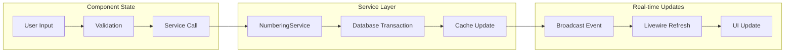
```mermaid
graph LR
    subgraph "Component State"
        A[User Input]
        B[Validation]
        C[Service Call]
    end
    
    subgraph "Service Layer"
        D[NumberingService]
        E[Database Transaction]
        F[Cache Update]
    end
    
    subgraph "Real-time Updates"
        G[Broadcast Event]
        H[Livewire Refresh]
        I[UI Update]
    end
    
    A --> B
    B --> C
    C --> D
    D --> E
    E --> F
    F --> G
    G --> H
    H --> I
```

### Caching Strategy

```php
// Cache Keys Pattern
"numbering:{business_unit_id}:{module_code}:{department_id}:{year}:{month}"
"sequence_lock:{business_unit_id}:{module_code}:{department_id}:{year}:{month}"
"void_numbers:{sequence_id}"

// Cache Implementation
class NumberSequenceRepository
{
    public function getCachedSequence($businessUnitId, $moduleCode, $departmentId, $year, $month)
    {
        $cacheKey = "numbering:$businessUnitId:$moduleCode:$departmentId:$year:$month";
        
        return Cache::remember($cacheKey, 3600, function () use ($businessUnitId, $moduleCode, $departmentId, $year, $month) {
            return NumberSequence::where([
                'business_unit_id' => $businessUnitId,
                'numbering_module_id' => $this->getModuleId($moduleCode, $businessUnitId),
                'department_id' => $departmentId,
                'year' => $year,
                'month' => $month
            ])->first();
        });
    }
}
```

## Testing Strategy

### Unit Testing Structure

```php
// tests/Unit/Services/NumberingServiceTest.php
class NumberingServiceTest extends TestCase
{
    use RefreshDatabase;
    
    protected $numberingService;
    protected $businessUnit;
    protected $department;
    
    public function setUp(): void
    {
        parent::setUp();
        
        $this->numberingService = app(NumberingService::class);
        $this->businessUnit = BusinessUnit::factory()->create(['code' => 'WNS']);
        $this->department = Department::factory()->create([
            'business_unit_id' => $this->businessUnit->id,
            'code' => 'GA'
        ]);
    }
    
    /** @test */
    public function it_generates_sequential_pr_numbers()
    {
        $user = User::factory()->create(['department_id' => $this->department->id]);
        
        $firstPR = $this->numberingService->generateNumber('PR', $this->businessUnit->id, $this->department->id, $user->id);
        $secondPR = $this->numberingService->generateNumber('PR', $this->businessUnit->id, $this->department->id, $user->id);
        
        $expectedFirst = 'PR.GA/' . date('Y') . '/' . date('m') . '/001';
        $expectedSecond = 'PR.GA/' . date('Y') . '/' . date('m') . '/002';
        
        $this->assertEquals($expectedFirst, $firstPR);
        $this->assertEquals($expectedSecond, $secondPR);
    }
    
    /** @test */
    public function it_reuses_void_numbers()
    {
        $user = User::factory()->create(['department_id' => $this->department->id]);
        
        // Generate 3 numbers
        $pr1 = $this->numberingService->generateNumber('PR', $this->businessUnit->id, $this->department->id, $user->id);
        $pr2 = $this->numberingService->generateNumber('PR', $this->businessUnit->id, $this->department->id, $user->id);
        $pr3 = $this->numberingService->generateNumber('PR', $this->businessUnit->id, $this->department->id, $user->id);
        
        // Void the second number
        $this->numberingService->voidNumber($pr2, 'PR');
        
        // Generate new number should reuse voided number
        $pr4 = $this->numberingService->generateNumber('PR', $this->businessUnit->id, $this->department->id, $user->id);
        
        $this->assertEquals($pr2, $pr4);
    }
    
    /** @test */
    public function it_handles_concurrent_number_generation()
    {
        $user = User::factory()->create(['department_id' => $this->department->id]);
        
        $numbers = [];
        $promises = [];
        
        // Simulate concurrent requests
        for ($i = 0; $i < 10; $i++) {
            $promises[] = async(function() use ($user) {
                return $this->numberingService->generateNumber('PR', $this->businessUnit->id, $this->department->id, $user->id);
            });
        }
        
        $results = await($promises);
        
        // All numbers should be unique
        $this->assertCount(10, array_unique($results));
    }
}
```

### Feature Testing

```php
// tests/Feature/Livewire/PRCreateTest.php
class PRCreateTest extends TestCase
{
    use RefreshDatabase;
    
    /** @test */
    public function it_can_generate_pr_number_via_livewire()
    {
        $user = $this->createUserWithDepartment();
        
        Livewire::actingAs($user)
            ->test(PRCreate::class)
            ->call('generatePR')
            ->assertHasNoErrors()
            ->assertSet('prData.pr_number', function ($value) {
                return str_starts_with($value, 'PR.GA/');
            })
            ->assertEmitted('prGenerated');
    }
    
    /** @test */
    public function it_broadcasts_real_time_updates()
    {
        Event::fake();
        
        $user = $this->createUserWithDepartment();
        
        Livewire::actingAs($user)
            ->test(PRCreate::class)
            ->call('generatePR');
        
        Event::assertDispatched(PRNumberGenerated::class);
    }
}
```

### Role-Based Access Testing

```php
// tests/Feature/RoleBasedAccessTest.php
class RoleBasedAccessTest extends TestCase
{
    use RefreshDatabase;
    
    /** @test */
    public function admin_can_view_all_prs()
    {
        $admin = $this->createUser('admin');
        $otherDeptPR = $this->createPRInDifferentDepartment();
        
        $this->assertTrue($admin->canViewPR($otherDeptPR));
        
        $response = $this->actingAs($admin)->get('/modules/wns/pr');
        $response->assertSuccessful();
        $response->assertSee($otherDeptPR->pr_number);
    }
    
    /** @test */
    public function bod_can_view_all_prs_but_cannot_void()
    {
        $bod = $this->createUser('bod');
        $pr = $this->createPR();
        
        $this->assertTrue($bod->canViewPR($pr));
        $this->assertFalse($bod->canVoidPR($pr));
        
        $response = $this->actingAs($bod)->delete("/api/v1/wns/pr/{$pr->pr_number}/void");
        $response->assertForbidden();
    }
    
    /** @test */
    public function hod_can_view_department_prs_only()
    {
        $hod = $this->createUser('hod', 'GA');
        $departmentPR = $this->createPR('GA');
        $otherDeptPR = $this->createPR('IT');
        
        $this->assertTrue($hod->canViewPR($departmentPR));
        $this->assertFalse($hod->canViewPR($otherDeptPR));
        
        Livewire::actingAs($hod)
            ->test(PRList::class)
            ->assertSee($departmentPR->pr_number)
            ->assertDontSee($otherDeptPR->pr_number);
    }
    
    /** @test */
    public function leader_can_view_subordinate_prs_only()
    {
        $leader = $this->createUser('leader', 'GA');
        $subordinate = $this->createUser('staff', 'GA', $leader->id);
        $otherStaff = $this->createUser('staff', 'GA');
        
        $subordinatePR = $this->createPRForUser($subordinate);
        $otherStaffPR = $this->createPRForUser($otherStaff);
        $leaderPR = $this->createPRForUser($leader);
        
        $this->assertTrue($leader->canViewPR($subordinatePR));
        $this->assertTrue($leader->canViewPR($leaderPR));
        $this->assertFalse($leader->canViewPR($otherStaffPR));
    }
    
    /** @test */
    public function staff_can_view_own_prs_only()
    {
        $staff1 = $this->createUser('staff', 'GA');
        $staff2 = $this->createUser('staff', 'GA');
        
        $ownPR = $this->createPRForUser($staff1);
        $otherPR = $this->createPRForUser($staff2);
        
        $this->assertTrue($staff1->canViewPR($ownPR));
        $this->assertFalse($staff1->canViewPR($otherPR));
        
        Livewire::actingAs($staff1)
            ->test(PRList::class)
            ->assertSee($ownPR->pr_number)
            ->assertDontSee($otherPR->pr_number);
    }
    
    /** @test */
    public function hierarchy_permissions_work_correctly()
    {
        $hod = $this->createUser('hod', 'GA');
        $leader = $this->createUser('leader', 'GA', $hod->id);
        $staff = $this->createUser('staff', 'GA', $leader->id);
        
        $staffPR = $this->createPRForUser($staff);
        
        // HOD can see all department PRs
        $this->assertTrue($hod->canViewPR($staffPR));
        $this->assertTrue($hod->canVoidPR($staffPR));
        
        // Leader can see subordinate PRs
        $this->assertTrue($leader->canViewPR($staffPR));
        $this->assertTrue($leader->canVoidPR($staffPR));
        
        // Staff can see own PR
        $this->assertTrue($staff->canViewPR($staffPR));
        $this->assertTrue($staff->canVoidPR($staffPR));
    }
    
    /** @test */
    public function user_management_requires_admin_role()
    {
        $admin = $this->createUser('admin');
        $hod = $this->createUser('hod');
        
        // Admin can access user management
        $response = $this->actingAs($admin)->get('/admin/users');
        $response->assertSuccessful();
        
        // HOD cannot access user management
        $response = $this->actingAs($hod)->get('/admin/users');
        $response->assertForbidden();
    }
    
    private function createUser($role, $deptCode = 'GA', $supervisorId = null)
    {
        $businessUnit = BusinessUnit::factory()->create(['code' => 'WNS']);
        $department = Department::factory()->create([
            'business_unit_id' => $businessUnit->id,
            'code' => $deptCode
        ]);
        $position = Position::factory()->create([
            'department_id' => $department->id,
            'level' => $role === 'hod' ? 'hod' : ($role === 'leader' ? 'leader' : 'staff')
        ]);
        
        return User::factory()->create([
            'department_id' => $department->id,
            'position_id' => $position->id,
            'supervisor_id' => $supervisorId,
            'role' => $role,
            'phone_number' => fake()->phoneNumber()
        ]);
    }
    
    private function createPR($deptCode = 'GA')
    {
        $user = $this->createUser('staff', $deptCode);
        return $this->createPRForUser($user);
    }
    
    private function createPRForUser($user)
    {
        return PurchaseRequest::factory()->create([
            'business_unit_id' => $user->department->business_unit_id,
            'department_id' => $user->department_id,
            'user_id' => $user->id
        ]);
    }
}
```

### Integration Testing

```php
// tests/Integration/NumberingIntegrationTest.php
class NumberingIntegrationTest extends TestCase
{
    /** @test */
    public function it_handles_full_pr_lifecycle()
    {
        // Setup business unit and department
        $businessUnit = BusinessUnit::factory()->create(['code' => 'WNS']);
        $department = Department::factory()->create(['business_unit_id' => $businessUnit->id, 'code' => 'GA']);
        $user = User::factory()->create(['department_id' => $department->id]);
        
        // Test PR generation
        $response = $this->actingAs($user)->postJson('/api/v1/wns/pr/generate');
        $response->assertSuccessful();
        $prNumber = $response->json('data.number');
        
        // Verify PR exists in database
        $this->assertDatabaseHas('purchase_requests', [
            'pr_number' => $prNumber,
            'status' => 'active'
        ]);
        
        // Test PR voiding
        $response = $this->actingAs($user)->deleteJson("/api/v1/wns/pr/{$prNumber}/void");
        $response->assertSuccessful();
        
        // Verify PR is voided
        $this->assertDatabaseHas('purchase_requests', [
            'pr_number' => $prNumber,
            'status' => 'void'
        ]);
        
        // Test resequencing (generate new PR should reuse voided number)
        $response = $this->actingAs($user)->postJson('/api/v1/wns/pr/generate');
        $newPrNumber = $response->json('data.number');
        
        $this->assertEquals($prNumber, $newPrNumber);
    }
}
```