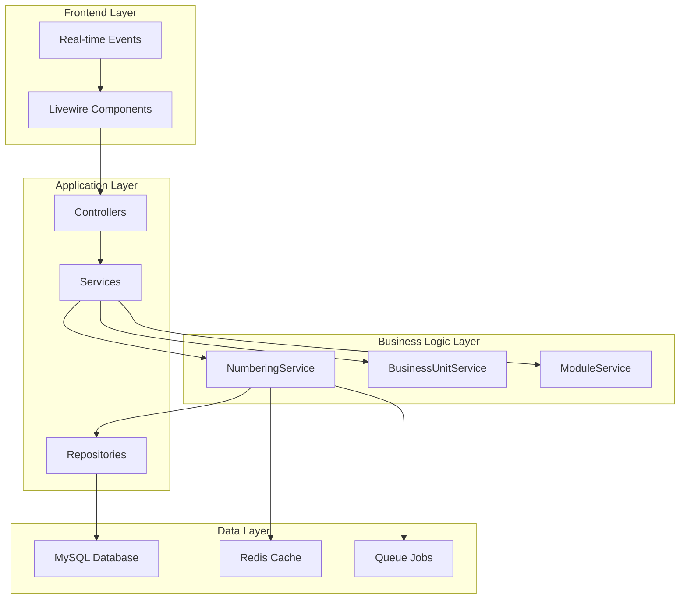
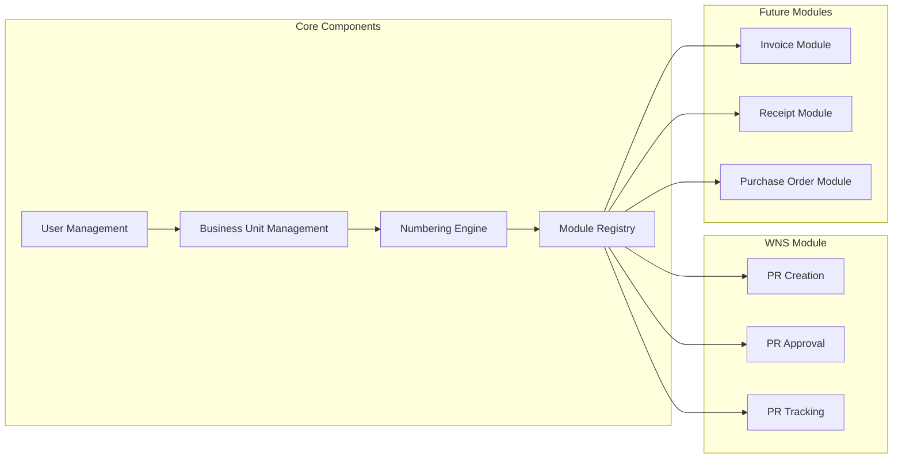
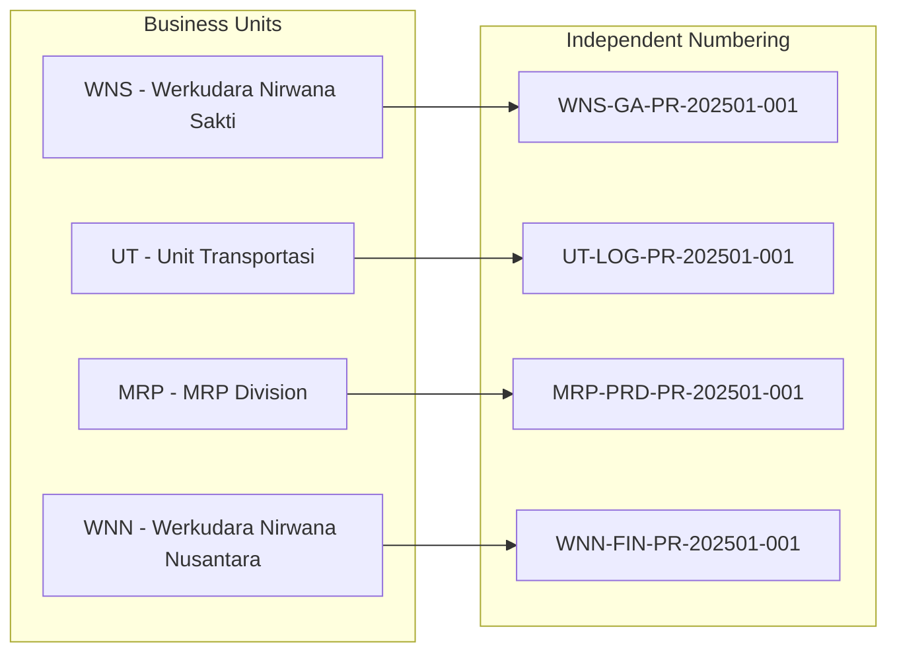
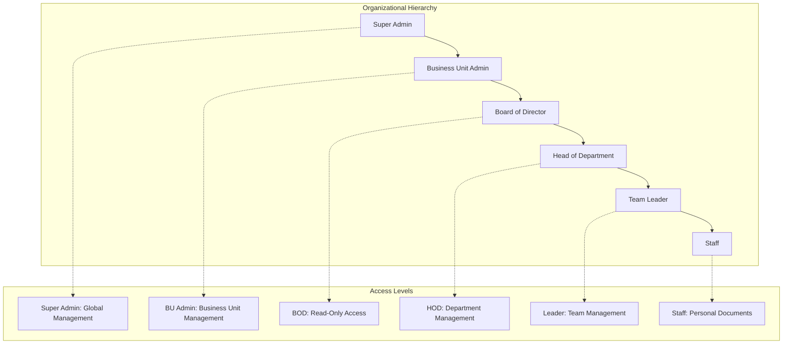
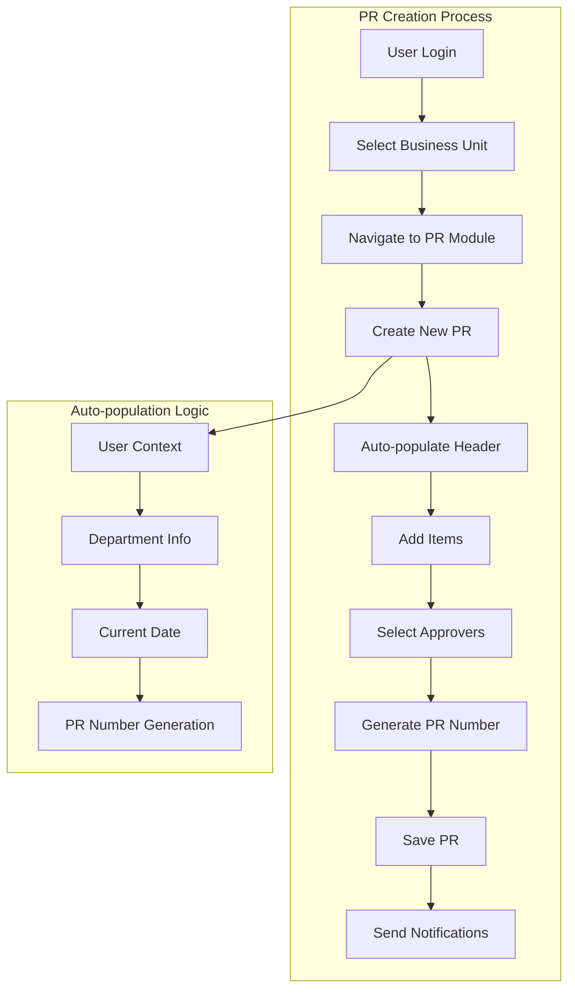
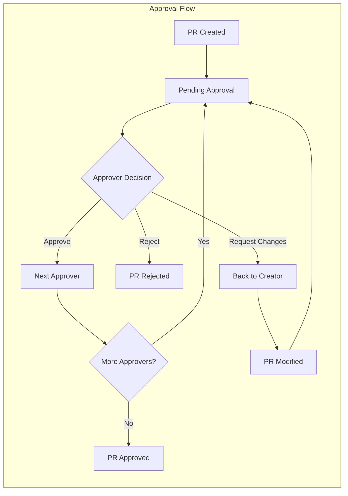
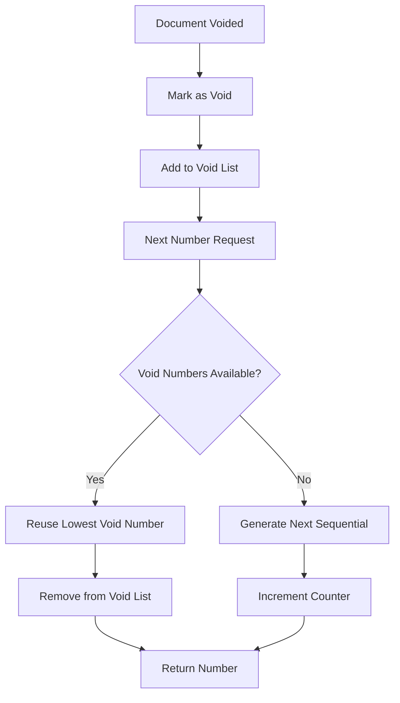
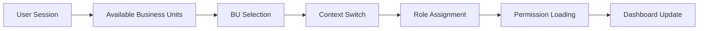
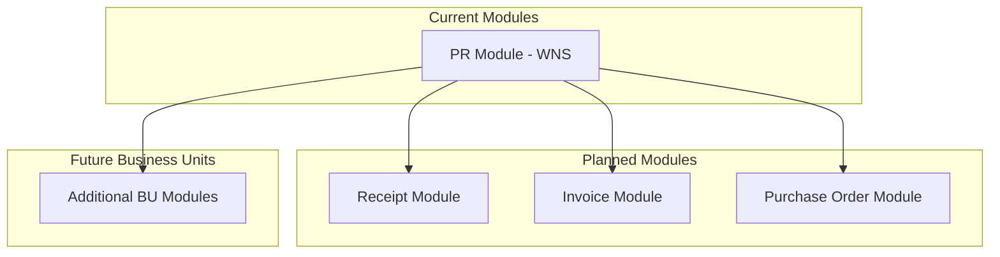

# Company Numbering System Design

## Overview

Sistem penomoran multi-business unit yang dibangun dengan PHP Laravel dan Livewire untuk menyediakan penomoran dokumen real-time tanpa konflik di berbagai unit bisnis dan modul. Sistem ini awalnya berfokus pada penomoran Purchase Request (PR) untuk business unit Werkudara Nirwana Sakti (WNS), dengan arsitektur yang dapat diskalakan untuk unit bisnis dan modul penomoran masa depan.

### Fitur Utama
- Dukungan multi-business unit dengan logika penomoran individual
- Penomoran real-time tanpa konflik
- Auto re-sequencing ketika dokumen dibatalkan
- Integrasi prefix departemen
- Arsitektur modular untuk berbagai jenis dokumen
- Live updates tanpa refresh halaman menggunakan Livewire

## Technology Stack & Dependencies

- **Backend Framework**: PHP Laravel 12.0
- **Frontend**: Laravel Livewire 3.x dengan Volt
- **Database**: MySQL 8.0+ dengan dukungan transaksi
- **Real-time Updates**: Livewire real-time events
- **Authentication**: Laravel Breeze
- **Caching**: Redis untuk caching number sequence
- **Queue System**: Laravel Queue untuk background processing

## Architecture

### System Architecture Overview



### Component Architecture



## Data Models & Database Schema

### Entity Relationship Diagram

```mermaid
erDiagram
    BusinessUnit ||--o{ Department : contains
    BusinessUnit ||--o{ NumberingModule : has
    BusinessUnit ||--o{ UserBusinessUnit : assigns
    Department ||--o{ Position : has
    Department ||--o{ User : belongs_to
    Position ||--o{ User : holds
    User ||--o{ User : supervises
    User ||--o{ UserBusinessUnit : has
    UserBusinessUnit }o--|| BusinessUnit : belongs_to
    NumberingModule ||--o{ NumberSequence : generates
    NumberSequence ||--o{ PurchaseRequest : creates
    PurchaseRequest ||--o{ PrItem : contains
    PurchaseRequest ||--o{ PrApproval : requires
    
    BusinessUnit {
        int id PK
        string code UK "WNS, UT, MRP, WNN"
        string name
        json numbering_config
        boolean is_active
        timestamps
    }
    
    Department {
        int id PK
        int business_unit_id FK
        string code "GA, IT, HR, etc"
        string name
        boolean is_active
        timestamps
    }
    
    Position {
        int id PK
        int department_id FK
        string name
        string code
        enum level "hod, leader, staff"
        int hierarchy_level
        boolean is_active
        timestamps
    }
    
    User {
        int id PK
        int primary_department_id FK
        int primary_position_id FK
        int supervisor_id FK
        string name
        string email
        string phone_number
        enum global_role "super_admin, user"
        boolean is_active
        timestamps
    }
    
    UserBusinessUnit {
        int id PK
        int user_id FK
        int business_unit_id FK
        int department_id FK
        int position_id FK
        enum role "admin, bod, hod, leader, staff"
        boolean is_primary
        boolean is_active
        json permissions
        timestamps
    }
    
    NumberingModule {
        int id PK
        int business_unit_id FK
        string module_code "PR, RT, etc"
        string module_name
        string format_pattern
        json config
        boolean is_active
        timestamps
    }
    
    NumberSequence {
        int id PK
        int business_unit_id FK
        int numbering_module_id FK
        int department_id FK
        int year
        int month
        int current_number
        int max_number
        json void_numbers
        timestamps
    }
    
    PurchaseRequest {
        int id PK
        string pr_number UK
        int business_unit_id FK
        int department_id FK
        int user_id FK
        int sequence_id FK
        string status
        datetime void_at
        json pr_data
        timestamps
    }
```

### Core Business Logic

#### Numbering Service Architecture

```mermaid
graph TB
    subgraph "Number Generation Flow"
        A[Request Number] --> B[Check Business Unit]
        B --> C[Identify Module]
        C --> D[Get Department Context]
        D --> E[Generate Sequence]
        E --> F[Apply Redis Lock]
        F --> G[Check for Voids]
        G --> H[Generate/Reuse Number]
        H --> I[Update Sequence]
        I --> J[Release Lock]
        J --> K[Return Number]
    end
    
    subgraph "Conflict Resolution"
        L[Concurrent Request Detected]
        L --> M[Queue Request]
        M --> N[Process in Order]
        N --> O[Return Unique Number]
    end
    
    subgraph "Void Handling"
        P[Document Voided]
        P --> Q[Mark Number as Void]
        Q --> R[Add to Void List]
        R --> S[Background Resequencing]
    end
```



#### Multi-Business Unit Support



## Role-Based Access Control (RBAC)

### User Hierarchy & Permissions



### Permission Matrix

| Role | Global Access | View All BU | View Department | View Team | View Personal | Create PR | Void PR | User Mgmt | Reports |
|------|---------------|-------------|-----------------|-----------|---------------|-----------|---------|-----------|---------|
| Super Admin | ✅ | ✅ | ✅ | ✅ | ✅ | ✅ | ✅ | ✅ | ✅ |
| BU Admin | ❌ | ✅ | ✅ | ✅ | ✅ | ✅ | ✅ | ✅* | ✅ |
| BOD | ❌ | ✅ | ✅ | ✅ | ✅ | ❌ | ❌ | ❌ | ✅ |
| HOD | ❌ | ❌ | ✅ | ✅ | ✅ | ✅ | ✅* | ❌ | ✅* |
| Leader | ❌ | ❌ | ❌ | ✅ | ✅ | ✅ | ✅* | ❌ | ❌ |
| Staff | ❌ | ❌ | ❌ | ❌ | ✅ | ✅ | ✅* | ❌ | ❌ |

*Limited to own scope

## Purchase Request (PR) Module - WNS

### WNS Business Unit Departments

The WNS business unit supports the following departments with their respective codes:

| Department Code | Department Name | Description |
|----------------|-----------------|-------------|
| BAS | Business & Administrative Services | Business and administrative support services |
| CORP | Corporate | Corporate affairs and governance |
| GA | General Affair | General administrative affairs |
| HR | Human Resource | Personnel and human capital management |
| ACC | Accounting | Financial accounting and reporting |
| TEP | Tour & Event Planning | Event management and tour planning services |
| ACS | Art & Creative Support | Creative and artistic services |
| SO | Sales Operation | Sales operations and support |
| BID | Business Innovation Development | Innovation and business development |

### PR Creation Workflow



### PR Approval Workflow



### PR Form Fields Structure

#### Header Section (Auto-populated)
- **Create By**: User's full name from session
- **Department**: User's current department in WNS context
- **Request No**: Auto-generated PR number
- **Date of Request**: Current system date

#### Content Section (User Input Required)
- **Used For**: Brief description of purpose (required)
- **Keperluan**: Specific needs or requirements (short text, required)
- **Notes**: Additional information (optional)

#### Items Section (Dynamic User Input)
- Item details with quantities and pricing
- Multiple items supported
- Expense department assignment per item

#### Approval Section (Semi-automated)
- Approver selection based on workflow rules
- Approval sequence management

## Numbering Pattern & Logic

### Standard Format Pattern

```
{BU_CODE}-{DEPT_CODE}-{MODULE_CODE}-{YYYY}{MM}-{###}

Examples:
- WNS-GA-PR-202501-001
- WNS-IT-PR-202501-002  
- UT-LOG-PR-202501-001
- MRP-PRD-RT-202501-001
```

### WNS Department PR Number Examples

The WNS business unit uses **cross-department sequential numbering**. All departments share the same sequence counter that only resets annually:

#### Sequential Numbering Flow Example:
```
PR.GA/2025/01/001    (GA department, January)
PR.BAS/2025/01/002   (BAS department, January) 
PR.GA/2025/01/003    (GA department, January)
PR.HR/2025/02/004    (HR department, February - continues sequence)
PR.ACC/2025/02/005   (ACC department, February - continues sequence)
PR.GA/2025/02/006    (GA department, February - continues sequence)
PR.TEP/2025/03/007   (TEP department, March - continues sequence)
```

#### Key Numbering Rules:
- **Shared Counter**: All WNS departments share the same sequence number
- **Annual Reset**: Counter resets to 001 only when year changes
- **Month Continuation**: Month changes do NOT reset the counter
- **Department Independence**: Department code changes, sequence continues

#### Answer to Scenario:
If there were 30 requests in January, and GA makes the first request in February, they would get: **`PR.GA/2025/02/031`**

### Number Generation Rules

1. **Cross-Department Sequential Generation**: Numbers increment sequentially across ALL departments within the same business unit
2. **Annual Reset Only**: Sequences reset only when the year changes (not monthly)
3. **Shared Business Unit Counter**: All departments in WNS share the same sequence counter
4. **Month Continuation**: Month changes do NOT reset the sequence number
5. **Void Reuse**: Voided numbers are reused in next generation
6. **Conflict Resolution**: Redis locking prevents duplicate numbers
7. **Auto Re-sequencing**: Background job reorders sequences when needed

### Void Number Handling



## Real-time Features

### Live Number Generation

- **Conflict Prevention**: Redis distributed locking
- **Real-time Updates**: Livewire components update without page refresh
- **Concurrent Handling**: Queue system manages simultaneous requests
- **Status Broadcasting**: Real-time status updates to relevant users

### Business Unit Switching



## Scalability & Future Extensions

### Module Extension Framework



### Extension Points

1. **New Business Units**: Add new BU with independent numbering
2. **New Document Types**: Register new modules with custom patterns
3. **Custom Workflows**: Implement business-specific approval flows
4. **Integration APIs**: Connect with external systems
5. **Reporting Modules**: Add specialized reporting features

## Testing Strategy

### Test Coverage Areas

| Component | Unit Tests | Integration Tests | Feature Tests |
|-----------|------------|-------------------|---------------|
| Numbering Service | ✅ | ✅ | ✅ |
| RBAC System | ✅ | ✅ | ✅ |
| PR Module | ✅ | ✅ | ✅ |
| Multi-BU Support | ✅ | ✅ | ✅ |
| API Endpoints | ✅ | ✅ | ✅ |
| Livewire Components | ✅ | ❌ | ✅ |

### Key Test Scenarios

- **Concurrent Number Generation**: Multiple users generating numbers simultaneously
- **Cross-Business Unit Isolation**: Ensuring BU data isolation
- **Role-based Access**: Testing permission boundaries
- **Void Number Reuse**: Verifying resequencing logic
- **Workflow Integrity**: Testing approval workflows end-to-end


