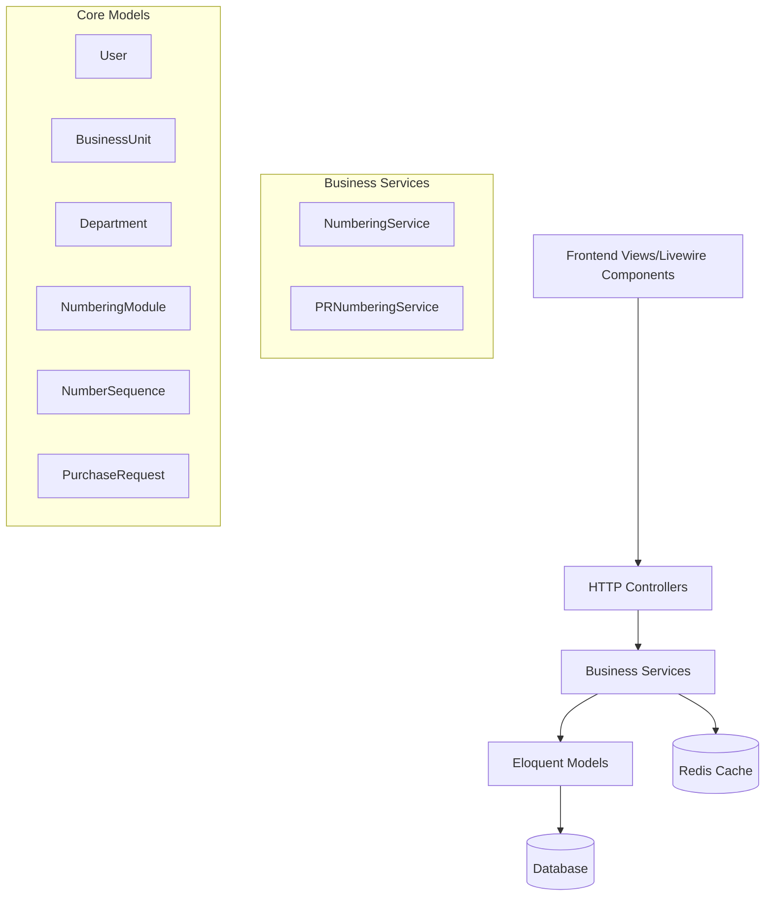
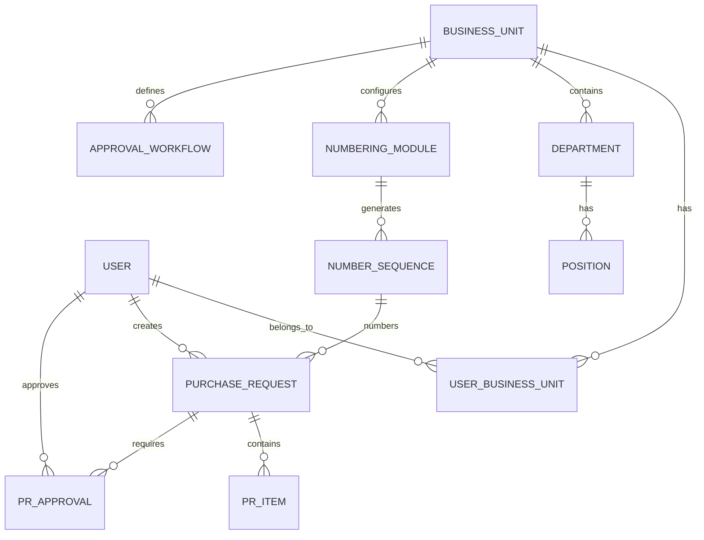
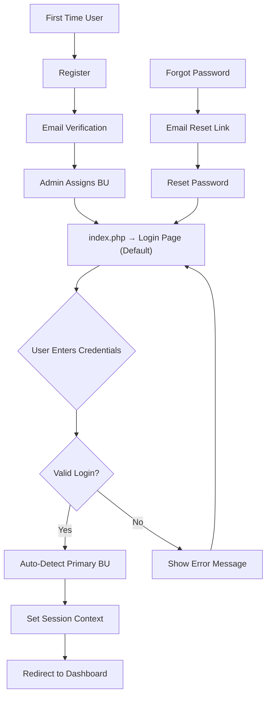
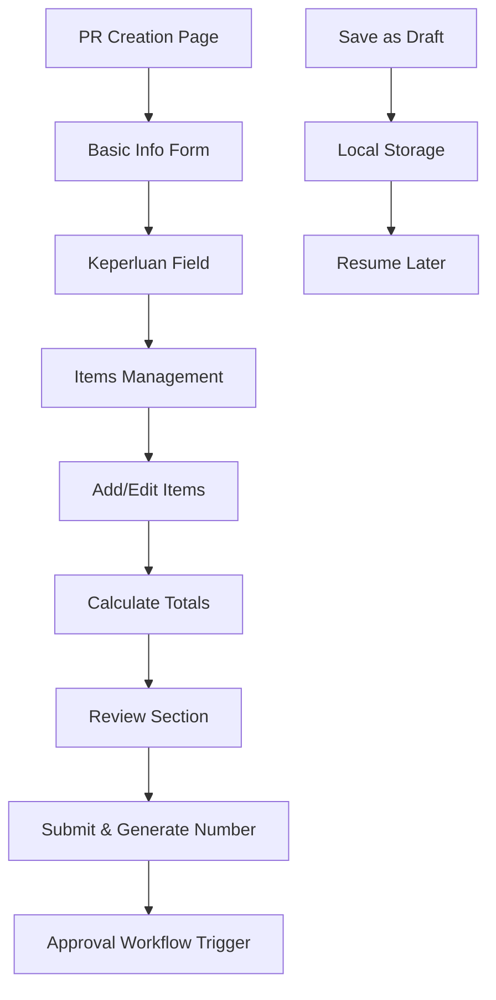
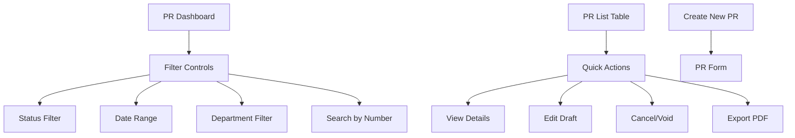
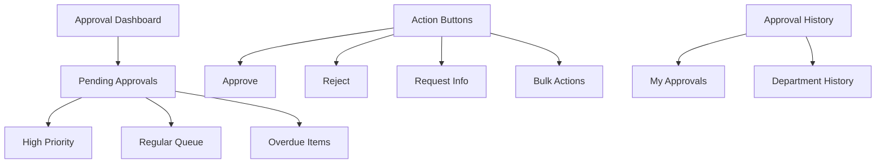
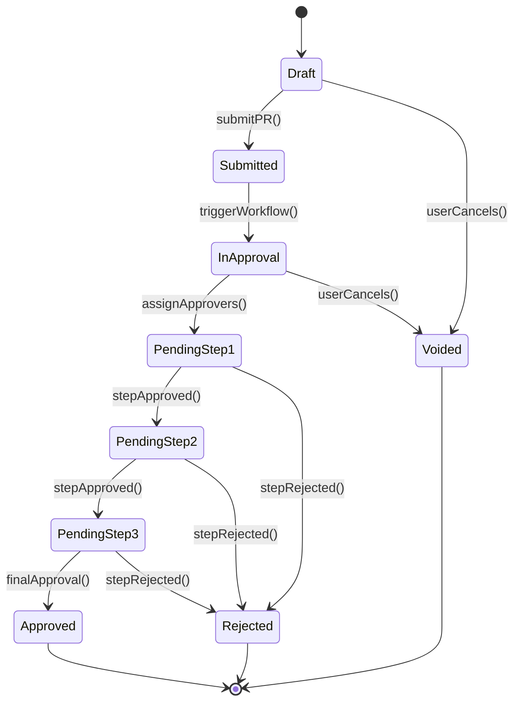
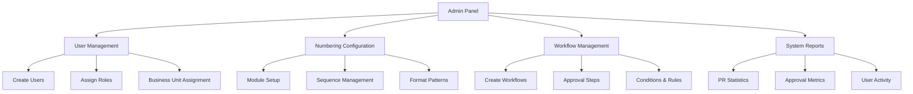
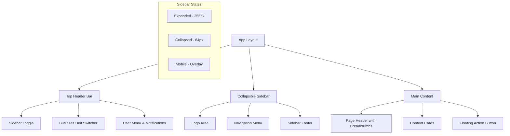

# Numbering System Project - Current State Analysis & Next Steps

## Overview

The Numbering System is a Laravel-based web application designed to manage enterprise-wide document numbering and approval workflows. The project focuses on purchase request management with integrated numbering sequences, approval workflows, and audit logging.

**Current Status**: Core foundation and backend services are implemented. Frontend UI and business workflows are the next development focus.

## Technology Stack & Dependencies

### Backend Framework
- **Laravel 12.0** - Primary PHP framework
- **PHP 8.2+** - Programming language
- **Eloquent ORM** - Database abstraction
- **Laravel Breeze** - Authentication scaffolding
- **Livewire 3** - Reactive UI components
- **Spatie Laravel Permission** - Role-based access control
- **Spatie Activity Log** - Audit trail logging

### Frontend & Build Tools
- **Vite** - Modern build tool
- **Tailwind CSS** - Utility-first CSS framework
- **Alpine.js** - Lightweight JavaScript framework (via Livewire)
- **Axios** - HTTP client for API requests

### Database & Caching
- **MySQL/SQLite** - Primary database
- **Redis** - Caching and queue management (via predis/predis)
- **Laravel Queues** - Background job processing

## Architecture

### MVC Pattern with Service Layer


### Key Architectural Components

**Service Layer Pattern**
- `NumberingService`: Core numbering logic with Redis locking
- `PRNumberingService`: Purchase request specific numbering

**Repository Pattern**
- Eloquent ORM models serve as repositories
- Relationships defined through Eloquent associations

**Event-Driven Architecture**
- Activity logging through model events
- Queue processing for background tasks

## Current Implementation Status

### ✅ Completed Components

#### 1. Database Schema & Models
- **17 migrations** successfully applied
- **Core models** implemented with proper relationships:
  - User, BusinessUnit, Department, Position
  - NumberingModule, NumberSequence
  - PurchaseRequest, PrItem, PrApproval
  - ApprovalWorkflow

#### 2. Authentication System
- Complete user authentication using Laravel Breeze
- Login/logout functionality with Livewire forms
- User registration, password reset, email verification
- Session-based authentication

#### 3. Numbering System Core
- **NumberingService** with Redis-based concurrency control
- **PRNumberingService** for purchase request numbering
- Format pattern: `PR.<DEPT>/<YEAR>/<MONTH>/<SEQUENCE>`
- Cross-department sequential numbering (resets annually)
- Void number resequencing capability

#### 4. Business Logic Services
- Numbering generation with statistics
- Cross-department sequential numbering
- Database seeding for initial configuration

#### 5. Testing Infrastructure
- PHPUnit test framework configured
- Feature tests for authentication
- Unit tests for numbering services (`WNSPRNumberingTest`)

### 🚧 In Progress Components

#### 1. Purchase Request Management
- Models and relationships defined
- Business logic partially implemented
- Missing frontend forms and workflows

#### 2. Approval Workflow System
- Database schema and models complete
- Workflow configuration structure ready
- Missing workflow execution engine

### ❌ Pending Components

#### 1. Frontend User Interface
- Purchase request forms
- Approval dashboard
- Number sequence management UI
- User management interface

#### 2. Business Workflows
- Purchase request creation flow
- Approval process implementation
- Email notifications for approvals
- Status tracking and updates

#### 3. API Layer
- RESTful API endpoints
- API authentication
- External system integration

#### 4. Advanced Features
- Reporting and analytics
- Bulk operations
- Export/import functionality
- Mobile responsiveness

## Data Models & Relationships

### Core Entity Relationships


### Key Business Rules

**Numbering Format**
- Pattern: `PR.<DEPT>/<YEAR>/<MONTH>/<SEQUENCE>`
- Cross-department sequential numbering
- Annual reset only (not monthly)
- 3-digit minimum sequence padding

**Purchase Request Workflow**
- Requires 'keperluan' (purpose) field
- Department-based approval routing
- Sequential or parallel approval options
- Status tracking: draft → submitted → in_approval → approved/rejected

## UI Design & Implementation Specifications

### 1. Authentication System UI

#### Seamless Login Flow (Default/Index Page)


**Key Design Principles:**
- **Login page adalah default landing page** (index.php route)
- **No Business Unit selection** - completely automatic
- **Single-step authentication** - email/password only
- **Instant redirect** setelah successful login
- **Primary BU detection** berdasarkan order created_at

**Enhanced Authentication Logic:**

**Routes Configuration (web.php)**
```php
// Default route mengarah ke login
Route::get('/', function () {
    return Auth::check() ? redirect('/dashboard') : redirect('/login');
});

// Auth routes - login adalah entry point utama
Route::middleware('guest')->group(function () {
    Route::get('/login', [LoginController::class, 'create'])->name('login');
    Route::post('/login', [LoginController::class, 'store']);
    Route::get('/register', [RegisterController::class, 'create'])->name('register');
    // ... other guest routes
});

// Protected routes dengan middleware business unit
Route::middleware(['auth', 'ensure.business.unit.selected'])->group(function () {
    Route::get('/dashboard', [DashboardController::class, 'index'])->name('dashboard');
    // ... other protected routes
});
```

**LoginForm.php** (Seamless Single-Step Login)
```php
class LoginForm extends Component
{
    public $email = '';
    public $password = '';
    public $remember = false;
    public $loading = false;
    
    public function authenticate()
    {
        $this->loading = true;
        
        // Simple credential validation - no BU selection
        $credentials = $this->validate([
            'email' => 'required|email',
            'password' => 'required'
        ]);
        
        if (Auth::attempt($credentials, $this->remember)) {
            $user = Auth::user();
            
            // Automatic primary business unit detection
            $primaryBusinessUnit = $user->businessUnits()
                ->orderBy('user_business_units.created_at', 'asc')
                ->first();
            
            if ($primaryBusinessUnit) {
                // Auto-set session context - no user interaction needed
                session([
                    'current_business_unit_id' => $primaryBusinessUnit->id,
                    'current_business_unit_code' => $primaryBusinessUnit->code,
                    'current_business_unit_name' => $primaryBusinessUnit->name
                ]);
                
                // Remember user preference for future logins
                $user->update(['last_business_unit_id' => $primaryBusinessUnit->id]);
                
                $this->loading = false;
                
                // Direct redirect to dashboard - seamless experience
                return redirect()->intended('/dashboard');
            } else {
                // User has no business unit assigned
                Auth::logout();
                $this->loading = false;
                session()->flash('error', 'No business unit assigned. Please contact administrator.');
                return;
            }
        }
        
        $this->loading = false;
        $this->addError('email', 'These credentials do not match our records.');
    }
    
    public function render()
    {
        return view('livewire.forms.login-form');
    }
}
```

**Simple Login Page Design (Default Index Page)**
```html
<!DOCTYPE html>
<html lang="en" class="h-full bg-gray-50">
<head>
    <meta charset="utf-8">
    <meta name="viewport" content="width=device-width, initial-scale=1">
    <title>Numbering System - Login</title>
    @vite(['resources/css/app.css', 'resources/js/app.js'])
    @livewireStyles
</head>
<body class="h-full">
    <div class="min-h-full flex items-center justify-center py-12 px-4 sm:px-6 lg:px-8">
        <div class="max-w-md w-full space-y-8">
            
            <!-- Logo & Header -->
            <div class="text-center">
                <div class="mx-auto w-16 h-16 bg-gradient-to-br from-indigo-600 to-purple-600 rounded-2xl flex items-center justify-center shadow-lg">
                    <svg class="w-8 h-8 text-white" fill="currentColor" viewBox="0 0 24 24">
                        <path d="M3 7h18l-2 10H5L3 7zM1 3h4l2 10h10l2-10H7"/>
                    </svg>
                </div>
                <h2 class="mt-6 text-center text-3xl font-bold text-gray-900">
                    Welcome to NumberSys
                </h2>
                <p class="mt-2 text-center text-sm text-gray-600">
                    Sign in to access your account
                </p>
            </div>
            
            <!-- Login Form Card -->
            <div class="bg-white py-8 px-6 shadow-xl rounded-2xl border border-gray-100">
                <form wire:submit.prevent="authenticate" class="space-y-6">
                    
                    <!-- Email Input -->
                    <div>
                        <label for="email" class="block text-sm font-medium text-gray-700 mb-2">
                            Email Address
                        </label>
                        <input wire:model="email" 
                               id="email"
                               type="email" 
                               required 
                               autocomplete="email"
                               class="w-full px-4 py-3 border border-gray-300 rounded-xl focus:ring-2 focus:ring-indigo-500 focus:border-indigo-500 transition-colors duration-200"
                               placeholder="Enter your email">
                        @error('email') 
                            <p class="mt-1 text-sm text-red-600">{{ $message }}</p>
                        @enderror
                    </div>
                    
                    <!-- Password Input -->
                    <div>
                        <label for="password" class="block text-sm font-medium text-gray-700 mb-2">
                            Password
                        </label>
                        <input wire:model="password" 
                               id="password"
                               type="password" 
                               required 
                               autocomplete="current-password"
                               class="w-full px-4 py-3 border border-gray-300 rounded-xl focus:ring-2 focus:ring-indigo-500 focus:border-indigo-500 transition-colors duration-200"
                               placeholder="Enter your password">
                        @error('password') 
                            <p class="mt-1 text-sm text-red-600">{{ $message }}</p>
                        @enderror
                    </div>
                    
                    <!-- Remember Me & Forgot Password -->
                    <div class="flex items-center justify-between">
                        <div class="flex items-center">
                            <input wire:model="remember" 
                                   id="remember" 
                                   type="checkbox" 
                                   class="h-4 w-4 text-indigo-600 focus:ring-indigo-500 border-gray-300 rounded">
                            <label for="remember" class="ml-2 block text-sm text-gray-700">
                                Remember me
                            </label>
                        </div>
                        
                        <div class="text-sm">
                            <a href="{{ route('password.request') }}" 
                               class="font-medium text-indigo-600 hover:text-indigo-500 transition-colors duration-200">
                                Forgot password?
                            </a>
                        </div>
                    </div>
                    
                    <!-- Login Button -->
                    <div>
                        <button type="submit" 
                                wire:loading.attr="disabled"
                                class="w-full flex justify-center py-3 px-4 border border-transparent rounded-xl shadow-sm text-sm font-medium text-white bg-gradient-to-r from-indigo-600 to-purple-600 hover:from-indigo-700 hover:to-purple-700 focus:outline-none focus:ring-2 focus:ring-offset-2 focus:ring-indigo-500 disabled:opacity-50 transition-all duration-200">
                            
                            <!-- Loading State -->
                            <span wire:loading.remove wire:target="authenticate">
                                Sign In
                            </span>
                            
                            <span wire:loading wire:target="authenticate" class="flex items-center">
                                <svg class="animate-spin -ml-1 mr-3 h-4 w-4 text-white" fill="none" viewBox="0 0 24 24">
                                    <circle class="opacity-25" cx="12" cy="12" r="10" stroke="currentColor" stroke-width="4"></circle>
                                    <path class="opacity-75" fill="currentColor" d="M4 12a8 8 0 018-8V0C5.373 0 0 5.373 0 12h4zm2 5.291A7.962 7.962 0 014 12H0c0 3.042 1.135 5.824 3 7.938l3-2.647z"></path>
                                </svg>
                                Signing in...
                            </span>
                        </button>
                    </div>
                    
                    <!-- Register Link -->
                    <div class="text-center pt-4 border-t border-gray-200">
                        <p class="text-sm text-gray-600">
                            Don't have an account?
                            <a href="{{ route('register') }}" 
                               class="font-medium text-indigo-600 hover:text-indigo-500 transition-colors duration-200">
                                Sign up here
                            </a>
                        </p>
                    </div>
                </form>
            </div>
            
            <!-- Error Messages -->
            @if (session('error'))
                <div class="bg-red-50 border border-red-200 rounded-xl p-4">
                    <div class="flex">
                        <div class="flex-shrink-0">
                            <svg class="h-5 w-5 text-red-400" fill="none" stroke="currentColor" viewBox="0 0 24 24">
                                <path stroke-linecap="round" stroke-linejoin="round" stroke-width="2" d="M12 8v4m0 4h.01M21 12a9 9 0 11-18 0 9 9 0 0118 0z"/>
                            </svg>
                        </div>
                        <div class="ml-3">
                            <p class="text-sm text-red-700">{{ session('error') }}</p>
                        </div>
                    </div>
                </div>
            @endif
            
            <!-- Success Messages -->
            @if (session('success'))
                <div class="bg-green-50 border border-green-200 rounded-xl p-4">
                    <div class="flex">
                        <div class="flex-shrink-0">
                            <svg class="h-5 w-5 text-green-400" fill="none" stroke="currentColor" viewBox="0 0 24 24">
                                <path stroke-linecap="round" stroke-linejoin="round" stroke-width="2" d="M9 12l2 2 4-4m6 2a9 9 0 11-18 0 9 9 0 0118 0z"/>
                            </svg>
                        </div>
                        <div class="ml-3">
                            <p class="text-sm text-green-700">{{ session('success') }}</p>
                        </div>
                    </div>
                </div>
            @endif
        </div>
    </div>
    
    @livewireScripts
</body>
</html>
```

**Login Experience Summary:**

1. **User visits project URL** → Langsung ke login page (index)
2. **User enters email/password** → No additional steps
3. **System validates credentials** → Auto-detects primary Business Unit
4. **Instant redirect to dashboard** → User sudah dalam context BU yang benar
5. **Business Unit switching** → Available dari dashboard header jika needed

**No Business Unit Selection Required:**
- Login form hanya email/password
- Primary BU detection otomatis
- Seamless redirect experience
- BU context sudah ter-set di session

#### Enhanced User Model
**Add to User.php model:**
```php
class User extends Authenticatable
{
    protected $fillable = [
        // ... existing fields
        'last_business_unit_id', // Add this field
    ];
    
    /**
     * Get the primary business unit (first added)
     */
    public function primaryBusinessUnit()
    {
        return $this->businessUnits()
            ->orderBy('user_business_units.created_at', 'asc')
            ->first();
    }
    
    /**
     * Get the last used business unit or primary if none
     */
    public function getDefaultBusinessUnit()
    {
        if ($this->last_business_unit_id) {
            $lastBU = $this->businessUnits()
                ->where('business_units.id', $this->last_business_unit_id)
                ->first();
            if ($lastBU) return $lastBU;
        }
        
        return $this->primaryBusinessUnit();
    }
}
```

#### Database Migration for User Enhancement
**Create migration: add_last_business_unit_to_users_table.php**
```php
Schema::table('users', function (Blueprint $table) {
    $table->unsignedBigInteger('last_business_unit_id')->nullable()->after('email_verified_at');
    $table->foreign('last_business_unit_id')->references('id')->on('business_units')->onDelete('set null');
});
```

#### Middleware Enhancement
**EnsureBusinessUnitSelected.php** (Enhanced)
```php
class EnsureBusinessUnitSelected
{
    public function handle(Request $request, Closure $next)
    {
        if (Auth::check()) {
            // Check if business unit is already set in session
            if (!session('current_business_unit_id')) {
                $user = Auth::user();
                $defaultBU = $user->getDefaultBusinessUnit();
                
                if ($defaultBU) {
                    // Auto-set the default business unit
                    session([
                        'current_business_unit_id' => $defaultBU->id,
                        'current_business_unit_code' => $defaultBU->code,
                        'current_business_unit_name' => $defaultBU->name
                    ]);
                } else {
                    // Redirect to business unit setup if none available
                    return redirect()->route('setup.business-unit')
                        ->with('error', 'Please contact administrator to assign business units.');
                }
            }
        }
        
        return $next($request);
    }
}
```

### 2. Purchase Request Management UI

#### PR Creation Form


**Required Livewire Components:**

1. **CreatePurchaseRequest.php**
   ```php
   class CreatePurchaseRequest extends Component
   {
       public $keperluan = '';
       public $date_of_request;
       public $items = [];
       public $total_amount = 0;
       public $currency = 'IDR';
       public $draft_mode = false;
       
       public function addItem()
       public function removeItem($index)
       public function calculateTotal()
       public function saveDraft()
       public function submitPR()
       public function generatePreviewNumber()
   }
   ```

2. **PrItemManager.php**
   ```php
   class PrItemManager extends Component
   {
       public $items = [];
       public $departments = [];
       
       public function addItem()
       public function updateItem($index, $field, $value)
       public function removeItem($index)
       public function calculateItemTotal($index)
   }
   ```

3. **PrNumberPreview.php**
   ```php
   class PrNumberPreview extends Component
   {
       public $department_id;
       public $date_of_request;
       public $preview_number;
       
       public function updatedDepartmentId()
       public function updatedDateOfRequest()
       public function generatePreview()
   }
   ```

#### PR List & Management


**Required Components:**

4. **PurchaseRequestList.php**
   ```php
   class PurchaseRequestList extends Component
   {
       public $search = '';
       public $status_filter = 'all';
       public $department_filter = 'all';
       public $date_from;
       public $date_to;
       public $per_page = 10;
       
       public function filterPRs()
       public function exportToPDF($pr_id)
       public function quickView($pr_id)
   }
   ```

5. **PrStatusBadge.php**
   ```php
   class PrStatusBadge extends Component
   {
       public $status;
       public $size = 'md';
       
       public function getStatusColor()
       public function getStatusIcon()
   }
   ```

### 3. Approval Workflow UI

#### Approval Dashboard


**Required Components:**

6. **ApprovalDashboard.php**
   ```php
   class ApprovalDashboard extends Component
   {
       public $pending_approvals = [];
       public $completed_approvals = [];
       public $selected_items = [];
       public $filter_priority = 'all';
       
       public function loadPendingApprovals()
       public function approve($approval_id, $notes = '')
       public function reject($approval_id, $notes)
       public function bulkApprove()
       public function markAsViewed($approval_id)
   }
   ```

7. **ApprovalActions.php**
   ```php
   class ApprovalActions extends Component
   {
       public $approval;
       public $notes = '';
       public $action_type;
       
       public function approve()
       public function reject()
       public function requestMoreInfo()
       public function escalate()
   }
   ```

8. **ApprovalTimeline.php**
   ```php
   class ApprovalTimeline extends Component
   {
       public $purchase_request_id;
       public $timeline_data = [];
       
       public function loadTimeline()
       public function getStepStatus($step)
       public function getCurrentStep()
   }
   ```

### 4. Business Workflow Implementation

#### Complete PR Lifecycle


**Workflow Engine Components:**

9. **WorkflowEngine.php** (Service Class)
   ```php
   class WorkflowEngine
   {
       public function triggerWorkflow(PurchaseRequest $pr)
       public function findApplicableWorkflow($pr)
       public function createApprovalSteps($pr, $workflow)
       public function processApprovalStep($approval_id, $action, $notes)
       public function checkWorkflowCompletion($pr)
       public function sendNotifications($approval)
   }
   ```

10. **NotificationService.php** (Service Class)
    ```php
    class NotificationService
    {
        public function sendApprovalRequest($approval)
        public function sendApprovalCompleted($pr)
        public function sendRejectionNotice($pr)
        public function sendOverdueReminder($approval)
        public function sendEscalationNotice($approval)
    }
    ```

### 5. API Layer Design

#### RESTful API Endpoints
```mermaid
flowchart TD
    A[API Routes] --> B[Authentication]
    B --> C[/api/auth/login]
    B --> D[/api/auth/logout]
    B --> E[/api/auth/refresh]
    
    A --> F[Purchase Requests]
    F --> G[GET /api/purchase-requests]
    F --> H[POST /api/purchase-requests]
    F --> I[GET /api/purchase-requests/{id}]
    F --> J[PUT /api/purchase-requests/{id}]
    F --> K[DELETE /api/purchase-requests/{id}]
    
    A --> L[Approvals]
    L --> M[GET /api/approvals/pending]
    L --> N[POST /api/approvals/{id}/approve]
    L --> O[POST /api/approvals/{id}/reject]
    
    A --> P[Numbering]
    P --> Q[POST /api/numbering/generate]
    P --> R[GET /api/numbering/preview]
```

**API Controllers:**

11. **PurchaseRequestApiController.php**
    ```php
    class PurchaseRequestApiController extends Controller
    {
        public function index(Request $request)
        public function store(CreatePRRequest $request)
        public function show($id)
        public function update(UpdatePRRequest $request, $id)
        public function destroy($id)
        public function generateNumber(Request $request)
    }
    ```

12. **ApprovalApiController.php**
    ```php
    class ApprovalApiController extends Controller
    {
        public function pending(Request $request)
        public function approve(Request $request, $id)
        public function reject(Request $request, $id)
        public function history(Request $request)
    }
    ```

### 6. Management Interface (Admin Panel)

#### Admin Dashboard


**Admin Components:**

13. **UserManagement.php**
    ```php
    class UserManagement extends Component
    {
        public $users = [];
        public $roles = [];
        public $business_units = [];
        public $selected_user;
        
        public function createUser($userData)
        public function assignRole($userId, $roleId)
        public function assignBusinessUnit($userId, $buId)
        public function deactivateUser($userId)
    }
    ```

14. **NumberingConfiguration.php**
    ```php
    class NumberingConfiguration extends Component
    {
        public $modules = [];
        public $sequences = [];
        public $selected_module;
        
        public function createModule($moduleData)
        public function updateFormatPattern($moduleId, $pattern)
        public function resetSequence($sequenceId)
        public function configureVoidNumbers($sequenceId)
    }
    ```

15. **WorkflowBuilder.php**
    ```php
    class WorkflowBuilder extends Component
    {
        public $workflows = [];
        public $steps = [];
        public $conditions = [];
        
        public function createWorkflow($workflowData)
        public function addApprovalStep($workflowId, $stepData)
        public function setConditions($workflowId, $conditions)
        public function testWorkflow($workflowId, $testData)
    }
    ```

### 7. UI Layout & Styling Specifications

#### Modern UI Layout with Collapsible Sidebar


**Enhanced Layout Components with Modern Design:**

**AppLayout.php** (Modern Layout with Sidebar)
```php
class AppLayout extends Component
{
    public $sidebar_collapsed = false;
    public $current_business_unit;
    public $current_business_unit_name;
    public $navigation_items = [];
    public $user_notifications = [];
    public $user_permissions = [];
    
    protected $listeners = [
        'business-unit-switched' => 'refreshBusinessUnitContext',
        'toggle-sidebar' => 'toggleSidebar'
    ];
    
    public function mount()
    {
        // Get sidebar state from user preference or session
        $this->sidebar_collapsed = auth()->user()->sidebar_collapsed ?? false;
        $this->loadBusinessUnitContext();
        $this->loadNavigationItems();
        $this->loadNotifications();
    }
    
    public function toggleSidebar()
    {
        $this->sidebar_collapsed = !$this->sidebar_collapsed;
        
        // Save user preference
        auth()->user()->update(['sidebar_collapsed' => $this->sidebar_collapsed]);
        
        // Emit event for other components
        $this->dispatch('sidebar-toggled', $this->sidebar_collapsed);
    }
    
    public function loadBusinessUnitContext()
    {
        $this->current_business_unit = session('current_business_unit_id');
        $this->current_business_unit_name = session('current_business_unit_name');
        
        $this->user_permissions = Auth::user()
            ->getPermissionsViaRoles()
            ->where('business_unit_id', $this->current_business_unit)
            ->pluck('name')
            ->toArray();
    }
    
    public function loadNavigationItems()
    {
        $this->navigation_items = [
            [
                'name' => 'Dashboard',
                'route' => 'dashboard',
                'icon' => 'home',
                'permission' => null,
                'active' => request()->routeIs('dashboard'),
                'badge' => null
            ],
            [
                'name' => 'Purchase Requests',
                'route' => 'purchase-requests.index',
                'icon' => 'document-text',
                'permission' => 'view-purchase-requests',
                'active' => request()->routeIs('purchase-requests.*'),
                'badge' => $this->getMyPRsCount(),
                'children' => [
                    [
                        'name' => 'Create New',
                        'route' => 'purchase-requests.create',
                        'icon' => 'plus',
                        'permission' => 'create-purchase-requests'
                    ],
                    [
                        'name' => 'My Requests',
                        'route' => 'purchase-requests.my-requests',
                        'icon' => 'user',
                        'permission' => 'view-own-purchase-requests'
                    ],
                    [
                        'name' => 'All Requests',
                        'route' => 'purchase-requests.index',
                        'icon' => 'collection',
                        'permission' => 'view-all-purchase-requests'
                    ]
                ]
            ],
            [
                'name' => 'Approvals',
                'route' => 'approvals.index',
                'icon' => 'check-circle',
                'permission' => 'approve-purchase-requests',
                'active' => request()->routeIs('approvals.*'),
                'badge' => $this->getPendingApprovalsCount(),
                'badge_color' => 'bg-red-500'
            ],
            [
                'name' => 'Reports',
                'route' => 'reports.index',
                'icon' => 'chart-bar',
                'permission' => 'view-reports',
                'active' => request()->routeIs('reports.*')
            ],
            [
                'name' => 'Administration',
                'route' => 'admin.index',
                'icon' => 'cog',
                'permission' => 'admin-access',
                'active' => request()->routeIs('admin.*'),
                'children' => [
                    [
                        'name' => 'Users',
                        'route' => 'admin.users.index',
                        'icon' => 'users',
                        'permission' => 'manage-users'
                    ],
                    [
                        'name' => 'Numbering',
                        'route' => 'admin.numbering.index',
                        'icon' => 'hashtag',
                        'permission' => 'manage-numbering'
                    ],
                    [
                        'name' => 'Workflows',
                        'route' => 'admin.workflows.index',
                        'icon' => 'workflow',
                        'permission' => 'manage-workflows'
                    ]
                ]
            ]
        ];
        
        // Filter navigation based on permissions
        $this->navigation_items = array_filter($this->navigation_items, function($item) {
            return !$item['permission'] || in_array($item['permission'], $this->user_permissions);
        });
    }
    
    public function getMyPRsCount()
    {
        return auth()->user()
            ->purchaseRequests()
            ->where('business_unit_id', $this->current_business_unit)
            ->where('status', '!=', 'approved')
            ->count();
    }
    
    public function getPendingApprovalsCount()
    {
        return auth()->user()
            ->pendingApprovals()
            ->whereHas('purchaseRequest', function($query) {
                $query->where('business_unit_id', $this->current_business_unit);
            })
            ->count();
    }
    
    public function render()
    {
        return view('layouts.app');
    }
}
```

**NavigationMenu.php** (BU-aware Navigation)
```php
class NavigationMenu extends Component
{
    public $navigation_items = [];
    public $active_route;
    public $current_business_unit;
    
    protected $listeners = ['business-unit-switched' => 'refreshNavigation'];
    
    public function mount($navigationItems)
    {
        $this->navigation_items = $navigationItems;
        $this->active_route = request()->route()->getName();
        $this->current_business_unit = session('current_business_unit_code');
    }
    
    public function refreshNavigation($businessUnitId)
    {
        $this->current_business_unit = session('current_business_unit_code');
        // Navigation items will be refreshed by parent component
    }
    
    public function hasPermission($permission)
    {
        if (!$permission) return true;
        
        return Auth::user()->can($permission);
    }
    
    public function getActiveClass($route)
    {
        return request()->routeIs($route) ? 'bg-indigo-700 text-white' : 'text-indigo-100 hover:bg-indigo-600';
    }
    
    public function render()
    {
        return view('livewire.navigation-menu');
    }
}
```

**HeaderBusinessUnitDisplay.php** (New Component)
```php
class HeaderBusinessUnitDisplay extends Component
{
    public $current_business_unit_name;
    public $current_business_unit_code;
    
    protected $listeners = ['business-unit-switched' => 'refreshDisplay'];
    
    public function mount()
    {
        $this->refreshDisplay();
    }
    
    public function refreshDisplay()
    {
        $this->current_business_unit_name = session('current_business_unit_name');
        $this->current_business_unit_code = session('current_business_unit_code');
    }
    
    public function render()
    {
        return view('livewire.header-business-unit-display');
    }
}
```

#### UI Implementation Examples

**Business Unit Switcher Dropdown (Tailwind CSS)**
```html
<!-- Business Unit Switcher in Header -->
<div class="relative" x-data="{ open: false }">
    <button @click="open = !open" 
            class="flex items-center space-x-2 px-3 py-2 rounded-md text-sm font-medium text-gray-700 hover:bg-gray-100 focus:outline-none focus:ring-2 focus:ring-indigo-500">
        <div class="w-8 h-8 bg-indigo-500 rounded-full flex items-center justify-center text-white text-xs font-bold">
            {{ session('current_business_unit_code') }}
        </div>
        <span>{{ session('current_business_unit_name') }}</span>
        <svg class="w-4 h-4" fill="none" stroke="currentColor" viewBox="0 0 24 24">
            <path stroke-linecap="round" stroke-linejoin="round" stroke-width="2" d="M19 9l-7 7-7-7"></path>
        </svg>
    </button>
    
    <div x-show="open" 
         @click.away="open = false"
         x-transition:enter="transition ease-out duration-100"
         x-transition:enter-start="transform opacity-0 scale-95"
         x-transition:enter-end="transform opacity-100 scale-100"
         class="absolute right-0 mt-2 w-64 bg-white rounded-md shadow-lg py-1 z-50">
        
        <div class="px-4 py-2 text-xs text-gray-500 uppercase tracking-wide font-semibold border-b">
            Switch Business Unit
        </div>
        
        @foreach($available_business_units as $bu)
            <button wire:click="switchBusinessUnit({{ $bu['id'] }})"
                    class="w-full text-left px-4 py-2 text-sm text-gray-700 hover:bg-gray-100 flex items-center space-x-3
                           {{ session('current_business_unit_id') == $bu['id'] ? 'bg-indigo-50 text-indigo-700' : '' }}">
                <div class="w-6 h-6 bg-indigo-500 rounded-full flex items-center justify-center text-white text-xs font-bold">
                    {{ $bu['code'] }}
                </div>
                <div>
                    <div class="font-medium">{{ $bu['name'] }}</div>
                    <div class="text-xs text-gray-500">{{ $bu['code'] }}</div>
                </div>
                @if(session('current_business_unit_id') == $bu['id'])
                    <svg class="w-4 h-4 ml-auto text-indigo-600" fill="currentColor" viewBox="0 0 20 20">
                        <path fill-rule="evenodd" d="M16.707 5.293a1 1 0 010 1.414l-8 8a1 1 0 01-1.414 0l-4-4a1 1 0 011.414-1.414L8 12.586l7.293-7.293a1 1 0 011.414 0z" clip-rule="evenodd"></path>
                    </svg>
                @endif
            </button>
        @endforeach
    </div>
    
    <!-- Loading Overlay -->
    <div wire:loading wire:target="switchBusinessUnit" 
         class="absolute inset-0 bg-white bg-opacity-75 flex items-center justify-center rounded-md">
        <svg class="animate-spin h-4 w-4 text-indigo-600" fill="none" viewBox="0 0 24 24">
            <circle class="opacity-25" cx="12" cy="12" r="10" stroke="currentColor" stroke-width="4"></circle>
            <path class="opacity-75" fill="currentColor" d="M4 12a8 8 0 018-8V0C5.373 0 0 5.373 0 12h4zm2 5.291A7.962 7.962 0 014 12H0c0 3.042 1.135 5.824 3 7.938l3-2.647z"></path>
        </svg>
    </div>
</div>
```

**Login Form with Seamless Flow**
```html
<!-- Enhanced Login Form -->
<div class="min-h-screen flex items-center justify-center bg-gray-50 py-12 px-4 sm:px-6 lg:px-8">
    <div class="max-w-md w-full space-y-8">
        <div>
            
            <h2 class="mt-6 text-center text-3xl font-extrabold text-gray-900">
                Sign in to your account
            </h2>
        </div>
        
        <form wire:submit.prevent="authenticate" class="mt-8 space-y-6">
            <div class="rounded-md shadow-sm -space-y-px">
                <div>
                    <input wire:model="email" 
                           type="email" 
                           required 
                           class="appearance-none rounded-none relative block w-full px-3 py-2 border border-gray-300 placeholder-gray-500 text-gray-900 rounded-t-md focus:outline-none focus:ring-indigo-500 focus:border-indigo-500 focus:z-10 sm:text-sm" 
                           placeholder="Email address">
                    @error('email') <span class="text-red-500 text-xs">{{ $message }}</span> @enderror
                </div>
                <div>
                    <input wire:model="password" 
                           type="password" 
                           required 
                           class="appearance-none rounded-none relative block w-full px-3 py-2 border border-gray-300 placeholder-gray-500 text-gray-900 rounded-b-md focus:outline-none focus:ring-indigo-500 focus:border-indigo-500 focus:z-10 sm:text-sm" 
                           placeholder="Password">
                    @error('password') <span class="text-red-500 text-xs">{{ $message }}</span> @enderror
                </div>
            </div>
            
            <div class="flex items-center justify-between">
                <div class="flex items-center">
                    <input wire:model="remember" 
                           type="checkbox" 
                           class="h-4 w-4 text-indigo-600 focus:ring-indigo-500 border-gray-300 rounded">
                    <label class="ml-2 block text-sm text-gray-900">
                        Remember me
                    </label>
                </div>
                
                <div class="text-sm">
                    <a href="{{ route('password.request') }}" class="font-medium text-indigo-600 hover:text-indigo-500">
                        Forgot your password?
                    </a>
                </div>
            </div>
            
            <div>
                <button type="submit" 
                        wire:loading.attr="disabled"
                        class="group relative w-full flex justify-center py-2 px-4 border border-transparent text-sm font-medium rounded-md text-white bg-indigo-600 hover:bg-indigo-700 focus:outline-none focus:ring-2 focus:ring-offset-2 focus:ring-indigo-500 disabled:opacity-50">
                    <span wire:loading.remove wire:target="authenticate">
                        Sign in
                    </span>
                    <span wire:loading wire:target="authenticate" class="flex items-center">
                        <svg class="animate-spin -ml-1 mr-3 h-4 w-4 text-white" fill="none" viewBox="0 0 24 24">
                            <circle class="opacity-25" cx="12" cy="12" r="10" stroke="currentColor" stroke-width="4"></circle>
                            <path class="opacity-75" fill="currentColor" d="M4 12a8 8 0 018-8V0C5.373 0 0 5.373 0 12h4zm2 5.291A7.962 7.962 0 014 12H0c0 3.042 1.135 5.824 3 7.938l3-2.647z"></path>
                        </svg>
                        Signing in...
                    </span>
                </button>
            </div>
        </form>
    </div>
</div>
```

**Dashboard Header with Business Unit Context**
```html
<!-- Dashboard Header -->
<div class="bg-white shadow">
    <div class="px-4 sm:px-6 lg:px-8">
        <div class="flex justify-between items-center py-6">
            <div class="flex items-center space-x-4">
                <h1 class="text-2xl font-bold text-gray-900">Dashboard</h1>
                <div class="flex items-center space-x-2 text-sm text-gray-500">
                    <span>•</span>
                    <div class="flex items-center space-x-1">
                        <div class="w-4 h-4 bg-indigo-500 rounded-full flex items-center justify-center text-white text-xs font-bold">
                            {{ session('current_business_unit_code') }}
                        </div>
                        <span>{{ session('current_business_unit_name') }}</span>
                    </div>
                </div>
            </div>
            
            <div class="flex items-center space-x-4">
                <!-- Notifications -->
                <button class="p-2 text-gray-400 hover:text-gray-500">
                    <svg class="w-6 h-6" fill="none" stroke="currentColor" viewBox="0 0 24 24">
                        <path stroke-linecap="round" stroke-linejoin="round" stroke-width="2" d="M15 17h5l-5 5v-5z"></path>
                        <path stroke-linecap="round" stroke-linejoin="round" stroke-width="2" d="M9 7h6l5 5-5 5H9V7z"></path>
                    </svg>
                </button>
                
                <!-- Business Unit Switcher -->
                @livewire('business-unit-switcher')
                
                <!-- User Menu -->
#### Modern Card-Based Content Design

**Dashboard Cards & Purchase Request Form with Attractive UI**
```html
<!-- Modern Dashboard with Cards -->
<div class="px-6">
    <!-- Stats Cards Grid -->
    <div class="grid grid-cols-1 md:grid-cols-2 lg:grid-cols-4 gap-6 mb-8">
        <div class="bg-white rounded-2xl shadow-sm border border-gray-100 p-6 hover:shadow-md transition-all duration-200">
            <div class="flex items-center">
                <div class="p-3 rounded-xl bg-blue-50">
                    <svg class="w-6 h-6 text-blue-600" fill="none" stroke="currentColor" viewBox="0 0 24 24">
                        <path stroke-linecap="round" stroke-linejoin="round" stroke-width="2" d="M9 12h6m-6 4h6m2 5H7a2 2 0 01-2-2V5a2 2 0 012-2h5.586a1 1 0 01.707.293l5.414 5.414a1 1 0 01.293.707V19a2 2 0 01-2 2z"/>
                    </svg>
                </div>
                <div class="ml-4">
                    <p class="text-sm font-medium text-gray-600">Total PRs</p>
                    <p class="text-2xl font-bold text-gray-900">{{ $total_prs }}</p>
                </div>
            </div>
        </div>
    </div>
</div>

<!-- Modern PR Creation Form -->
<div class="max-w-4xl mx-auto px-6">
    <div class="bg-white rounded-2xl shadow-sm border border-gray-100 p-8">
        <h2 class="text-2xl font-bold text-gray-900 mb-6">Create Purchase Request</h2>
        
        <form wire:submit.prevent="submitPR">
            <!-- Keperluan Field (Required) -->
            <div class="mb-6">
                <label class="block text-sm font-medium text-gray-700 mb-2">Purpose (Keperluan) *</label>
                <input wire:model="keperluan" 
                       type="text" 
                       required
                       class="w-full px-4 py-3 border border-gray-300 rounded-xl focus:ring-2 focus:ring-indigo-500 focus:border-indigo-500 transition-colors duration-200"
                       placeholder="Enter the purpose of this purchase request">
                @error('keperluan') <span class="text-red-500 text-sm mt-1">{{ $message }}</span> @enderror
            </div>
            
            <!-- PR Number Preview with Modern Card -->
            <div class="mb-6 p-4 bg-gradient-to-r from-indigo-50 to-purple-50 rounded-xl border border-indigo-100">
                <div class="flex items-center space-x-3">
                    <div class="p-2 bg-indigo-100 rounded-lg">
                        <svg class="w-5 h-5 text-indigo-600" fill="none" stroke="currentColor" viewBox="0 0 24 24">
                            <path stroke-linecap="round" stroke-linejoin="round" stroke-width="2" d="M7 20l4-16m2 16l4-16M6 9h14M4 15h14"/>
                        </svg>
                    </div>
                    <div>
                        <p class="text-sm font-medium text-gray-700">PR Number Preview</p>
                        <p class="text-lg font-mono font-bold text-indigo-600">{{ $preview_number ?: 'PR.XXX/2024/01/001' }}</p>
                    </div>
                </div>
            </div>
            
            <!-- Submit Buttons -->
            <div class="flex justify-end space-x-4 pt-6 border-t border-gray-200">
                <button type="button" 
                        wire:click="saveDraft"
                        class="px-6 py-3 bg-gray-100 hover:bg-gray-200 text-gray-700 font-medium rounded-xl transition-all duration-200">
                    Save Draft
                </button>
                <button type="submit" 
                        class="px-6 py-3 bg-gradient-to-r from-indigo-600 to-purple-600 hover:from-indigo-700 hover:to-purple-700 text-white font-medium rounded-xl transition-all duration-200 shadow-lg hover:shadow-xl">
                    Submit PR
                </button>
            </div>
        </form>
    </div>
</div>
```

#### Design System Specifications

**Color Palette:**
- Primary: Indigo (600-700) with purple gradients
- Secondary: Gray (50-900) for neutrals  
- Success: Green (500-600)
- Warning: Yellow (500-600)
- Error: Red (500-600)

**Border Radius System:**
- Small: rounded-lg (8px)
- Medium: rounded-xl (12px) 
- Large: rounded-2xl (16px)
- Cards: rounded-3xl (24px) for hero elements

**Shadow System:**
- Default: shadow-sm
- Hover: shadow-md
- Focus: shadow-lg
- Elevated: shadow-xl

**Animation Standards:**
- Transition Duration: 200ms for micro-interactions
- Easing: ease-in-out for natural feel
- Hover Effects: Scale, shadow, and color changes
- Loading States: Smooth skeleton screens

**Responsive Breakpoints:**
- Mobile: < 768px (sidebar overlay)
- Tablet: 768px - 1024px (sidebar collapsed by default)
- Desktop: > 1024px (sidebar expanded by default)

**Accessibility Features:**
- WCAG 2.1 AA color contrast ratios
- Focus indicators on all interactive elements
- Screen reader friendly labels
- Keyboard navigation support
- Touch-friendly 44px minimum targets

### 8. Implementation Timeline

#### Phase 1: Core UI (Week 1-2)
- Authentication interfaces
- Basic PR creation form
- Simple approval dashboard

#### Phase 2: Advanced Features (Week 3-4)
- Complete workflow engine
- Email notifications
- Advanced filtering and search

#### Phase 3: Admin & API (Week 5-6)
- Management interfaces
- RESTful API endpoints
- External integration hooks

#### Phase 4: Polish & Testing (Week 7-8)
- UI/UX improvements
- Performance optimization
- Comprehensive testing
- Documentation

## Technical Requirements

### Performance Considerations
- Redis caching for number sequence generation
- Database query optimization with eager loading
- Background job processing for notifications
- Pagination for large data sets

### Security Requirements
- Role-based access control (RBAC)
- CSRF protection on all forms
- Input validation and sanitization
- Activity logging for audit trails
- Secure API authentication

### Testing Strategy
- Unit tests for business logic services
- Feature tests for UI workflows
- Integration tests for API endpoints
- End-to-end testing for critical paths

## Development Environment Setup

### Required Dependencies
```bash
# Backend dependencies
composer install

# Frontend dependencies  
npm install

# Environment configuration
cp .env.example .env
php artisan key:generate

# Database setup
php artisan migrate
php artisan db:seed
```

### Development Commands
```bash
# Start development servers
npm run dev
php artisan serve

# Run tests
php artisan test

# Queue processing
php artisan queue:listen

# Code formatting
./vendor/bin/pint
```

## Risk Assessment & Mitigation

### Technical Risks
1. **Concurrency Issues**: Mitigated by Redis-based locking in NumberingService
2. **Data Integrity**: Protected by database transactions and foreign key constraints
3. **Performance**: Addressed through caching and query optimization

### Business Risks
1. **User Adoption**: Mitigated by intuitive UI design and comprehensive training
2. **Workflow Complexity**: Addressed through configurable and flexible approval systems
3. **Data Migration**: Planned with careful backup and rollback procedures